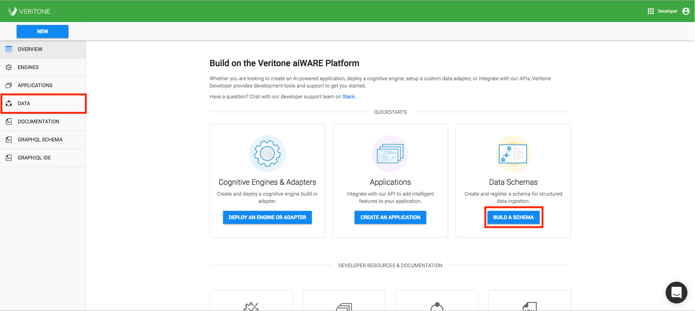
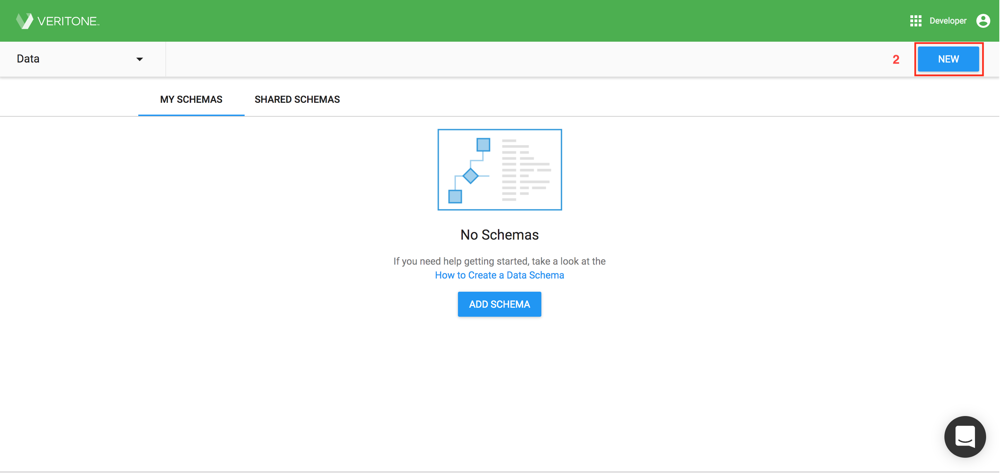
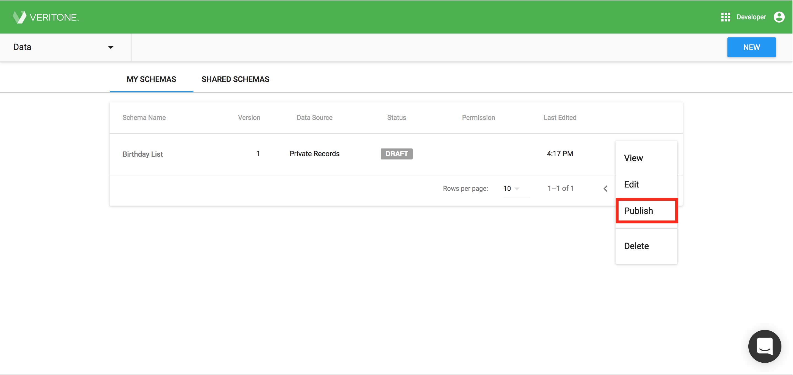
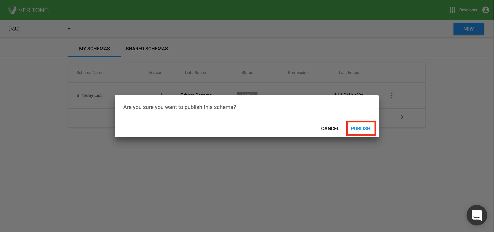

# Quick Start

This quick start is designed to take you through the process of registering a structured data schema. When completed, you can reference the schema when creating ingestion or processing jobs involving your structured data.

## Register a New Schema ##

Before using structured data in the Veritone platform, you need to register a schema for the data. You can do this within the Developer App UI by following these steps:

| To create a Schema  |                                                                  |
| ------------------- | ---------------------------------------------------------------- |
| 1. Log into [Veritone Developer](https://developer.veritone.com). From the **Overview** page, select **Data** from the menu on left hand side or click on **Build a Schema** on the Data Schemas card on the right side. The _Data_ page opens. | 

 |
| 2. Click **New** in the upper right of the window. The page opens to _New Data Schema Details_. | 

 |
| 3. Enter the following basic details to describe your schema:  <ul><li>**Data Source**: _(required)_ Enter the source of the data that you're creating the schema for.</li><li>**Schema Name**: _(required)_ Enter a name for the schema.</li><li>**Schema Description**: _(required)_ Describe what your schema covers in a sentence or two. This description will be displayed to users of your schema.</li></ul> 4. Click **Next** to continue. The Create Schema window opens.| 

 |
| 5. Write out or copy and paste a Schema with valid JSON formatting. See the section [below](###Requirements-and-Best-Practices-for-Schemas) for more information about how to create a valid schema.   6. Click on **Submit**. If your schema was accepted, you will see a temporary popup message at the bottom of the page that says _Data Schema created successfully!"_ and then the Edit Configuration page appears.| 

 |
| 7. At this point, you can edit the information that you entered earlier about your schema if you like or just click on the X in the upper right to return to the My Schemas page where you can now see your schema is saved as Draft.| 

 |
| 8. If you are happy with your schema, you can publish it by clicking on the vertical ellipses on the right hand side and selecting **Publish**.| 

 |
| 9. You will see a popup asking you to confirm that you want to publish the schema. Click **Publish** to confirm.| 

 |
| 10. You'll be returned to the My Schema page where you'll see that your schema now has the status of Published. Now you can now use the schema to ingest structured data.| 

 |

### Requirements and Best Practices for Schemas ###

Each schema should fully describe the fields for the structured data that you want Veritone to store and index. The schema should include the following fields:

| Field | Field Type | Required | Description | Example |
| ----- | ---------- | -------- | ----------- | ------- |
| $id | string | No | Defines the URI reference to the schema | "$id": "http://example.com/example.json" |
| description | string | No | Explains what the schema is about. | "description": "Employee birthday list" |
| type | string | No | Indicates the format type of the schema. If omitted, defaults to "object" | "type": "object" |
| required | array | No | Indicates the fields that are required to be present in the structured data. If a required field is not present in a record, that record will not be saved. | "required": \["id", "name"] |
| properties | object | No | A JSON object containing the names and data types of the fields in the structured data set | "properties": {"firstName":{"type":"string"},"lastName":{"type":"string"}}|

 The data types that Veritone supports:

| Data Type | Example |
| --------- | ------- |
| number | 1, 2.0, 3431455 |
| boolean | true, false |
| string | "string" |
| array | \["one", "two", "three"]
| object | {"firstName":{"type":"string"},"lastName":{"type":"string"}} |

Within the string type, we support two specific formats:

| Format | Example |
| ------ | ------- |
| geopoint | "34.052235,-118.243683" |
| datetime | "2018-02-22T01:00:00.000Z" |

_Note that datetime is in UTC time and formatted per [ISO 8601](https://en.wikipedia.org/wiki/ISO_8601)._

## Editing a Schema ##

While a schema has draft status, you can edit the schema by selecting the Edit option to the right of every row in the My Schemas table. You can edit it as many as you need to while the schema is in Draft status.

When you're ready to publish the schema, the status changes to Published and a version is assigned.

If you edit a Published schema, a new entry will be created with a status of Draft. 

If you attempt to publish this new entry, you will be asked to indicate whether the change should be saved as a minor or a major version. 

Version Type | Definition
------------ | -----------
Minor | Minor versions must be backwards compatible with the prior version and are indicated by incrementing the number to the right of the decimal for the version number. For example, 1.1 and 1.2 are minor versions of 1.0.
Major | Major versions are not backwards compatible with the prior version and are indicated by incrementing the number to the left of the decimal for the version number. For example, 1.0 and 2.0 are major versions.

It's important for Veritone to understand whether each schema edit is a major or minor version so that we can properly store and index any new structured data that conforms to the revised schema. If the schema represents a new major version, then any data ingested against that schema will be stored in a new index, and any users must elect to use that new version as it could be incompatible with any prior usage of the data. If the schema is a new minor version, then any data ingested against that schema will be stored in the same index as the prior version.

**Please note that at this time, Veritone will consider all changes to a published schema to be a major change unless the change consists only of adding new, unrequired fields to the prior version.**

Also note that while you can have multiple major schema versions published at the same time, you can only have one minor version per major version published. For example, you can have schema versions 1.6, 2., and 3.3 all in published state at the same time, but you cannot have 1.1, 1.2 and 1.3 all in published state together. **If you publish a new minor version of a schema, any pre-existing, published minor versions of that schema will be deactivated.**

