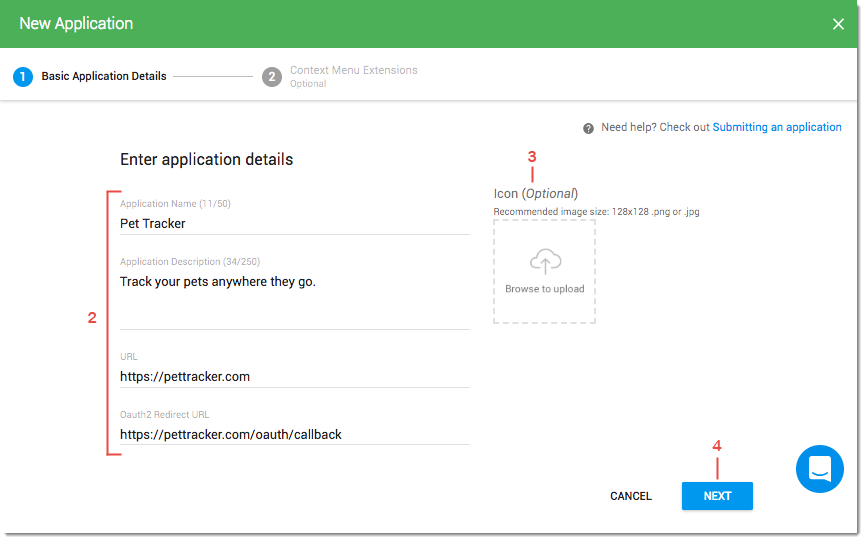
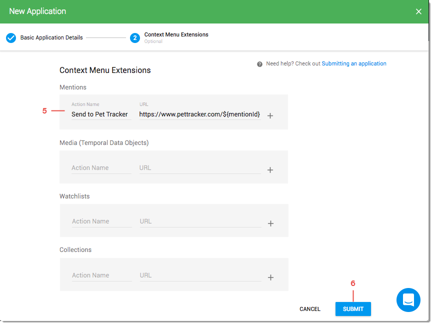
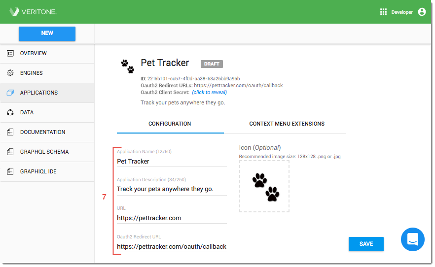
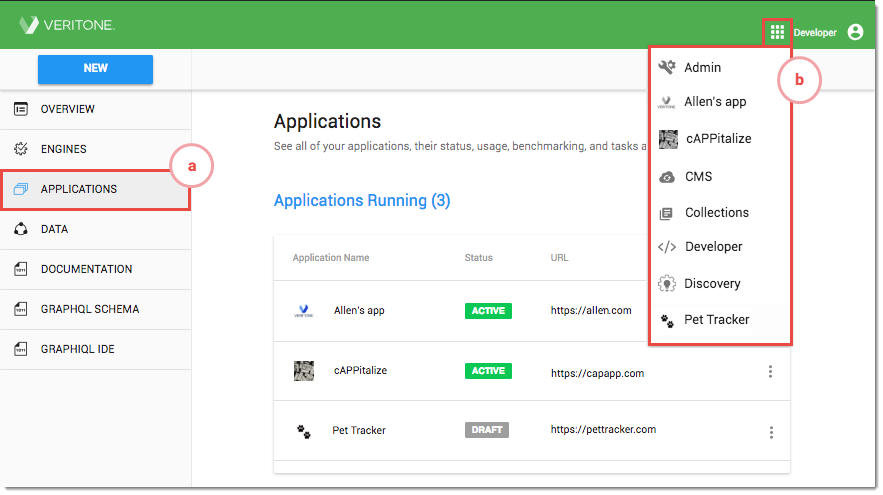

# Step 1. Register Your Application

Registering your app allows you to specify general information and basic configuration details about your application and add it to the Veritone platform in a draft state. Once your app is registered, you'll be provided with a unique Application ID and other credentials that your app will use to configure [user authentication](/developer/applications/quick-start/step-2). 

### To register your application:
1\.  Log into Veritone Developer. Click **New** in the upper left of the window and select **Application** from the dropdown. The *New Application* window opens to the _Basic Application Details_ page. 

2\. Enter the following information about your application:  

* **Application Name**: Enter your application's name (up to 50 characters in length) as you would like it to appear to users.
* **Application Description**: Describe what your application does in a few sentences. This description will display to users.
*   **URL:** Enter the URL where the application can be accessed.
*   **Redirect URL:** Enter your application server's Oauth2 redirect/callback URL. See the section on [OAuth](/developer/applications/oauth) for more information. 

3\. Upload an *icon* to represent your application as a 128x128 png or jpg file. For best results, upload a square image. The icon will display to the left of the application name in the *Veritone App Picker*. Images are automatically resized and converted to grayscale in the Veritone UI. If an icon is not uploaded, a generic icon will display next to your application name.

4\. Click **Next**. The *Context Menu Extensions* page opens.

5\. Enter the **Action Name** and **URL** to create one or more *Context Menu Extensions*. (Optional) See the [Context Menu Extensions](/developer/applications/context-menu-extensions) section of our docs to learn more.

6\. Click **Submit** to continue. A "Application created successfully" confirmation message momentarily displays and the app is added to Veritone in a *Draft* state. 

7\. Review your application details.

*   If no changes need to be made, no further action is necessary.
*   If changes are required, make the necessary edits and click _Save_. An "Application updated successfully" message displays momentarily. Note that the _Save_ button remains blue after your changes have been applied. 

Once your app is registered, use the values at the top of the page to [configure your app with OAuth 2.0 authentication](/developer/applications/oauth). 

### View and Access Your Application 
Your registered applications can be viewed and accessed in the following ways:

<ol type="a">
  <li><b>Applications Dashboard:</b> To manage your applications, click <b>Applications</b> on the left menu in Veritone Developer, then select an app from the <i>Applications</i> dashboard list to view and edit the settings.</li>
  <li><b>App Picker:</b> Registered applications display by clicking the <i>App Picker</i> icon in the upper right of the window. The App Picker provides an easy way for users to find and access applications that have been enabled for their organization.</li>
</ol>

