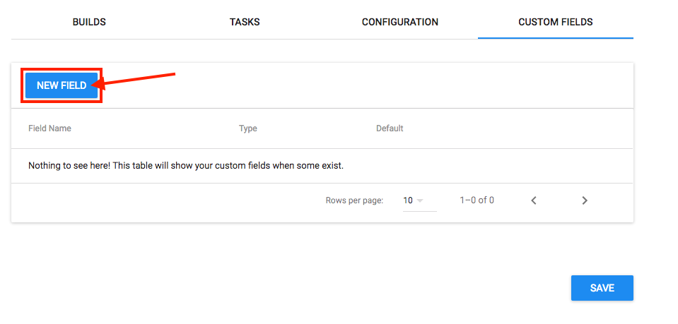

# Custom Fields

Depending on the type of your engine, it may require certain parameters to be input by the user in order to process their task. For example a detection based engine may need to know the minimum confidence level for a result to be considered valid. `Custom Fields` allow you to define these parameters which are then configurable by the end users of your engine. These configured parameters will be available to your engine inside of the payload it receives at runtime.

You can create custom fields inside of VDA both during the creation of a new engine, as well as on the details page of an existing engine.

On the custom fields table, click on `New Field`.



You will then be presented with the `Add Field` modal which contains a list of fields that we provide for defining custom fields on an engine. The purpose of each field is outlined below.

#### Field Name

Field name will be used as the `key` of the parameter inside of the `taskPayload` given to your engine at runtime.


#### Field Label

Field label is used as the friendly name of your parameter when being displayed to end users.


#### Field Info

Field info is used to provide description to end users regarding the purpose of the parameter.


#### Field Type

Field type represents the type of input your parameter requires. See the table below for details.

| Type       | Description                                             | 
| ---------- | --------------------------------------------------------| 
| Text     | Standard text input                                       | 
| Number      | Standard number input with optional min/max/step restrictions | 
| Picklist      | Define a list of KVP options, where only a single value is selectable                                       | 
| MultiPicklist     | Define a list of KVP options, where multiple values are selectable               |
| SchemaSelection     | For engines that accept a data schema as an input              |


#### Default Value

Default value will be used as the initial value of your parameter when being displayed to end users.


### Querying an engines fields using GraphQL

You can use the query below to view an engines fields, make sure to replace the id `replaceMe` below with the id of the engine you want to query.

```graphql
query {
  engine(id: "replaceMe") {
    fields {
      name
      label
      info
      type
      min
      max
      step
      options {
        key
        value
      }
      defaultValue
      defaultValues
    }
  }
}
```
