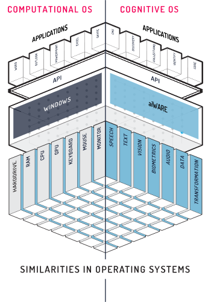

<!-- markdownlint-disable no-inline-html no-trailing-spaces blanks-around-headings heading-increment no-multiple-blanks-->

<!-- DISABLE VIDEO

<iframe src="https://player.vimeo.com/video/375527305?color=ff9933&title=0&byline=0&portrait=0" style="border:0;top:0;left:0;width:100%;height:100%;" allow="autoplay; fullscreen" allowfullscreen></iframe>

    <a href="/#/developer/applications/quick-start/" id="learn-aiware-btn">LEARN AIWARE IN 15 MINUTES</a>
     
    <a href="/#/apis" id="explore-api-basics-btn">EXPLORE API BASICS</a>

-->

<!-- 
 -->

<!-- 
<iframe src="https://player.vimeo.com/video/548657409?color=ff9933&title=0&byline=0&portrait=0" style="border:0;top:0;left:0;width:100%;height:100%;" allow="autoplay; fullscreen" allowfullscreen></iframe>
 -->

<!-- ## What is Veritone aiWARE? {docsify-ignore} -->

# Veritone aiWARE Overview

Veritone aiWARE is a production-proven AI platform that lets you harness the power of AI anywhere, any time. Cognitively enable new or existing apps rapidly, using a unified API for more than 300 engines available on the aiWARE platform. Deploy enterprise-grade solutions at scale, using our infrastructure or your own. Process massive amounts of data — audio, video, image, text, and more — to extract actionable intelligence. Boost the productivity of your business and IT teams by intelligently automating manual, repetitive, and data-driven tasks — no in-depth coding skills or AI expertise required.

<iframe style="border: none; width:500px; height:350px" src="https://player.vimeo.com/video/548657409?color=ff9933&title=0&byline=0&portrait=0" allow="autoplay; fullscreen" allowfullscreen></iframe>

## aiWARE: The Operating System for Artificial Intelligence <!-- {docsify-ignore} -->

A computer’s operating system connects a processor, peripherals and applications so they can communicate, working together to display what you see on your screen and respond to your commands. An AI operating system works in a similar fashion. It provides a common software infrastructure that lets you use end-to-end, AI-powered solutions — from data ingestion to intelligent data analysis — in either general or industry-specific applications. With thousands of limited cognitive engines on the market, you need an operating system to manage and orchestrate them all, so you can use them with general or industry-specific applications to solve real-world challenges.

## The Benefits of an OS for AI <!-- {docsify-ignore} -->

* Rapidly develop AI applications to solve business problems

* No need to manage and orchestrate underlying AI engines

* Seamlessly leverage multiple AI engines from multiple vendors

* Mitigate risks of single vendor dependency

* Flexibility to deploy in the Veritone cloud, your private cloud or on-premise

## Getting started <!-- {docsify-ignore} -->

 

<a class="card" href="https://www.veritone.com/devsignup/">

<h3>Signup to Cloud Platform</h3>

    Gain immediate access to aiware SaaS applications

</a>

<a class="card" href="/#/aiware/install/install">

<h3>Install on Local Machine</h3>

    Install aiWARE on a local environment such as a MacBook, VirtualBox instance or on a cloud instance

</a>

<a class="card" href="/#/aiware/install/cluster?id=cluster-deployment">

<h3>Install Production Cluster</h3>

    Install aiWARE on a 2+ node cluster.

</a>

## Do More With aiWARE <!-- {docsify-ignore} -->

 

<a class="card" href="/#/automate-studio/">

<h3>Automate Studio</h3>

    Start to build AI flows today with Veritone's Automate Studio

</a>

<a class="card" href="/#/benchmark/?id=veritone-benchmark-beta">

<h3>Veritone Benchmark</h3>

Compare the performance of different cognitive engines against your own use case.

</a>

<!-- ## Start building with Veritone aiWARE <!-- {docsify-ignore} -->

<!-- tabs:start -->

<!-- #### ** WHAT ARE YOU TRYING TO ACHIEVE? **

    

        
 
            

                <h3>Use existing model</h3>
                
Use any of the existing models to start creating cognitive applications.

                <a class="link" href="/#/quickstart/jobs/?id=working-with-jobs"> GET STARTED</a>
            

            

                
            

        

         
         
        
 
            

                <h3>Train a model</h3>
                
Use aiWARE to train your models and benchmark their performance.

                <a class="link" href="/#/developer/engines/tutorial/engine-training-tutorial"> GET STARTED</a>
            

            

                
            

        

         
         
        

            

                <h3>Run processes at scale</h3>
                
Use aiWARE to run proceses at scale in local networks, on and offline, and behind firewalls.

                <a class="link" href="/#/overview/aiware-features"> GET STARTED</a>
            

            

                
            

        

    

    

        
 
            

                <h3>Build a custom model</h3>
                
Use aiWARE to create custom model based on your own data points.

                <a class="link" href="/#/developer/engines/tutorial/"> GET STARTED</a>
            

            

                
            

        

         
         
        
  
            

                <h3>Integrate a model into my app</h3>
                
Use your model in production apps and start resolving real technical challenges.

                <a class="link" href="/#/developer/applications/app-tutorial/"> GET STARTED</a>
            

            

                
            

        

         
         
        
  
            

                <h3>Automate a process</h3>
                
Use aiWARE to automate business processes and maximize your speed and output.

                <a class="link" href="/#/automate-studio/"> GET STARTED</a>
            

            

                
            

        

    

#### ** WHAT'S YOUR ROLE?**

    

        
 
            

                <h3>Developer</h3>
                
Learn how to create your own custom engine to analyze and process data.

                <a class="link" href="/#/quickstart/engine-developer/"> GET STARTED</a>
            

            

                
            

        

         
         
        
 
            

                <h3>Analyst</h3>
                
Learn how to use advanced automation AI techniques to streamline your process and optimize time.

                <a class="link" href="/#/quickstart/ml-explorer/"> GET STARTED</a>
            

            

                
            

        

         
         
        

            

                <h3>Product Manager</h3>
                
Use aiWARE to rapidly prototype and iterate on ideas with an easy to use GUI-based platform.

                <a class="link" href="/#/automate-studio/"> GET STARTED</a>
            

            

                
            

        

    

    

        
 
            

                <h3>Data Scientist</h3>
                
Learn how to implement your model quickly and run it at scale in production. 

                <a class="link" href="/#/developer/engines/"> GET STARTED</a>
            

            

                
            

        

         
         
        
  
            

                <h3>Solutions Architect</h3>
                
Solve business problems using AI and take them to market in no time.

                <a class="link" href="/#/quickstart/ml-integrator/"> GET STARTED</a>
            

            

                
            

        

         
         
        
  
            

                <h3>Operations</h3>
                
Use aiWARE to streamline operations and maximize your efficiency and output.

                <a class="link" href="/#/automate-studio/"> GET STARTED</a>
            

            

                
            

        

    

 -->

<!-- tabs:end -->

<!-- ## Do more with aiWARE {docsify-ignore} -->
<!--  

    

        
 
            

                <h3>Veritone Automate Studio</h3>
                
Automate workflows and processes using a drag and drop platform. Learn how to make money with our Automate flow bounties program by clicking <a class="in-text-link" href="/#/automate-studio/flow-bounties/README"> here</a>!

                <a class="link" href="/#/automate-studio/"> EXPLORE</a>
            

        

    

    

        
 
            

                <h3>Veritone Benchmark</h3>
                
Compare the performance of different cognitive engines against your own use case.

                <a class="link" href="/#/benchmark/"> EXPLORE</a>
            

        

    

    
 
        

            
        

        

            <h3>Join Veritone's Slack Channel</h3>
            
For technical and business-related questions, please reach out to us on Slack. We're here to help!

            <a class="link" href="https://veritonedev.slack.com"> JOIN CHANNEL</a>
        

    

 -->

<!-- DISABLE THIS FOR NOW
## Whats New 

    

        

            06/22/2020
        

    

    

        - Expanded documentation for <a class="in-text-link" href="/#/automate-studio/"> Automate Studio.</a>
         
        - New <a class="in-text-link" href="/#/quickstart/jobs/?id=working-with-jobs"> "Working with Jobs"</a> quickstart.
         
        - New <a class="in-text-link" href="/#/overview/aiWARE-in-depth/edge/logs"> "How to view job and task logs"</a> guide.
    

 

    

        

            3/24/2020
        

    

    

        - New documentation tells how you can <a class="in-text-link" href="/#/benchmark/"> benchmark</a> your engines with the Benchmark app (beta).
         
        - New documentation on how to update <a class="in-text-link" href="/#/developer/engines/"> cognitive engines</a> for the latest version of aiWARE Edge.
         
        - New Automate Studio <a class="in-text-link" href="/#/automate-studio/faq"> FAQ</a>.
    

 

    

        

            2/10/2020
        

    

    

        - You can now search across all the Cognitive and Ingestion engines your Veritone organization has access to
         
        - The brand new and enhanced engines table now lets you filter and sort your engine results
         
        - All of your engines, both ingestion and cognitive types are displayed in one centralized table for you to view, filter, and query
    

-->