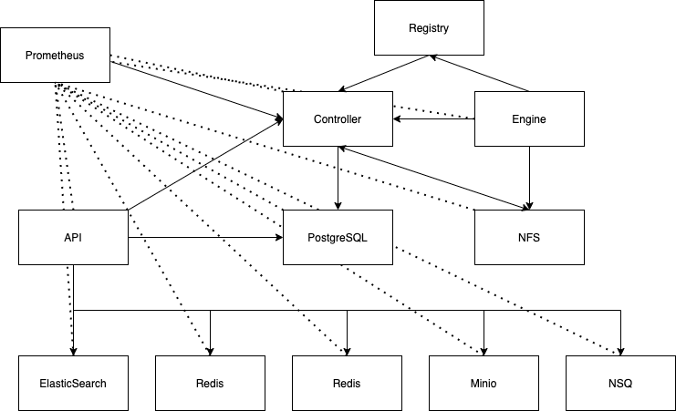

# Cluster Deployment

## Architecture



A full aiWARE Anywhere cluster comes with 12 run modes. A run mode is the cluster role of that instance that can be one or many of the following: `api`, `controller`, `db`, `elasticsearch`, `engine`, `lb`, `minio`, `nfs`, `nsq`, `prometheus`, `redis`, `registry` To run a minimal cluster that is able to run jobs and produce results, the controller, engine, PostgreSQL database (db) and NFS nodes are necessary. Prometheus is necessary for monitoring and providing dynamic targets. 

With aiWARE Anywhere, in addition to having the ability to run cognitive engines on a local platform or cluster, you can also have the power of indexing your job results, storing the data in long term storage and have the history of jobs available to you. With the controller, you have the brains of the cluster. With the api node(s), you add the hard drive capabilities and potentially, the graphical user interface (GUI). 

## Requirements

* At a minimum, the `controller`, `engine`, `db`, `nfs`, `prometheus`, and `registry` run modes are required
* Ubuntu 18.04 or Ubuntu 20.04. Support for Red Hat is coming soon. 

### Database
* An existing PostgreSQL server can replace a `db` node. The `postgres` will have a new schema named `edge` added to it. Access to the `postgres` database on a PostgreSQL server is required
### Docker
Many of the services that run in the cluster run in Docker containers. As such, ensure that there is enough disk space available for the Docker root directory (typically located at `/var/lib/docker`)
## Network Storage
We don't recommend using NAS or SAN for the `AIWARE_ROOT` which is typically `/opt/aiware`. NAS or SAN can be used for the cluster cache and can replace the `nfs` run mode. 
### Network
These are the network ports required if you have a firewall. 
#### Connections within aiWARE cluster
| Source Run Mode | Target Run Mode | Port | Description |
| --- | --- | --- | --- |
| DB | Controller | 9000 | HTTP/HTTPS, can be changed |
| DB | Registry | 5000 | HTTP, this is used to pull engines and other containers |
| DB | NFS | 2049 | TCP - Access to /cache |
| Controller | Controller | 9000 | HTTP/HTTPS - API |
| Controller | Registry | 5000 | HTTP, this is used to pull engines and other containers |
| Controller | DB | 5432 | TCP, This is used to connect to the database |
| Controller | Automate | 5000-6000 | HTTP, This is the proxying of the HTTP connections to Automate Studio |
| Controller | NFS | 2049 | TCP - Access to /cache |
| Controller | Redis | 6379 | TCP, redis |
| Controller | NSQ | 4150, 4151, 4160, 4161 | HTTP & TCP, NSQ |
| Engine | Controller | 9000 | HTTP/HTTPS - API |
| Engine | Registry | 5000 | HTTP, this is used to pull engines and other containers |
| Engine | NFS | 2049 | TCP - Access to /cache |
| Prometheus | Controller | 9000 | HTTP/HTTPS - API |
| Prometheus | *all* | 8000 | HTTP, agent /metrics |
| Prometheus | Controller | 8001 | HTTP, controller /metrics |
| DB | Controller | 9000 | HTTP/HTTPS, can be changed |
| DB | Registry | 5000 | HTTP, this is used to pull engines and other containers |
| DB | NFS | 2049 | TCP - Access to /cache |
### SELinux
```
Coming soon
```
### Sizing Guide
```
Coming soon
```
### RAM
For the `prometheus` node(s), please consider the RAM necessary for that node. The metrics that are scraped from the entire cluster must be able to fit onto the RAM of an instance. Prometheus can crash when it runs out of memory. 
### Swap
We recommend adding swap space to the `engine` nodes at a minimum. Swap adds processing room when the RAM on the system has been exhausted. For the engines, adding swap will aid with the speed of processing jobs and tasks. 
### Storage Space
We recommend a minimum of 50GB for base installation. For Docker root directory of an `engine` node(s), we recommend a minimum of 500GB disk space. The `registry` node(s) typically requires enough disk space to manage the images needed to run engines. We recommend at least 500GB for this node type. Please refer to the (Sizing Guide)[#sizing-guide] for more information about tuning for disk space.
### Registry
Currently, the `registry` node(s) is not swappable with an existing Docker Registry. 
### Backups
We recommend that you back up the `db` node as that is where the most important data is store. The engine Docker containers are ephemeral. For extending the lifespan of metrics, consider tuning the `prometheus` node(s) to be able to accommodate the time-series database. 
### aiWARE Anywhere
aiWARE Anywhere adds the `api`, `redis`, `elasticsearch`, `nsq`, `lb`, and `minio` run modes to an existing cluster. We recommend that you size your cluster according to the (Sizing Guide)[#sizing-guide]. 
### Disaster Recovery
```
Coming soon
```

## Installation
1. Become root
    ```bash
    sudo bash
    ```

2. Install Dependencies
   ```
   apt update -y
   apt install docker.io nfs-common uuid prometheus-node-exporter
   ```

3. Set the variables and install db and controller
   ```bash

    mkdir -p /opt/aiware

    export AIWARE_DB_HOST="10.123.234.35"
    export AIWARE_DB_PORT=5432
    export AIWARE_MODE=db
    export AIWARE_HOST_EXPIRE=false
    export INSTALL_AIWARE_CHANNEL=prod
    export AIWARE_DB_MIGRATE=true
    export AIWARE_AGENT_UPDATE_INTERVAL=5
    export AIWARE_INIT_TOKEN=`uuidgen`
    curl -sfL https://get.aiware.com | sudo -E sh -

    echo "AIWARE_INIT_TOKEN is $AIWARE_INIT_TOKEN"
    ```
    For controller: 
    ```bash

    mkdir -p /opt/aiware

    export AIWARE_DB_HOST="10.123.234.35"
    export AIWARE_DB_PORT=5432
    export AIWARE_MODE=controller
    export AIWARE_HOST_EXPIRE=false
    export INSTALL_AIWARE_CHANNEL=prod
    export AIWARE_DB_MIGRATE=true
    export AIWARE_AGENT_UPDATE_INTERVAL=5
    export AIWARE_INIT_TOKEN=`uuidgen`
    curl -sfL https://get.aiware.com | sudo -E sh -

    echo "AIWARE_INIT_TOKEN is $AIWARE_INIT_TOKEN"
    ```

    Note that the value of `AIWARE_INIT_TOKEN` is important. This will be the "Bearer Token" that
    you'll need to authorize calls to `aiware-agent` later, so make sure you record this somewhere.

    For the reminder of the cluster, install aiWARE in the same fashion, changing the environment variable `AIWARE_MODE` to include one or many of the `registry`, `engine`, `prometheus`, `nfs`, etc.


4. Validate install

    Go to http://<HOST>:9000/edge/v1/version, or curl localhost:9000/edge/v1/version, for aiWARE Edge version information.  This will return information such as :

    ```
    { "version": "---
    build_date: Tue Feb 4 22:52:57 UTC 2020
    git_repo: realtime
    git_branch: HEAD
    git_commit: f8a8130c88b8ed5b0e50a8f26bf45d5d9b1a22e1
    git_author: al
    build_url: https://build_url/job/aiware/job/edge-controller/1281/
    build_number: 1281
    " }
    ```

5. Run install command for aiWARE applications

    ```bash
    /usr/local/bin/aiware-agent --controller-token $AIWARE_INIT_TOKEN hub install core --channel stable
    ```

    This will install the aiware-agent as a service. You can check the status via running `service aiware-agent status` command, or monitor
    it in realtime with `watch service aiware-agent status`.
