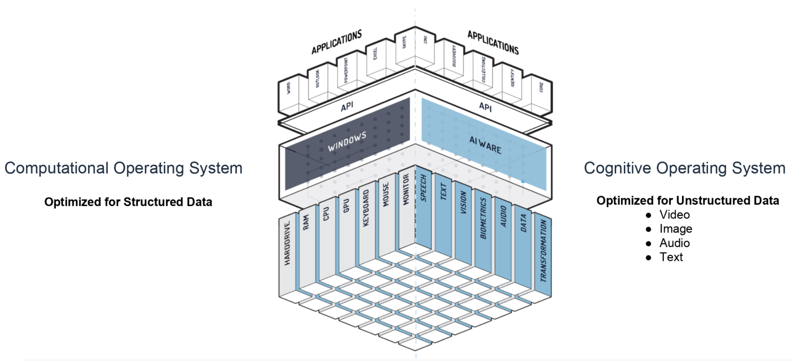
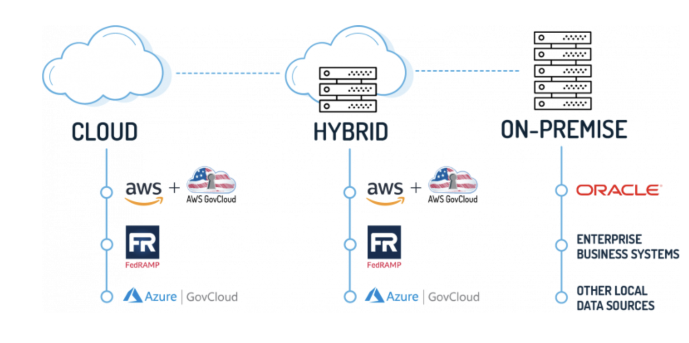
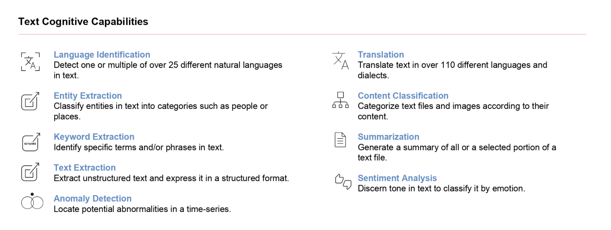
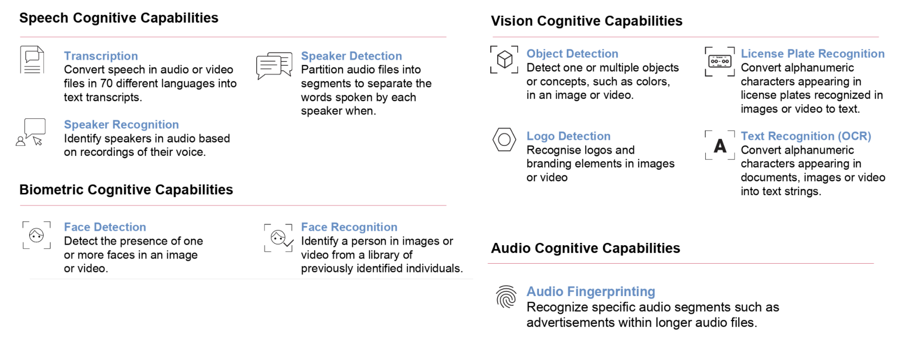

# Introduction to Automate Studio

The Automate Studio training and certification program provides foundational technical training on how to successfully develop, deploy, and use aiWARE-powered solutions.

The training is organized into three units.

* Unit 1: Introduction to aiWARE and Cognitive Engines  (1 hour)
* Unit 2: Using Automate Studio (2 hours)
* Unit 3: Introduction to aiWARE for Alteryx (1 hour)

## Prerequisites
This training is designed for developers, business analysts, and Alteryx consultants who already have the following skills:

* Familiarity with unstructured data types such as .mp3/.mp4, jpeg, .mpeg, .m4a, .wav.
* Optional but helpful: Basic familiarity with JSON (JavaScript Object Notation).
* Familiarity with logic/flow concepts like looping, branching, and joins. (No actual programming experience is needed.)
* “Advanced Beginner” experience level (or higher) with Alteryx Desktop (for Unit 3 only).

For this training, you'll need an internet connection and a computer with the Chrome browser installed. (Other browsers may work, but are not guaranteed to work.) For the unit on Alteryx integration, you should already have a machine with Alteryx Desktop installed. You can obtain a [free evaluation copy of Alteryx Desktop](https://www.alteryx.com/designer-trial/alteryx-free-trial).
You will also need to set up a Veritone Developer user account at https://www.veritone.com/devsignup/.

# Unit 1: Introduction to aiWARE and Cognitive Engines

**Time Required:** 1 hour

Before we get started, let's get oriented to the "Veritone way" of doing AI. Veritone's aiWARE has often been likened to an Operating System for AI. That's because it follows the OS paradigm of offering highly modularized services that allow application developers to abstract away low-level details of data access, security, storage, and so on. Applications built on top of aiWARE can achieve high levels of reliability, scalability, interoperability, and technology agnosticity (not to mention deployment flexibility), thanks to aiWARE's extensive use of containerization technology combined with web APIs. 

## Flexible Deployment
One of the key strengths of Veritone's aiWARE platform is its ability to support flexible deployment architectures. You can use Veritone's cloud, or you can host your own instance(s) of aiWARE on public or private Azure or AWS clouds; or, if you need to maintain tight control over your data, you can host your own aiWARE instances on-premise. With aiWARE Anywhere, you can leverage Veritone's technology in whatever geography, infrastructure, scale, or security posture suits your needs.

## Cognitive Engine Technology

One of the biggest benefits of aiWARE is the availability of literally hundreds of off-the-shelf cognitive modules (written in many programming languages, by many vendors), exposed through a pipeline-oriented cognitive-engine API that makes AI truly plug-and-play. Apps written for aiWARE can be highly composable and bring together diverse machine-learning technologies to make it possible to attack difficult problems in new and exciting ways.

### What, Exactly, Is a Cognitive Engine?
A cognitive engine encapsulates the machine learning algorithms and logic required to analyze and extract meaningful insights from complex data -- data that's often unstructured, meaning that it consists of raw bits that don't necessarily conform to a schema or fit into nice, clean categories. Think of audio files, video streams, still images, or large freeform text blobs: These types of data tend to be large, complex, "noisy," and difficult to parse, search, or summarize. Some of these data types are referred to as time-series data, because the information is sequentially time-ordered, as frames in a video (for example).

Until recently, the large-scale analysis of unstructured data was simply impractical. But now, with the advent of AI, such data sources have become valuable reservoirs of actionable information. Today, it's feasible, using off-the-shelf AI technology, to identify faces (or objects: vehicles, weapons, signage, logos, etc.) in a video; transcribe audio to text; translate text into other languages; or make predictions based on patterns found in video streams, audio streams, still images, and so on. Cognitive engines make these things possible.

With a cognitive engine, you can feed unstructured data into the engine, and receive highly detailed analytic data (or "metadata") in response. Data in, insights out.

### Cognitive Capabilities

Veritone offers hundreds of cognitive engines (some written by Veritone; most, created by third parties) that can be used to perform analysis of your data in apps written for the aiWARE platform. Each engine has a particular cognitive capability. Some of the capabilities available are shown below.

>  Note: You can read more about aiWARE cognitive engine capabilities [here](https://docs.veritone.com/#/developer/engines/cognitive/?id=capabilities).

### What Kinds of Data Will an Engine Produce?

In aiWARE, engines accept various kinds of input data, appropriate to the type of cognition. On the output side, engines produce JSON (JavaScript Object Notation) data conforming to Veritone's open VTN Standard. The official specification is expressed in json-schema format according to various "validation contracts." The individual validation contracts are contained in their own schemas, which use definitions in a master schema.

By making engine outputs conform to VTN Standard, Veritone is able to assure interoperability between engines and processes that might otherwise not be able to talk to one another. 

What does VTN Standard JSON look like? It's a hierarchical representation of highly granular metadata. For example, a transcription engine will generally output an array of time-stamped pieces, representing spoken words in an audio stream. The individual pieces might look like this:

   		       {
                   "startTimeMs": 4890,
                   "stopTimeMs": 5340,
                   "words": [
                       {
                           "word": "before",
                           "confidence": 1,
                           "bestPath": true,
                           "utteranceLength": 1
                       }
                   ],
                   "language": "en"
               }

Every word in a transcript has a start and stop time (in milliseconds), and typically comes with a confidence value (as a floating-point number in the range of 0..1). You will get back an array of such pieces.

The relatively flat, granular nature of VTN Standard data makes such data easy to transform, filter, and manipulate. 

You can read more about VTN Standard [here](https://docs.veritone.com/#/developer/engines/standards/engine-output/).
 
### Engines Are Configurable

Many engines take custom input settings. For example, a translation engine might allow you to select from among various available output languages.

### Some Engines Are Trainable

While many cognitive engines need no special training (for example, a Spanish-to-English translation engine already "knows" both languages), other engines may need to be trained on one or more "training sets" before they are ready to be used in production. Then, in production, you will need to fetch the appropriate library file (containing prior learnings) in order to prepare the engine to operate on your data. An example of this would be a face-detection engine that is called upon to identify particular individuals within a video. Such an engine might be able to detect a human face without training, but it won't be able to identify a particular person's face unless you have trained the engine in advance to recognize, let's say, Barack Obama (or whoever you're interested in finding).

### Performance and Accuracy

Within a given engine category, Veritone generally offers more than one choice of engine of a given capability. You will often have your choice of, say, English-language transcription engines. The engines might vary not only in speed and accuracy, but price and features. Sometimes you will want to do some testing of your own to determine which vendor's engine is best suited to a particular task. Veritone makes it easy to do such testing, by means of a Veritone app called Clarity, which lets you set up benchmarking trials to compare engines in an apples-to-apples manner.

### Summary

* Veritone's aiWARE platform offers an extensible, scalable, secure, flexible infrastructure for implementing custom AI-powered apps aimed at unlocking the tremendous latent potential of unstructured data sources.

* The aiWARE platform achieves much of its flexibility thanks to the modularity of pluggable cognitive engines. 

* Cognitive engines have various capabilities that give them specialized abilities, involving such things as logo detection, facial recognition, speech-to-text transcription, etc. Engines vary not only in speed and accuracy but cost and features.

* Regardless of capability, engines designed to operate in the aiWARE platform are required to support VTN Standard output, an extensible, granular, easy-to-manipulate text format based on industry-standard JavaScript Object Notation. Thanks to VTN Standard output, engines and apps that might not otherwise be able to talk to one another can be chained together to produce powerful solutions that simply weren't possible before.
