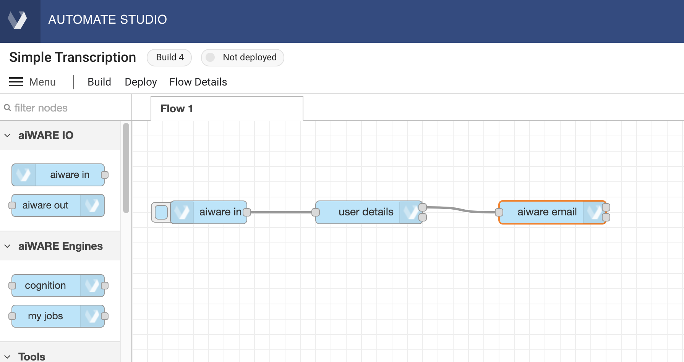
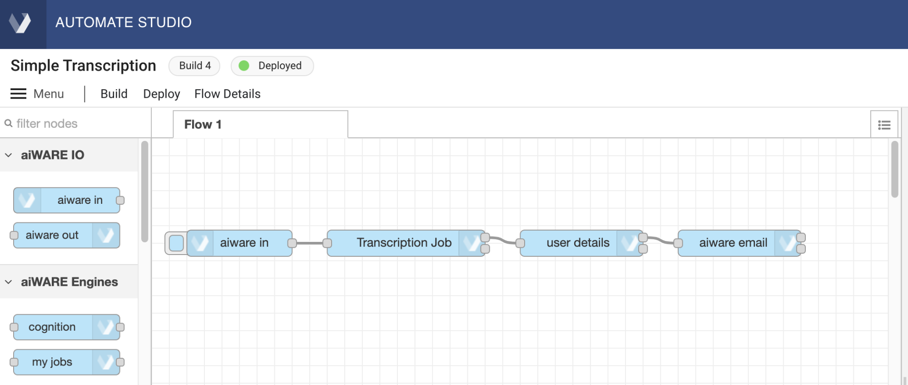
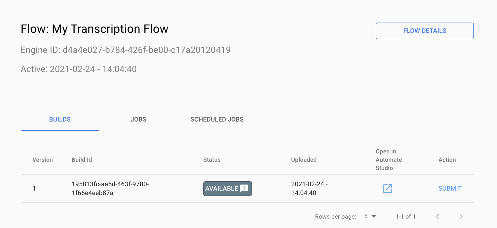
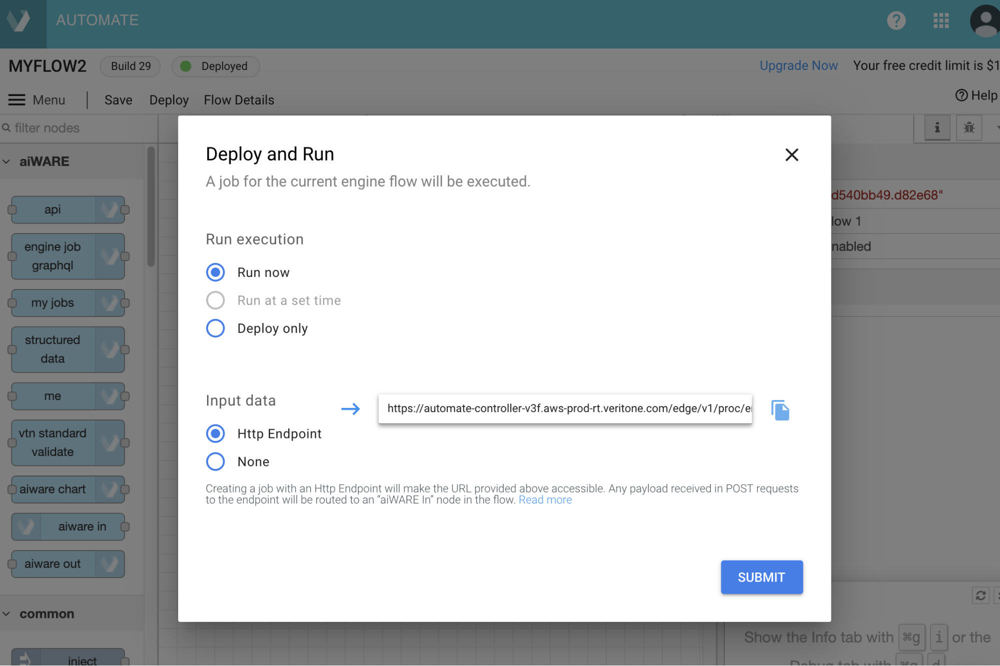
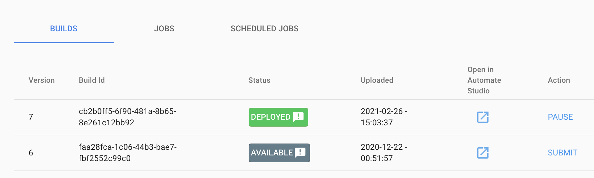
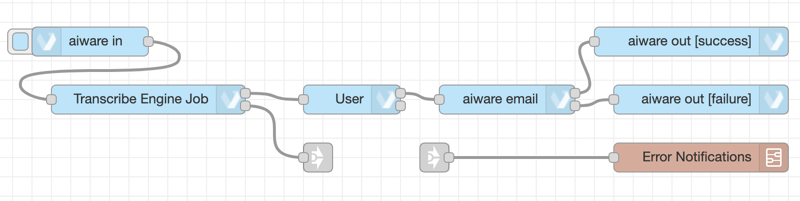

# Unit 2, Part 1:  Introduction to Automate Studio

**Time Required:** 1 hour

**What You Will Learn:** In this session, you will get hands-on experience with the Veritone workflow builder called Automate Studio, which allows for the construction of custom AI-intensive flows that run on aiWARE (yet can be called from Alteryx). You will learn basic Automate Studio design-time idioms, and build a simple workflow that uses a cognitive engine, plus custom logic, to achieve a desired outcome. And do it without coding.

**Prerequisites:** In order to use Automate Studio, you will need to set up an account at https://www.veritone.com/onboarding/#/signUp?type=automate. (Go there now, if you have not already done so).

**Quick Video Introduction:** To see a quick preview of Automate Studio, go [here](https://player.vimeo.com/video/388620185?color=ff9933&title=0&byline=0&portrait=0).

## High-Level Overview

Veritone's aiWARE platform is modularized in a way that lets you do cognitive processing with the aid of pluggable components called _engines_. An engine takes unstructured data (e.g., audio or video) in, and sends structured data (representing features of interest, extracted from the input data) as structured JSON output.

Any workflow created in Automate Studio can be packaged as an engine. This powerful feature means it is possible for you to augment existing AI capabilities (built on existing engines) with custom pre- and post-processing logic of your own.

The overall process is captured in the following graphic.


## Why Use Automate Studio?

One of the most important things Automate Studio allows you to do is build and test modular components of your own that you can call from other aiWARE processes (or even from Alteryx Studio), and do it in a way that's "closer to the OS" (to use the Veritone aiWARE "AI for OS" metaphor). Automate Studio lives at a level that's close to aiWARE's various APIs, giving you access to nearly every feature of aiWARE, without the need to write actual code.

Another thing that makes Automate Studio so powerful, of course, is that it gives you direct access to hundreds of cognitive engines that are available for use today in the aiWARE ecosystem. Thus, for transcription, you can compare multiple engines for things like language capabilities, speed, cost, features, etc., and then choose the engine that's best suited for your project.

But enough talk. Let's see what Automate Studio can actually do!

### Exercise 1: Become familiar with the Automate Studio design-time experience.

1. Launch Automate Studio in your browser. Navigate to Veritone aiWARE Login. In the upper right corner of that page, click the Create New Flow button.

2. From the node palette on the left, drag an aiware in node, a user details node, and an aiware email node onto the canvas.

3. Connect the nodes by dragging out a new wire from the right edge of each node to the left edge of the next node. Your canvas should look something like this:



4. Double-click the aiware-in node to bring up its Properties. Under Inject Mock Data, choose JSON as the data type (in the dropdown picklist) and then provide mock data that looks like this:

```json
{
    "url": "https://www.nasa.gov/mp3/591240main_JFKmoonspeech.mp3"
}
```

5. Double-click the aiware email node to bring up its Properties panel. Change the "To Email" field's value by setting the picker to msg., then enter payload.aiware.user.name after it. Enter text of your choosing in the "Email Subject" field. Change the "Message Body" field to be a JSONata script (use the drop-down control) containing the following:

```pre
"Hello,
<br>Your job finished!
<br><br> Here is your transcribed file: https://cms.veritone.com/#/media-details/" & payload.aiware.tdoId &
"<br><br> Basic Engine Output: " & 
payload.aiware.engineResultSimple
```

6. The Properties pane for the e-mail node should look something like this:


7. Click the blue Done button in the upper right part of the Properties pane. The pane goes away and your changes will be saved.

> NOTE: A small blue dot will appear along the top edge of the node whose properties you just edited. This dot will disappear in a second or two, after your changes have been auto-saved.

### Exercise 2: Add a Cognition Node.

Now let's add some cognitive processing to our flow. It's easy to do.

1. Drag a cognition node from the Node Palette onto the canvas, positioning it over the wire that connects your first two nodes. When you do this, the wire will change to a dotted line. At that point, you can let your finger off the mouse and your new node will instantly be wired into your flow.

2. Double-click the cognition node to open up its Properties pane. Make the following changes:

• Make sure the Job Definition field says "Engine selector" (the default).

• Under Choose Engine, set Cluster to any available aiWARE Edge instance (such as "PROD-V3," if available).

• Use the Category picker control to set the Category to "Transcription."

• Use the Engine picker to select the Engine named "Transcription - E - English (Global) V3."

• Find the WaitForResults checkbox and check it. This is important, because you want cognition to be complete before the flow proceeds to the next node. (If you leave this box unchecked, the flow, when it executes, will queue your cognition job in aiWARE, then run to the end immediately. At that point, it becomes your responsibility to check the cognition job periodically to see if it is done, and then retrieve the results when it's done.)

• (Recommended) Set Job Priority to "Very High."

• (Recommended) Change the Name field to have a value of "Transcription Job."

3. Click the blue Done button to close and save your new Properties. Your flow will look something like this:



4. Add two aiware out nodes to the canvas. They will both be shown as "Success" nodes at first. Click into the Properties of one of the nodes, and set that node's Output Status control to "Failure." You should now have one Success node and one Failure node of type aiware out. 

5. Connect a wire from the uppermost output port of the aiware email node to the input port of the Success version of aiware out. Also connect wires from the lowermost (error) port of the cognition node, and from the lower port of the user details node, to the input port of the Failure node. This way, a failure anywhere in the flow will cause the appropriate aiware out node to be invoked.

> NOTE: As a best practice, you should always have **aiware-out** nodes at the end of your flow, wired in a manner similar to that just described. These nodes tell aiWARE that your flow completed (whether normally, or with errors). Without these nodes, your flow instance might never shut down, or might be marked as "busy" when it is not, etc.

### Exercise 3: Run the flow

Now comes the fun part. It's time to test your flow. 

1. Click the square tab on the left edge of the first node in the flow (the aiware in node) to invoke the flow.

2. Watch the Debug pane in the Sidebar (on the right of the canvas). Click the "bug" icon if need be, to make debug results visible. You should see a series of messages appear in real time, explaining what's happening as the flow executes. 

3. If the flow completes without error, you should see an e-mail appear in your mailbox containing a link to the transcript of your input file.

### Exercise 4: Save your flow as a Build

When you want to save a particular version of your flow so you can find it and load it again later, use the Build button near the Menu icon in the upper left portion of the editor window.

> NOTE: To "save your work" requires no special action in Automate Studio, because Automate will automatically save your workspace every few seconds as you work in the design-time UI. Therefore, you don't need to click the Build button very often. Click it only when you want to memorialize a given instance of your flow as a versioned instance -- in other words, as a Build.

1. If you have not yet done so, give your flow a Name. Find the flow's name in the upper left corner of the window, under the "Automate Studio" banner. Single-click the name to open a dialog that lets you edit the name. Enter a name, then click the Update button.


2. Find and click the Build button in the upper left corner of the workspace near the Menu. You will see a toast notification at the lower left corner of the window, then the main workspace window will refresh. 

3. When the window has finished refreshing, note the Build number (which will have incremented automatically) in the little status badge in the upper left corner of the workspace.


Notice that the status badge also contains deployment information. In the above illustration, you can see that the engine is "Not deployed."

4. Just below the status badge, find the Flow Details link and click it. A new tab will open. It looks like this:



For now, it's not necessary to understand the various pieces of information available in this window. (We'll look at this window again in the next Unit of this training.) Right now, it's enough to know that you can use this window to get back to your flow at any time (and open it again in Automate Studio). Which means you need to do one more thing:

5. Bookmark the tab! 

#### Homework:

* Build your own flow from scratch without referring to this lesson. Use the sample audio here: https://adaniel-testing.s3.amazonaws.com/Apollo+Launch+Countdown.mp4

* **Bonus:** The cognition node accepts URLs via the node configuration or dynamically from whatever is found under `msg.payload.aiwareChunk.url`. Can you use the Change node to set this value successfully?

# Unit 2, Part 2: Create Your Own Automate Flow Engine

Every flow you create in Automate Studio can be deployed as an engine in aiWARE, making your custom flow available to other aiWARE processes. In the following exercises, we'll look at what's involved in deploying a custom Automate Studio workflow as a flow engine so that it can be used not only in other aiWARE processes, but in Alteryx Studio as well.

**What You Will Learn:** In this session, you will learn how to save and version an Automate workflow; how to deploy it as an engine in aiWARE; how to test the deployed engine. 

## Important Concepts

When a flow built in Automate becomes an engine in aiWARE, it needs to be associated with a Build number. A flow will always have a particular name and ID, but it's important to remember that there can be many different versions of that engine. Each version represents a different Build. (Bottom line, Builds are versions.) This is important because only one Build of a given engine can be in a deployed and active state in aiWARE at any particular time.

Fortunately, Automate Studio makes it easy for you to create and deploy Builds. It's literally a one-click process. But it's still important, from an administrative (and troubleshooting) perspective, to be able to find and identify your engine's Builds, and manipulate their deployment states, yourself, using the Veritone Developer web UI.

### Exercise 1: Create a flow, save it as a Build, and Deploy it in aiWARE

1. If you have not already done so, create a working flow in Automate Studio. For this, you can use the flow you created in the last Unit of this training. Find it using the link you bookmarked in the final step of the last lesson. If you did that lesson, you will already have saved your flow as a Build. Otherwise, you need to have a flow that has been saved as a Build.

2. If you are not already looking at the Flow Details page, click the Flow Details link in the action bar of Automate Studio. You should see a page that looks like this:


Notice, at the top of this window, your flow has not only a Name, but an Engine ID (as a long hex string with dashes in it). The Engine ID is an identifier that never changes. You will always be able to search for your flow either by its Name, or by Engine ID, in Veritone Developer's UI.

Notice also that every Build of your engine (in this case, there's just one) will show up, with its own Build ID, in this window. Every Build will be shown with its status, its upload date, and other information. 

The possible statuses of a Build are:

```pre
approved
available
deleted
deploying
deployed
deployFailed
disapproved
fetching
invalid
paused
pending
uploaded
```

Don't worry too much about what these statuses mean right now. The main thing you need to know is that a Build cannot run as an engine in aiWARE until and unless it achieves a status of Deployed.

3. Go back to Automate Studio's design-time UI. (Notice that within the Flow Details page, each row of the Builds table contains a little blue "Open in Automate Studio" button. You can use that button to get back to the design-time UI.)

4. Find and click the Deploy button (in the action bar, near the Build button). A dialog appears:



Radio buttons allow you to choose Run Now, Run at a set time, or Deploy only. For now, click Deploy Only.

5. After the dialog goes away, find and click the Flow Details button (in the Automate action bar). When the Flow Details page opens, find the row of the table that contains your build, and notice that its status has changed to Deployed (shown in green).



Any other versions of your flow that exist as available Builds will be shown as Available. 

> NOTE: Remember that only one Build may have a status of Deployed at any time. To make a different Build active (as Deployed), first use the blue PAUSE action link at the far right edge of a row to deactivate the currently deployed build; then use the far-right action link in a different row to promote an "Available" Build of your choice to Deployed.

### Exercise 2: Add Error Handling in a Subflow

You will inevitably want to "build out" a flow by adding or refining functionality. Each time you do so, you will need to re-deploy the flow as a new Build. Let's take a look at how it's done.

**What you will learn:** In this exercise, we will add a subflow to our project, and wire it up so that the subflow is called in case of error(s).

1. Open the flow you created in the previous lessons. Go to the Menu and select Create subflow. A new tab will appear in the workspace called "Subflow 1." (You can click the tab to change its name, if you like. We're going to change ours to "Error Notifications.")


2. Drag out a User Details node and an aiware email node, and wire them together, with the User Details node ahead of the email node. Set the Properties on the email node as shown below:.


3. In the subflow's actions header, find the "inputs" control (you can see it outlined in red in the screen shot below), and click the '1' once, to make an Input node appear on the canvas. Connect the Input node to the input port of your User Details node as shown:


4. Now go back to your main flow (click its tab to give it focus). Notice how, at the very top of the Nodes Palette, you now have a Subflow showing. Drag an instance of it into your main flow.
   
5. Find the **link-in** and **link-out** nodes under the Common Nodes section of the Node Palette. Drag one link-in and one link-out node onto the canvas. Connect the link-in node to your subflow, and connect the link-out node to your Cognition (Transcribe Engine Job) node. Then connect the link-out node to the link-in node. The flow should look something like this:



Note that the connections between link-in and link-out nodes normally do not display, unless you have selected a link-in node; and then all relevant linkages will show as dotted lines. Select and de-select your link-in node to understand how this works.

6. Since you've made major alterations to your flow, now might be a good time to click the Build button, and save this iteration of the flow as a Build. 

#### What Are "Link Nodes"?

Link nodes (link-in, link-out) are "virtual" nodes that don't do anything except pass msg data straight through unchanged. They are an organizational feature for hiding wires, so that your canvas doesn't become a clutter of wires. As you build flows that are increasingly complex (especially flows that call subflows, and flows that route failure messages from many points of failure to just a small number of error-handler nodes),  you will find that link nodes can greatly reduce visual "noise" on your canvas.
 
### Exercise 3: Test the Subflow

Unlike top-level flows, subflows cannot be invoked directly, from inside the subflow's canvas, using an Inject node. Also, a subflow cannot contain the entry point of a flow. (It can't start with an aiware-in node, for instance.) The only real way to test a subflow is therefore either to first create it as a top-level flow and test it as a top-level flow before converting it to a subflow, or wire it into your top-level flow (as we have done), then invoke the top-level flow to see if your subflow is triggered appropriately. Let's try that right now.

1. In your top-level flow, open the Properties of the aiware-in node and deliberately introduce a typo into the URL of the mock data. This should cause the downstream cognition job to fail, triggering your subflow.

2. Enable the Debug mode of your workspace's debug panel (to the right of the canvas).

3. Now go ahead and start the flow manually by clicking the tab on the left side of the aiware-in node. Watch the debug messages that show up in real time. Eventually, you should see messages saying that the job failed.

4. Check your e-mail inbox. You should receive a message from Automate, containing the raw JSON corresponding to the failure message for the job in question.


