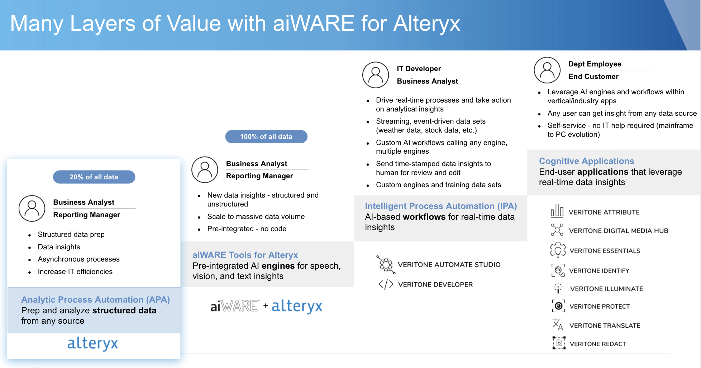
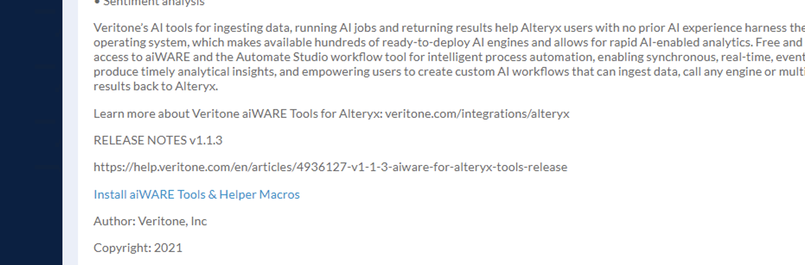
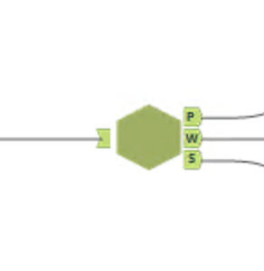
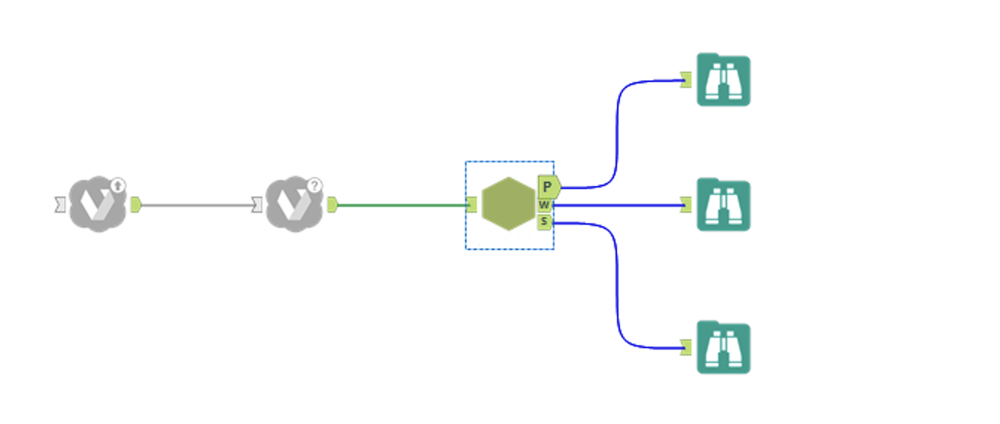
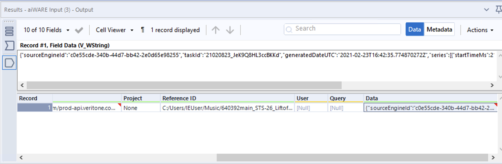
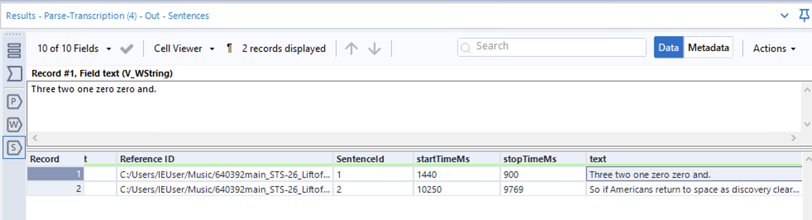

# Unit 3:  Introduction to aiWARE for Alteryx

**Time Required:** 1 hour

**What You Will Learn:** In this session, you will get hands-on experience with the Run aiWARE and aiWARE Input tools. You will learn the basic operation of these plug-ins and learn about configuration options and usage patterns. You will build a simple workflow that uses the aiWARE cloud-based platform to do transcription of a video file to English text. In the process, you’ll become familiar with the data formats produced by Veritone.

### Exercise 1: Install and/or Upgrade to the Latest Veritone Tools.

1. If you have not already done so, go to https://www.veritone.com/devsignup/ and create a Veritone Developer user account.

2. Open Alteryx Designer. Check the top row of tools to see if Veritone’s Run aiWARE and aiWARE Input icons are showing. If so, single-click each icon to see the version info. If you don’t have the tools at all, or if the version info shows a version that may be out of date, proceed to Step 3.

3. Go to [this link](https://gallery.alteryx.com/#!app/Veritone-aiWARE-Tools/5ff7444e0462d71998d0c4be). Go to the bottom of the page and click the link that says **Install aiWARE Tools & Helper Macros**.

After you click the link, a .yxi file will appear in your Downloads folder. Double-click it to install the file. After one or two minutes, a dialog box will appear, saying that the installation has finished:

Click Close and wait to be sure the installation has finished. A second set of files may install. Do not hit Cancel. Wait until the next “Installation successful” message appears. Then hit Close.

> Tip: At no time should you click Cancel. Always wait until a Close button is showing. Click Close (only).

### Exercise 2: Create a workflow and learn to configure the Run aiWARE node.

The Run aiWARE node is the cognitive workhorse of your workflow. It will take unstructured data (such as an audio or video file) and analyze it to extract features of interest, which are formatted in a special JSON format conforming to Veritone’s VTN Standard. We’ll have more to say about the data later. For now, let’s just concentrate on placing a Run aiWARE node on the canvas and getting it configured properly.

1. Create a new Workflow in Alteryx Designer. (File > New Workflow)

2. Drag a Run aiWARE node onto the Alteryx canvas. A Properties panel should appear on the left. (If it does not, single-click the Run aiWARE node to select it.)

3. Select a Destination using the drop-down control (see above).

4. Enter your Veritone Developer user name (e-mail address).

5.   Enter your Veritone Developer password.

6.   Click the LOGIN button.

7.   The Properties panel will change to have an appearance similar to the following:
   

8. Under Select Data, choose Local.

9.   Under Upload Type, select File, then (in the next field) use the file picker to find and designate a local audio or video file (.mp3, .mp4, .m4a, .wav, .mpeg, etc.) for processing.
   
>   NOTE: For this exercise, we decided to use a NASA audio file: https://www.nasa.gov/mp3/591240main_JFKmoonspeech.mp3.
   
10.  Optionally enter  Project Name.

11.  IMPORTANT: Under flow Options, check the Wait for flow to complete checkbox.

12. Checking this checkbox makes the node operate in synchronous fashion, meaning that workflow execution will halt until the node’s processing is 100% complete. Leaving the box unchecked is an advanced option that you should attempt only after you have gained experience with Veritone’s tools.
    
13. Be sure the Flow Options drop-down control shows Standard Flows. (You will select Custom Flows later, when using your own custom-made flows. This is an advanced option.)
    For Flow Type, choose Transcription.

Notice that you have many different category options in this list, representing different kinds of AI-based cognition.

### Exercise 3: Learn to use the aiWARE Input tool.

The aiWARE Input tool fetches data from the Run aiWARE tool (and thus needs to be placed downstream of Run aiWARE). The output from aiWARE Input is a large JSON file, which can be further processed by additional downstream nodes. For now, let’s just go ahead and place the aiWARE Input node on the canvas, wire it up  to Run aiWARE, and configure it.

1. Drag an aiWARE Input node onto the canvas. Place it downstream of your Run aiWARE node. Be sure to connect the nodes so that the output of Run aiWARE goes to the input side of aiWARE Input.

2. With the aiWARE Input node selected (single-click it, if necessary), check the Properties panel (on the left). You will need to log in (as in step 3, 4, 5, and 6 of the previous Exercise). Enter your log-in credentials as necessary.

3. In the Properties panel (after you’ve logged in), you’ll see a drop-down control called Selection Option. Choose Incoming TDO.

“Incoming TDO” means the node will look for a Temporal Data Object coming from the previous node (which is Run aiWARE). The Temporal Data Object, or TDO, is Veritone’s generic GraphQL-based wrapper object for all cognitive data operations. The TDO contains pointers to various resources, such as (typically) the URL for a media file that has been ingested into the Veritone content repository, and/or various other Asset objects associated with the media file. Assets can be of various types; for example, an ingested media file may have an associated thumbnail image. It may also contain transcripts or other feature-extraction artifacts from prior cognitive analyses. (Note: Usually, all the different resources in a TDO are stored by reference, not by value.) You can learn more about TDOs at https://docs.veritone.com/#/apis/jobs-tasks-tdos?id=tdo-temporal-data-object. 

### Exercise 4: Place a Parser on the canvas and connect it to your aiWARE Input object.

The output from cognition is a single large JSON file. Usually, unless you are an advanced user comfortable with custom-parsing JSON objects, you will want to have a Parser macro handle the interpretation of various fields in the JSON data. We can do that with a Parse Transcription macro.

1. Right-click on a spot in your canvas, and wait for the context menu to appear.
2. Select **Insert > Macro...**

3. Find the folder that contains the tools you downloaded earlier. Look for a tool called Parse-Transcription.yxmc. Select it and double-click it. 

4. A new hexagonal icon (node) will appear on your canvas. This is the Parse-Transcription macro. Notice that it has three outputs, labelled P, W, and S, representing Paragraph, Word, and Sentence-based output. 

5. While it’s not required that you use all 3 outputs of the Parse-Transcription node, for this demonstration we will want to go ahead and wire up three individual Browse nodes, one per output. Do that now. Drag three Browse nodes onto the canvas (from your main toolbar). Wire them to the individual outputs of the parser macro.

> NOTE: The macro node requires no configuration. Also, the Browse nodes need no configuration.

6. Your workflow should now look something like this:

### Exercise 5: Run the workflow.

1. Click the Run button at the upper right of the Desktop.

2. Wait for the run to finish. This could take several minutes; the exact time will depend on how large your input file is. In general, you should not be surprised if a one-minute video or audio file requires one to two minutes to process, a ten-minute video requires ten to twenty minutes, etc.

3. When the flow finishes, click on an empty piece of canvas, then look at the messages at the bottom of the Desktop. You should see something similar to this:

Notice the first few messages look to be identical; that’s because the Run aiWARE node, operating in synchronous mode, is polling the underlying cognition engine periodically to see if it’s done. In this case, the engine finished after six poll attempts (20 seconds apart). 

4. Click on the output port of the aiWARE Input node. In the log pane below, scroll to the right to expose the Data column of the output. Click on the Data cell, then click Cell Viewer in the log pane’s actions bar.

Notice when you click on the Data cell, the Cell Viewer shows a single long line of JSON data, starting with { "sourceEngineId":"c0e55cde-." This is the output from the cognition engine. We'll have more to say about this data shortly. 

Unfortunately, Alteryx Desktop viewer doesn't allow you to see the complete cell contents in the above view. And you probably don't want to read the raw JSON anyway. That's why we decided to use the Parser macro and the Browse nodes further downstream.

5. Click the 'S' output port of the Parser macro. Go to the log pane and scroll to the right to expose the text column.

If you single-click the first cell under the text column, and then click the Cell Viewer action button, you will see that the first sentence of the transcription is given as "Three two one zero zero and." (See illustration above.)

Try clicking other output ports and data columns.

### Exercise 6: Find and use the Custom Engine you built in Unit 2

1. If you haven't already done so, go into Alteryx Desktop and open a workflow that contains a Run aiWARE node. Single-click the Run aiWARE node to select it (which will also make its Properties panel appear). 

2. Go to the Properties panel and change the Flow Options dropdown to Custom Flows. When you do this, it has a side effect of making the Select Flow dropdown control repopulate to show custom flows.

3. Click the Custom Flows dropdown and scroll through the choices to see if your Automate flow engine is displayed in the list. (It should be.) Our custom Automate flow called "My Transcription Flow" can be seen in the list, in the screen shot above.
   
>   NOTE: If your custom Automate engine does not show up in the Custom Flows list, check the Flow Details page in Veritone Developer to verify that your flow engine is in the Deployed state. Also, ask your instructor about how to white-list an engine for your Organization.

