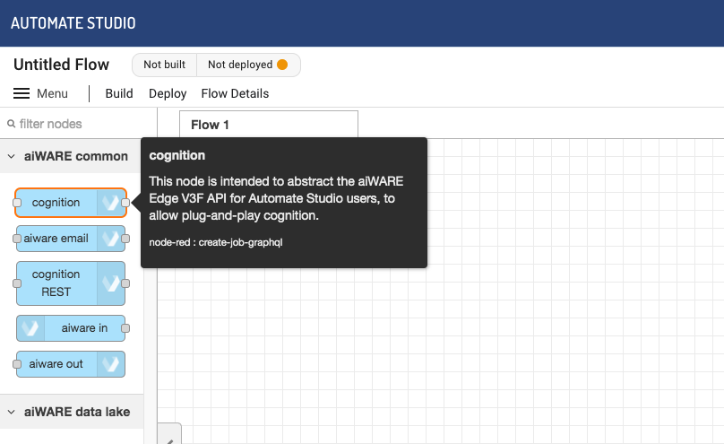
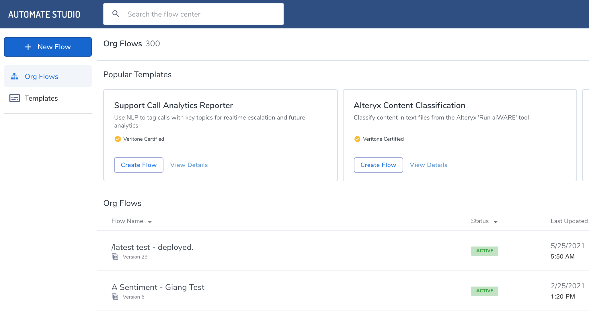
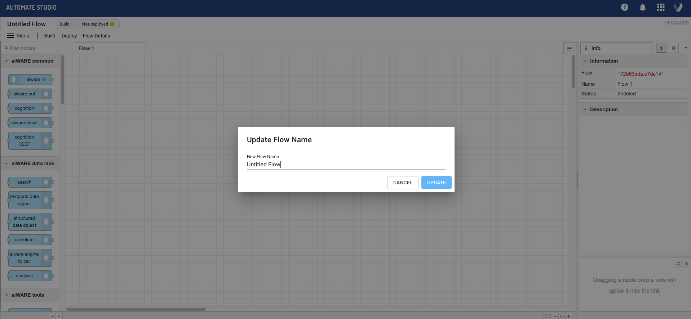
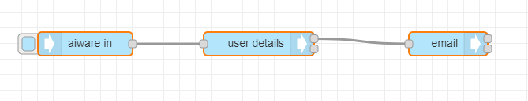
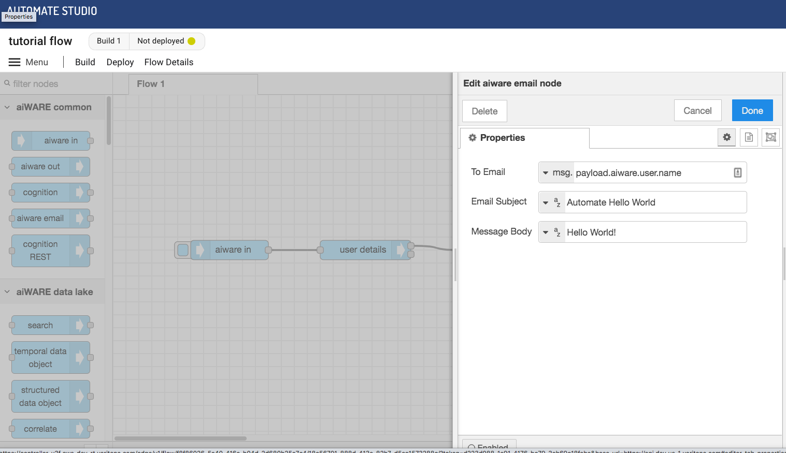

# Getting Started with Automate Studio

**APPROXIMATE READING TIME: 4 MINUTES**

Learn to build your first flow in just a few minutes with this quickstart guide of Automate Studio.

If you haven't already done so, [create your free account](https://www.veritone.com/onboarding/#/signUp?type=automate&lead_source_detail=docs.veritone.com%2Fautomate-studio%2Fgetting-started).

Navigate to [automate.veritone.com](https://automate.veritone.com)

## Step 0: Learn about the Building Blocks

Before we create a flow, let's quickly look at the main concepts you need to know about. This only takes a second!

<ul><li>
                <input type="checkbox" id="list-item-1">
                <label for="list-item-1">Click here to learn about the main conceptsClick here to close this section.</label>
                <ul>
                    <li>

The main concepts you need to know about are:

1. **Nodes:** These are the button-like shapes in the editor that represent discrete steps in your flow.
2. **Wires:** These are the lines that connect the nodes together.
3. **Flow:** This is an overall term for the "graph" (or node-and-wire model) that you define by dropping and connecting your nodes on the canvas.
4. **Subflow:** A group of nodes presented as a node in the palette which can be reused in the main flow.
5. **Message:** The `msg` variable is the highest level variable that is sent from one node to another at flow runtime.

<!-- > **Tip:** Hover your cursor over a node in the node palette, on the left, to learn what a given type of node does.

 -->

</li>                  
</ul>
</li>          
</ul>

## Step 1: Create a Flow

Automate Studio provides an easy drag-and-drop design experience. Creating a flow is a snap. Here's how.

<ul><li>
                <input type="checkbox" id="list-item-2">
                <label for="list-item-2">Click here to learn how to create a flowClick here to close this section.</label>
                <ul>
                    <li>
     

                    

If you haven't already done so, [create your free account](https://www.veritone.com/onboarding/#/signUp?type=automate&lead_source_detail=docs.veritone.com%2Fautomate-studio%2Fgetting-started).

Navigate to [automate.veritone.com](https://automate.veritone.com). In the upper left corner of that page, click the `Add New` button.

After a few seconds, the **Automate Studio Editor** design-time environment will open. When it does, notice that you can single-click the name of your flow (shown in the upper left) to bring up a small dialog that lets you change the name of your to something more meaningful than "Untitled Flow." Try it!

</li>                  
</ul>
</li>          
</ul>

## Step 2: Add Nodes to Your Flow

You've got the basics, now let's start building out our flow &mdash; and test it right in the design-time UI!

<ul><li>
                <input type="checkbox" id="list-item-3">
                <label for="list-item-3">Click here to learn how to build a flowClick here to close this section.</label>
                <ul>
                    <li>
                    

### Nodes Are Easy to Work With

&#9642; To put a node in your graph, just drag any node from the node palette to the canvas, and let go of the mouse.

&#9642; Single-click a node on the canvas to select it. When it is selected, hit the Delete or Backspace key on your keyboard to delete it. 

&#9642; Click and drag from the _output_ endpoint on the right side of a node, to the _input_ endpoint on the left side of a second node, to connect two nodes with a wire.

&#9642; Use Ctrl-Z to Undo any action.

### Build a Simple Flow

In this example, we'll create a simple flow that extracts your user information and sends you an email. 

1\. From the node palette on the left, drag an **aiware in** node, a **user details** node, and an **aiware email** node onto the canvas.

2\. Connect the nodes by dragging out a new wire from the right edge of each node to the left edge of the next node. Your canvas should look something like this:

> Note: Some nodes have two output ports on the right. The top port is for ordinary output, while the bottom port is for error reporting. For now, you needn't worry about the bottom port. As long as the top port is wired, the flow will be functional.

3\. Double-click on the **aiware email** node. Change the  "To Email" field's value by setting the picker to `msg.`, then enter `payload.aiware.user.name` after it. Enter text of your choosing in the "Email Subject" and "Message Body" fields. The Properties pane in the node should look something like this:

4\. Click the blue **Done** button in the upper right part of the Properties pane. The pane goes away.

> A small blue dot will appear along the top edge of the node whose properties you just edited. This dot will disappear in a second or two, after your changes have been auto-saved.

</li>                  
</ul>
</li>          
</ul>

## Step 3 : Test The Flow

Let's test our brand new flow

<ul><li>
                <input type="checkbox" id="list-item-4">
                <label for="list-item-4">Click here to learn how to test your flowClick here to close this section.</label>
                <ul>
                    <li>
                

1\. Click the little _bug_ icon in the information pane, on the right, to enable the display of debug messages.

2\. Click once on the ballot-box square at the left edge of the first node (the node labelled "aiware in"). This runs the flow, from start to finish.

3\. You should see a brief message ("inject.airware-in.success") appear onscreen, and then all three nodes should show an `aiware.success` message underneath. 

4\. You should see a new e-mail in your inbox (at the address you used when you signed up for your Veritone account). 

> If any errors occurred, they will be shown in the Debug pane (on the right).

Congratulations! You just ran your first flow.

</li>                  
</ul>
</li>          
</ul>

</li>                  
</ul>
</li>          
</ul>

## Congratulations!

Congratulations on building and running your first flow engine using Automate Studio.

## Next steps

Now that we have the basics, go ahead and create your first [AI flow](/automate-studio/tutorials/basic/transcription/tutorial)

?> Need help or have a question? Contact us in our [Slack Community.](http://veritonedev.slack.com/)

