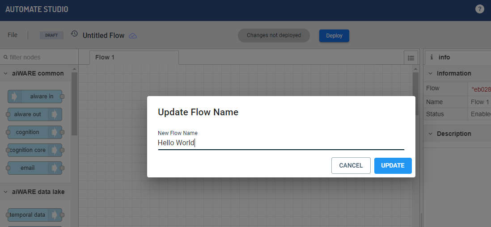
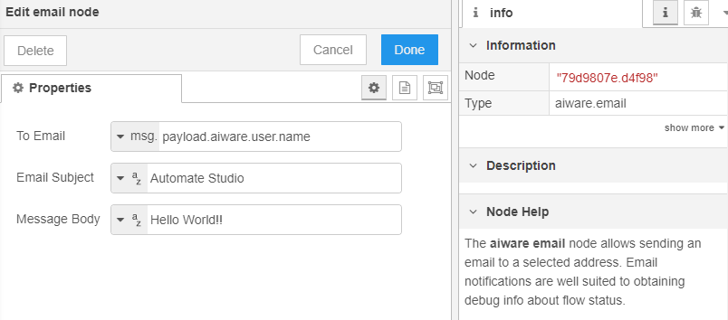

# Getting Started with Automate Studio

**APPROXIMATE READING TIME: 4 MINUTES**

You will learn to quickly build your first flow in just a few minutes with this quickstart guide of Automate Studio. 

## Before you Start

Before you start, if you haven't already done so, [create your free account](https://www.veritone.com/onboarding/#/signUp?type=automate&lead_source_detail=docs.veritone.com%2Fautomate-studio%2Fgetting-started). If you do, then you can start by navigating to [automate.veritone.com](https://automate.veritone.com).

Once you are ready with your Automate Studio login, you can start on creating a flow. However before you create a flow, let's quickly look at the main concepts you need to know about. This only takes a second!

<ul><li>
                <input type="checkbox" id="list-item-1">
                <label for="list-item-1">Click here to learn about the main conceptsClick here to close this section.</label>
                <ul>
                    <li class="inner-content">

The main concepts you would need to know before you create a flow are:

- **Nodes:** These are the button-like shapes in the editor that represent discrete steps in your flow.
- **Wires:** These connect the nodes together.
- **Flow:** This is an overall term for the "graph" (or node-and-wire model) that you define by dropping and connecting your nodes on the canvas.
- **Subflow:** A group of nodes presented as a node in the palette which can be reused in the main flow.
- **Message:** A`msg` variable is the highest level variable that is sent from one node to another at flow runtime.

> **Tip:** Hover your cursor over a node in the node palette, on the left, to learn what a given type of node does.

 

</li>                  
</ul>
</li>          
</ul>

## Step 1: Create a Flow

Automate Studio provides an easy drag-and-drop design experience. Creating a flow is a snap. Here's how.

<ul><li>
                <input type="checkbox" id="list-item-2">
                <label for="list-item-2">Click here to learn how to create a flowClick here to close this section.</label>
                <ul>
                    <li class="inner-content">
​     

​                    

**To create a flow:**

1. Navigate to [automate.veritone.com](https://automate.veritone.com), click on the `Add New` button in the upper left corner of that page.

   

   ​	The **Automate Studio Editor** design-time environment will open.

2. In the editor, click on the name of the flow (shown in the upper left) to change the name of the flow. 

Next, let us start by adding nodes to the  flow.

</li>                  
</ul>
</li>          
</ul>

## Step 2: Add Nodes to Your Flow

You are all ready to start building the flow and then test it right in the design-time UI!

<ul><li>
                <input type="checkbox" id="list-item-3">
                <label for="list-item-3">Click here to learn how to build a flowClick here to close this section.</label>
                <ul>
                    <li class="inner-content">
​                    

### Working with Nodes

It is very easy to work with nodes if you remember these points:

- To add a node, just drag-and-drop it from the node palette to the canvas.

- Click a node to select it. Press Delete or Backspace key on your keyboard to delete it. 

- To connect two nodes with a wire, click and drag from the _output_ endpoint on the right side of a node to the _input_ endpoint on the left side of a second node.

- Press Ctrl+Z to undo any action.

Now, you are ready to build the first flow.

### Build a Simple Flow

In this example, we'll create a simple flow that extracts user information and sends us an email:

1. From the node palette on the left, drag an **aiware in** node, a **user details** node, and an **aiware email** node onto the canvas.

2. Let's connect the nodes by dragging out a new wire from the right edge of each node to the left edge of the next node. You can select the node to view help about the node. 

   Our canvas should look something like this:

   

   > **Note:** Some nodes have two output ports (squares on the node) on the right. The top port is for ordinary output, and the bottom port is for error reporting. For now, you can ignore the bottom port. For this flow, you will use only the top port.

   

3. Double-click on the **aiware email** node. Change the  **To Email** field's value by setting the picker to `msg.`, then enter `payload.aiware.user.name`. Enter the Email Subject and Message Body. 

   The **Properties** pane in the node would look like:

   

4. Click the **Done** button to save your changes. 

> A small blue dot will appear along the top edge of the node whose properties you just edited. This dot indicates that the node is updated and disappear in a second or two after your changes have been auto-saved.

</li>                  
</ul>
</li>          
</ul>

## Step 3 : Test The Flow

Now that you have a flow ready, let us test the flow. 

<ul><li>
                <input type="checkbox" id="list-item-4">
                <label for="list-item-4">Click here to learn how to test your flowClick here to close this section.</label>
                <ul>
                    <li class="inner-content">
​                

**To test the flow:**

1. Click the _bug_ icon in the information pane, on the right, to enable the display of debug messages.

   

   

2. Click on the ballot-box square at the left edge of the aiware.in node to run the flow.

   

   You will see a message ("inject.airware-in.success") appear onscreen, and then all three nodes should show an `aiware.success` message underneath. 

3. You should get an e-mail at the email address associated with your Veritone account. 

> Any errors will be displayed in the Debug pane (on the right).

Congratulations! You just ran your first flow.

</li>                  
</ul>
</li>          
</ul>

</li>                  
</ul>
</li>          
</ul>

Congratulations on building and running your first flow engine using Automate Studio!

> You recommend that you go ahead and create your first [AI flow](/automate-studio/tutorials/basic/transcription/tutorial).
>
> ?> For any questions, contact us in our [Slack Community.](http://veritonedev.slack.com/)

