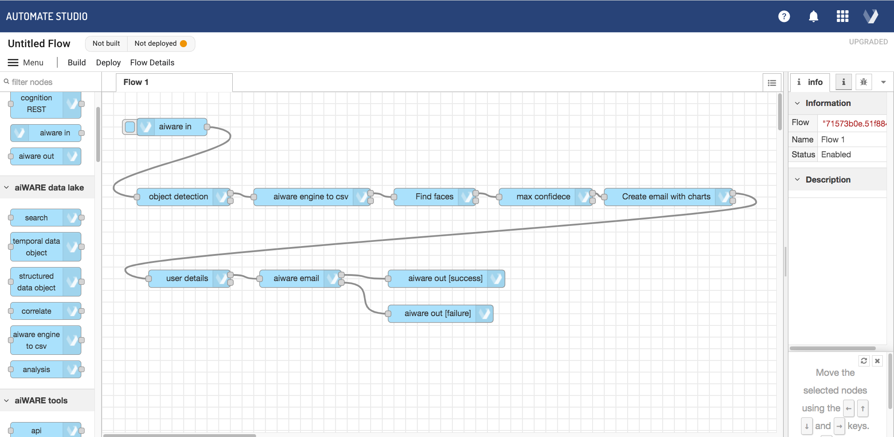
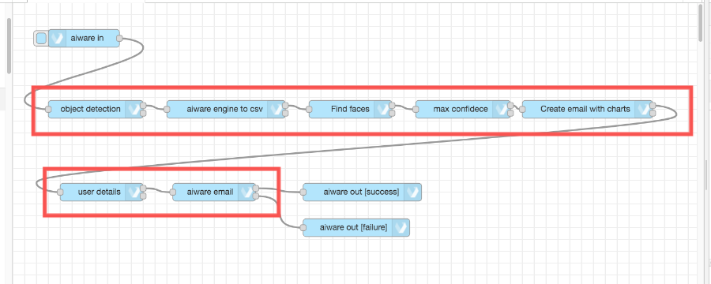
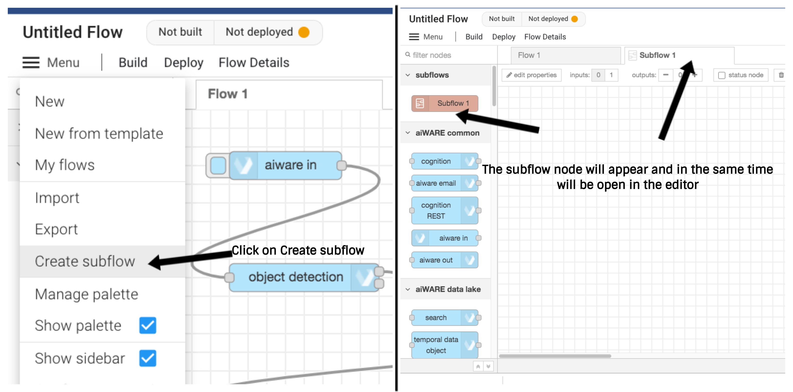
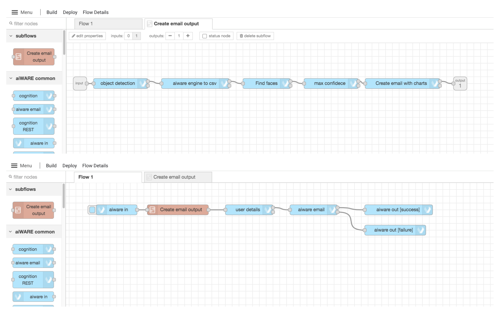

# Subflows

**APPROXIMATE READING TIME: 4 MINUTES**

?>Flow can be as simple as three nodes wired up together. But imagine a complex flow made of twenty, or maybe thirty nodes on your canvas. And all the wires between them... A bit messy, isn't it? Luckily, there is a quick way to organize even the most complex flow by separating it into distinct sections such that each section addresses a separate concern. This can be easily achieved by adding **Subflows** to our flow.

### Overview

- [Create Subflow](#create-subflow)
- [Edit Subflow Properties](#edit-subflow-properties)
- [Organize Your Flow (Expample)](#organize-your-flow)

### Create Subflow

A **Subflow** is a collection of nodes that are collapsed into a single node in the workspace.
They can be used to reduce some visual complexity of a flow or to package up a group of nodes as a reusable flow used in multiple places.

To create a new **Subflow** click on *File -> Create Subflow*

Once created, the **Subflow** is added to the palette of available nodes. Individual instances of the **Subflow** can then be added to the workspace just like any other node.

There are two ways to open a **Subflow**. 
1. Double-click on the **Subflow Node** in the **Node Palette** 
2. Double-click on the **Subflow Node** on the **Canvas**, then click on the *Edit Subflow Template* button.

The **Subflow** will then be opened as a new **Flow Tab** above the canvas.

Once the **Subflow Tab** is selected, any nodes dropped to the canvas will represent a part of that Subflow. 

**Subflow** may have zero or one input, and zero or more outputs. Setup the input and output number using the options in the Subflow taskbar.

The **Input Node** accepts the data from the previous node outside the **Subflow** (the node which Output is wired to the Subflow Input). A **Subflow** that is meant to receive and process data must have the **Input node** as the first node in the chain

The **Output Node(s)** are responsible to proceed the output data to the next node outside the **Subflow**. A **Subflow** that is meant to receive, process, and finally return output data, the **Output Node**  should be the last node in the chain.

### Edit Subflow Properties

To edit the Subflow properties open the Subflow as described in the previous section and click on on the *edit properties* button.
Switch between the three tabs under the *Done* button to edit the Subflow name, description, appearance, and more.

To apply the changes click on the blue *Done* button.

### Organize Your Flow

The following example runs some analysis on _Engine result_ converted to CSV, and sends an email with the results presented as Bar Charts ( It took less than 5 minutes to create this flow. Amazing, isn't it? ). Even though it is not the most complex flow we will see or create, we will use it for the example to keep things simple and straight forward. 

Let us take a look closer and understand what parts this flow is built of.
1. We have the **aiware in** to inject the input data.
2. Next, without going into what the next 5 nodes do low level, we can say that in general they *Create the Email output*
3. Finally, we have the nodes that are responsible to get the user details and send the email. 

Let us create a subflow and try to reduce the complexity of this flow:

A subflow can be created by selecting the ‘Subflow -> Create subflow’ option in the menu. This will create a blank subflow and open it in the workspace.

Now, let's rename the subflow. Click on the edit properties button in the upper left corner of the editor. The properties editor will slide in from the right.
In the `Name` input type "Create email output" and click `Done`

Next, to make the subflow be able to receive input data, locate the `inputs:` option next to the `edit properties` button and click on the `1` button.

Let's add an output as well by clicking once on the `+` (plus) button.

Next, we will go back to the flow and select all the nodes from the second row and 'cut' them with `ctrl` + `x`

Then we go back to the subflow and paste them with `ctrl` +  `v`. Once done, just connect the `input` first node *port*. Then connect the `output` node to the last node *success output*

Now, drag and drop the subflow node to the canvas and wire it to get the input from the `aiware in` node, and provide the output to the `user details` node. 

The final result should be something like the following: 

> More about subfows can be found [here](https://nodered.org/docs/user-guide/editor/workspace/subflows)

