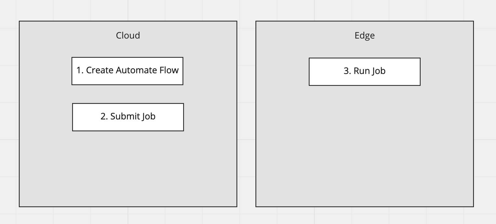
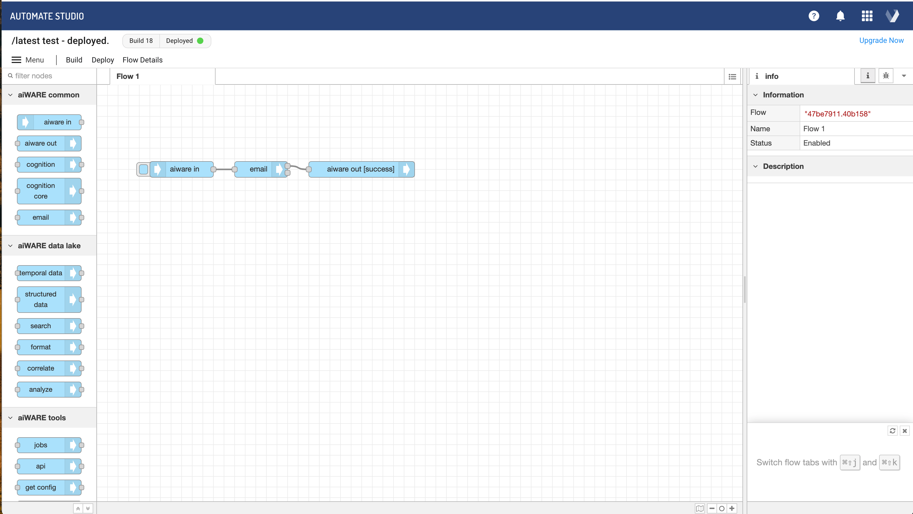
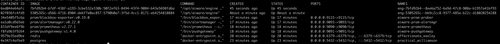

# Build A Remote Automate Studio Flow And Execute It Locally

**APPROXIMATE READING TIME: 5 MINUTES**

### Concept


It is possible to build an automate studio flow in the cloud and run it on the edge. You might want to do this in situations where the 
environment executing the container is in a data center or other secure environment where you need access to services that the cloud cannot or should not access. 


## 1. Create an Automate Studio Flow 


Here is a simple automate studio flow. You can configure the email node to send an email when the job runs to confirm that it works. 

## 2. Get the ID of the flow 

In the URL of the automate studio web application, take a look at the url in the browser. It will look something like this 

```https://automate.veritone.com/flow/7bfd92b4-b7df-438f-a193-3cbe532e330b/c213f896-179d-4f4c-a5c4-4974ed1216c5```

The first `UUID` is the EngineID. In our case, that's `7bfd92b4-b7df-438f-a193-3cbe532e330b`. 

## 3. Create the job and select your local cluster ID 

Here is an example graphql mutation to create the job with your cluster ID and engine ID. 
To get a cluster ID, check out the aiWARE installation Guide

```json
{
  "query": "mutation createJob($digestEngineId: ID) {
      createJob(input: {
        clusterId :\"<Your Cluster ID>\"
        tasks: [
            {
              engineId: $digestEngineId
              ioFolders: [
                {
                  referenceId: \"3af9a383-e050-4a04-ae29-77add011696a\"
                  mode: chunk
                  type: output
                }
              ]
            }
            {
              engineId: \"<Your Engine ID>\"
              ioFolders: [
                {
                  referenceId: \"cda12d5e-c389-4977-b31c-ca92902c6130\"
                  mode: chunk
                  type: input
                }
              ]
              executionPreferences:{
                priority: -98
              }
            }
        ]
        routes: [
          {
            parentIoFolderReferenceId: \"3af9a383-e050-4a04-ae29-77add011696a\"
            childIoFolderReferenceId: \"cda12d5e-c389-4977-b31c-ca92902c6130\"
            options: {}
          }
        ]
      }){
        id
      }
    }",
    "variables":{ 
        "digestEngineId":"<Your Engine ID>"
      }
    }
```

If the job was created successfully, your output should look like this:

```json
{
    "data": {
        "createJob": {
            "id": "xxx_xxx"
        }
    }
}
```

## 4. Confirm the job runs on the selected cluster.

After the job has been created, it will be picked up by your edge. If you're running the edge services locally, you'll see a new docker container spin up with your engine id processing the job 

