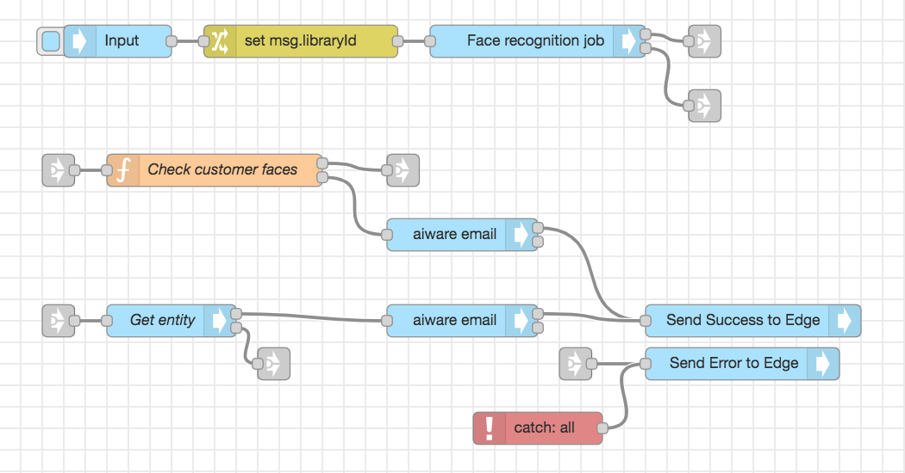
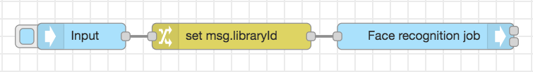
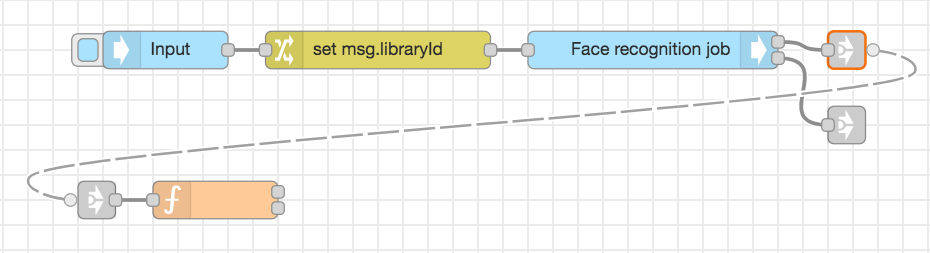
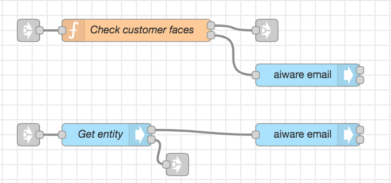
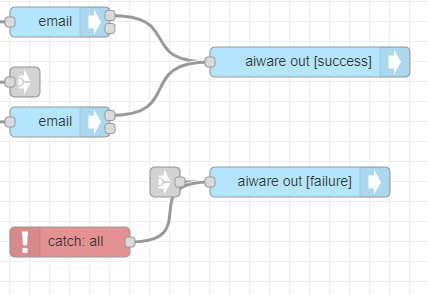
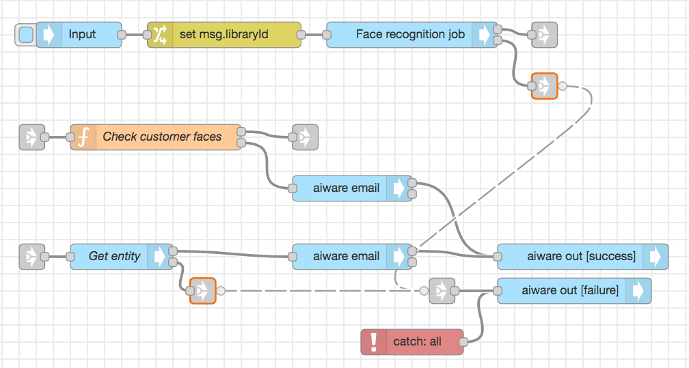
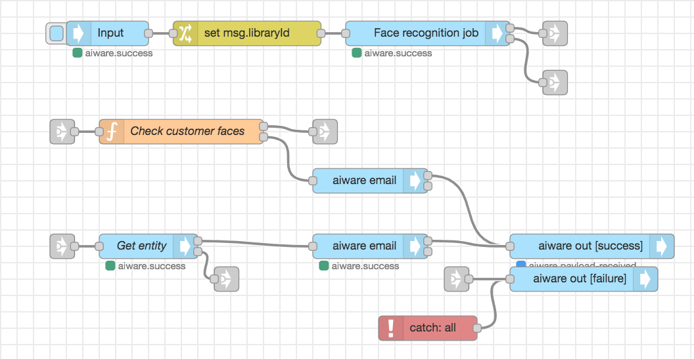

# Customer Recognition by Face Tutorial

**APPROXIMATE READING TIME: 10 MINUTES**

>**Tip** Before getting started, make sure to understand [Variables](/automate-studio/application/README?id=variables) and [Typed Inputs](/automate-studio/working-with-nodes/README?id=typed-inputs)

### Flow Description

The flow uses a face recognition engine to recognize the customer from an existing library. If the customer is not in the library, the flow can call a second flow to add the caller to the library automatically.

### Expected Result



### Steps To Reproduce

#### Step 1: Setup the 'aiware-in' Node

Drag the **aiware in** node from the Node Palette and drop it to the canvas. Double-click on the Node to open the *Node Properties*. 

First, let's rename the Node in the *Name* Input Field, and name it *Input*

Now, let's set up the **Inject Mock Data** Input. 

The Input is made of two main components. The **Input Type** dropdown menu defines the data format of the input field. The **Input Field** is where we put our data.

Click on the Input Type dropdown and select the *{} JSON* option. It lets the node know that the provided data should be passed to the next node in JSON format.

A horizontal menu button will appear on the right edge of the input field. Click on it to open the *JSON editor*

In the JSON editor, paste the following JSON object and click on *Done*

```json
{
    "url": "https://s3.amazonaws.com/static.veritone.com/assets/Obama_15s.mp4",
    "libraryCustomer": "75eb3365-f1c8-402b-b99d-f0e423df4e10"
}
```

Once done, click the *Done* button once again to close the Node Properties and save the changes.

Once the flow is triggered, the JSON will be available in msg.payload.aiwareChunk

<hr/>

#### Step 2: Setup the 'Change' Node

Drag the **Change** node from the Node Palette and drop it next to the previous node. Double-click on the Node to open the *Node Properties*. 

In the *Rules* section, make sure that the *Set* rule is selected.

Set the first **Input Type** to *msg*, then set Input Field value to *libraryId*

Set the second **Input Type** to *msg*, then set Input Field value to *payload.aiwareChunk.libraryCustomer*

Click on the *Done* button to close the Node Properties and save the changes.

Wire the **Input** node to the **Change** node.

<hr/>

#### Step 3: Setup the 'Cognition' Node

Drag the **Cognition - Core** node from the Node Palette and drop it next to the previous node. Once done, wire up the two nodes.

Double-click on the **Cognition - Core** node to open the node properties. 

First, let's rename the Node in the *Name* Input Field, and name it *Face recognition job*

From the *Category* dropdown select the *Facial Detection* option.

Next, from the *Engine* dropdown select the *Face Recognition - A V3* option.

Select the *Customers* library under the *Library* options. 

Scroll down to **Advanced Settings**. 

From the *Cluster* option select the *prd5 - Adhoc Cluster* 

Give the Job a high priority by selecting the *Very High* option from the *Job Priority* dropdown.

Check the *Wait for results* checkbox to proceed to the next node **only** when the job is done and the results are generated. 

Once done, click on the *Done* button to close the node properties and save the settings.

?>At this stage, your flow should look something like this: 

<hr/>

#### Step 4: Setup the 'Function' Node

Drag the **Function** node from the Node Palette and drop it few lines below the **Input** node.

Now, before add any javascript to this node, let's add some **link** nodes the canvas.

Add two **link out** nodes from the node palette and add them right after the **Face recognition job** node one above the other.

Link the *Success output* and the *Error output* to the link nodes.

Add a **link-in** node and put it right in front the **Function** node we added previousely. 

Now, to link the *Succcess output** from the **Face recognition job** node to the **Function** node, wire the **link-out** node from the **Face recognition job** node to the **link-in** node that is wired to the **Function** node. 

Don't worry about the second **link-out** node for now.

?>At this stage, your flow should look something like this: 

Double-click on the **Function** node to open the node properties. 

Change the node name to *Check customer faces* 

The following code will iterate trough the *Engine result* and look for *known faces* (those that have entity ID)

Then it will look for the result with the highest confidence rate and return it to the next node

Copy and paste the following code to the **Function** node

```javascript
let faces = [];
if (msg.payload.aiware && msg.payload.aiware.engineResult.series && msg.payload.aiware.engineResult.series.length > 0) {
 faces = msg.payload.aiware.engineResult.series;
} else {
 faces = [];
}

let knownFaces = faces.filter(face => {
 if (face && face.entityId) {
 return face;
 }
});

if(knownFaces.length > 0) {
    let Indexconfidence = 0;
    let maxconfidence = knownFaces[0].object.confidence;
    for(let i = 1; i < knownFaces.length - 1; i++){
     if (maxconfidence < knownFaces[i].object.confidence) {
        maxconfidence = knownFaces[i].object.confidence;
        Indexconfidence = i;
        }
    }
    
    let faceCustomer = knownFaces[Indexconfidence];
    msg.confidence = faceCustomer.object.confidence.toFixed(2);
    msg.payload = {
     "faces": faceCustomer,
    };
    return [msg, null];
} else {
    msg.payload = "Couldn't find a match";
    return [null, msg];
}
```
>When array is returned from the function node, like in our case, make sure to create the same number of node outputs as the number of the elements in the returned array. The first element in the output will be returned from the upper node output and so on respectively. You can add outputs by setting the **Outputs** field to higher number.

Once done, click on the blue *Done* button to close the node properties and save the changes

In case of a match, the result will be returned from the **upper output**. Otherwise a ``Couldn't find a match`` message will be returned from the **lower output**.

#### Step 5: Setup the 'Api' Node

Drag the **Api** node from the Node Palette and drop it few lines below the **Function** node.

Wire the **upper output** of the **Function** node with the **Api** node using the **link out** and **link in** nodes like we did in the previous steps.

Double-click on the **Api** node to open the node properties.

Rename the node to *Get entity*.

Select the *mustache* syntax from the dropdow menu.

Paste the following GraphQL query to the query input area

```graphql
query{
  entity(id:"{{payload.faces.entityId}}"){
    id
    name
  }
}
```
>Using the mustache syntax we provide the entity ID dynamicaly from the `msg` object

Once done, click the *Done* button to close the node properties and save the changes.

Add a **link out** node and wire it to the **error output** (the lower one) of the **Api** node.

<hr/>


#### Step 5: Setup the 'aiware email' Nodes

Add two **aiware email** nodes to the canvas and wire them to the **Function** node and the **Api** node just like in the image below


The upper one will send an email in case we couldn't find a match to inform the recipient about it.

The second one will send and email in case of a match and will receive its payload from the **Api** node.

Open the upper node properties.

For the *To Email* Input, choose type of string, and type the recipient email address (or addresses separeted by a comma).

> You can also use the **user details** node to dynamicaly set up the email address. Click [here](/automate-studio/tutorials/basic/transcription?id=step-3-setup-the-39user-details39-node) to learn how

For *Email Subject* Input, choose the string type as well. In the Input Field, paste the following: ``Automate: Customer Recognition by Face``.

For *Message Body* Input, choose the **msg** type. Our message is contained in the *payload* property of the **msg** object. Thus, we will type *payload* in the Input Field.

Once done, click the *Done* button to close the node properties and save the changes.

Open the second node properties.

The settings are basically the same as for the previous **aiware email** node. The only difference is the **Message Body** Input.

Choose **expression** as the input type and paste the following expression:

```json
"Dear user,<br><br>Customer is " & msg.payload.entity.name & " with confidence: " & 100*$number(msg.confidence) & "%.<br><br>Thanks"
```
Once done, click the *Done* button to close the node properties and save the changes.


#### Step 6: Setup the output nodes and error handling

Add two **aiware out** nodes, a **catch** node, and a **link in** node and wire them up as in the image below


Open the upper **aiware out** node properties and rename it to *Send Success To Edge*

Set the output status to *Success*

Open the second **aiware out** node properties and rename it to *Send Error To Edge*

Set the output status to *Failure*

Now, wire up the **link out** nodes for **error output** from the **Cognition** node and the **Api** node to the **link in** node for the **Send Error to Edge** node link in the image below:



#### Step 6: Run your flow

If you followed the steps, your flow should look something like the flow from the beginning of this tutorial. Have a quick look.

If so, go to the **aiware in** node and click on the **Inject** button (the sky-blue square on the left side of the node).

You can follow the job progress and debug your node from the **Debug** window by clicking on the *Bug* icon on the sidebar.

Within a few minutes, the flow will complete and you will be able to see the result in the email you signed up with.

Your screen should look something like this 


>Learn how to run your Flow via [HTTP API](/automate-studio/working-with-flows/README?id=run-via-http)