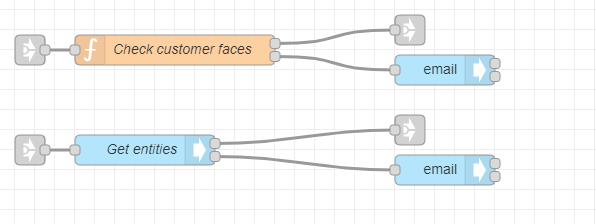
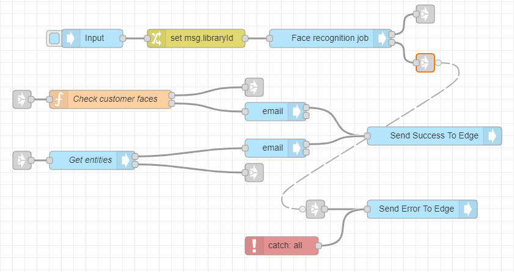

# Customer Recognition by Face Tutorial

**APPROXIMATE READING TIME: 10 MINUTES**

>**Tip** Before getting started, make sure to understand [Variables](/automate-studio/application/README?id=variables) and [Typed Inputs](/automate-studio/working-with-nodes/README?id=typed-inputs)

## Flow Description

In this tutorial, we will understand how we can create a flow that uses a facial recognition engine to recognize a customer from an existing library. If the customer is not in the library, then the flow calls adds the customer to the library automatically.

## Expected Result

At the end of the tutorial, we would have created a flow that looks like:


## Steps To Reproduce

### Step 1: Setup the 'aiware-in' Node

We will first add the aiware-in node and set it up to accept a JSON object.

**To set up the aiware-in node:**

1. Add the **aiware-in** node from the Node Palette and drop it to the canvas. Double-click on the Node to open the *Node Properties*. 

2. Click on the *Output format* dropdown menu, and select the *Simple* option.

3. Now, let's set up the **Manually Inject Data** area. 

   1. Click on the **Sample Input** dropdown and select the *Default* option. Optionally, you can select an existing sample input or create a new one.

   2. In the Edit JSON tab, paste the following JSON object and click on *Done*.

      ```json
      {
          "url": "https://s3.amazonaws.com/static.veritone.com/assets/Obama_15s.mp4",
          "libraryCustomer": "75eb3365-f1c8-402b-b99d-f0e423df4e10"
      }
      ```

      

   3. Once done, click the *Done* button once again to close the Node Properties and save the changes.

Once the flow is triggered, the JSON will be available in msg.payload.aiwareChunk


<hr/>

### Step 2: Setup the *Change* Node

Next, we will configure the Change node that would 

1. Drag the **Change** node from the Node Palette and drop it next to the previous node. Double-click on the Node to open the *Node Properties*. 
2. In the *Rules* section, make sure that the *Set* rule is selected.
   1. Set the first **Input Type** to *msg*, then set Input Field value to *libraryId*
   2. Set the second **Input Type** to *msg*, then set Input Field value to *payload.aiwareChunk.libraryCustomer*
   3. Click on the *Done* button to close the Node Properties and save the changes.
3. Wire the **Input** node to the **Change** node.

<hr/>

### Step 3: Setup the *Cognition* Node

Next, we will configure the core cognition node that perform the facial recognition.

**To set up the cognition node:**

1. Drag the **Cognition - Core** node from the Node Palette and drop it next to the previous node. Once done, wire up the two nodes.
2. Double-click on the **Cognition - Core** node to open the node properties. 
3. Rename the node to *Face recognition job*.
4. From the *Category* dropdown select the *Facial Detection* option.
5. Next, from the *Engine* dropdown select the *Face Recognition - A V3* option and select the *Customers* library under the *Library* options. 
6. Scroll down to **Advanced Settings**, and from the *Cluster* option select the *prd5 - Adhoc Cluster*.
7. Give the Job a high priority by selecting the *Very High* option from the *Job Priority* dropdown.
8. Check the *Wait for results* checkbox. This pauses the flow and proceeds to the next node **only** when the job is done and the results are generated. 
9. Once done, click on the *Done* button to close the node properties and save the settings.


?>At this stage, your flow should look something like this: 

<hr/>

### Step 4: Setup the *Function* Node

We will next add a function node that does a little custom processing using a JavaScript code.

**To set up the function node:**

1. Drag the **Function** node from the Node Palette and drop it below the **Input** node. Now, before add any javascript to this node, let's add some **link** nodes the canvas.

2. Add two **link out** nodes from the node palette and add them right after the **Face recognition job** node one above the other.

3. Link the *Success output* and the *Error output* to the link nodes.

4. Add a **link-in** node and put it right in front the **Function** node we added previously. 

5. Now, lets link the *Succcess output** from the **Face recognition job** node to the **Function** node. We will wire the **link-out** node from the **Face recognition job** node to the **link-in** node that is wired to the **Function** node. 

   ?>At this stage, your flow should look something like this: 

   

6. Double-click on the **Function** node to open the node properties and rename it to *Check customer faces*. 

7. Copy the below code and paste it in the **Function** node.

   ```javascript
   let faces = [];
   if (msg.payload.aiware && msg.payload.aiware.engineResult.series && msg.payload.aiware.engineResult.series.length > 0) {
    faces = msg.payload.aiware.engineResult.series;
   } else {
    faces = [];
   }
   
   let knownFaces = faces.filter(face => {
    if (face && face.entityId) {
    return face;
    }
   });
   
   if(knownFaces.length > 0) {
       let Indexconfidence = 0;
       let maxconfidence = knownFaces[0].object.confidence;
       for(let i = 1; i < knownFaces.length - 1; i++){
        if (maxconfidence < knownFaces[i].object.confidence) {
           maxconfidence = knownFaces[i].object.confidence;
           Indexconfidence = i;
           }
       }
       
       let faceCustomer = knownFaces[Indexconfidence];
       msg.confidence = faceCustomer.object.confidence.toFixed(2);
       msg.payload = {
        "faces": faceCustomer,
       };
       return [msg, null];
   } else {
       msg.payload = "Couldn't find a match";
       return [null, msg];
   }
   ```

   > When array is returned from the function node, like in our case, make sure to create the same number of node outputs as the number of the elements in the returned array. The first element in the output will be returned from the upper node output and so on respectively. You can add outputs by setting the **Outputs** field to higher number.

   This code iterates through the *Engine result* and looks for *known faces* (those that have entity ID). Then it will look for the result with the highest confidence rate and return it to the next node

8. Scroll down and set the **Outputs** to 2 - one for success and one for failure.

9. Once done, click on the blue *Done* button to close the node properties and save the changes

10. In case of a match, the result will be returned from the **upper output**. Otherwise, a ``Couldn't find a match`` message will be returned from the **lower output**.

<hr/>

### Step 5: Setup the API Node

We will next configure the API node that lets us run GraphQL queries.

**To set up the API node:**

1. Drag the **api** node from the Node Palette and drop it few lines below the **Function** node.

2. Wire the success output of the **Function** node with the **api** node using the **link out** and **link in** nodes like we did in the previous steps.

3. Double-click on the **Api** node to open the node properties.

4. Rename the node to *Get entity*.

5. Select the *mustache* syntax from the dropdown menu and paste the following GraphQL query to the query input area.

   

   ```graphql
   query{
     entity(id:"{{payload.faces.entityId}}"){
       id
       name
     }
   }
   ```

   > Using the mustache syntax we provide the entity ID dynamicaly from the `msg` object

6. Click the *Done* button to close the node properties and save the changes.

7. Add a **link out** node and wire it to the **error output** (the lower one) of the **Api** node.

<hr/>

### Step 5: Setup the *aiware email* Nodes

**To set up the email nodes:**

1. Drag two **email** node from the Node Palette and wire them to the **Function** node and the **Api** node just like in the image below.

   

   

   The upper email node sends an email when no match is found, and the second node sends an email when there is a match and will receive its payload from the **Api** node.

2. Open the upper node properties.

   1. For the *To Email* Input, choose type of string, and type the recipient email address (or addresses separated by a comma).

      > You can also use the **user details** node to dynamically set up the email address. Click [here](/automate-studio/tutorials/basic/transcription?id=step-3-setup-the-39user-details39-node) to learn how.

   2. For *Email Subject* Input, choose the string type as well. In the Input Field, paste the following: ``Automate: Customer Recognition by Face``.

   3. For *Message Body* Input, choose the **msg** type. Our message is contained in the *payload* property of the **msg** object. Thus, we will type *payload* in the Input Field.

   4. Once done, click the *Done* button to close the node properties and save the changes.

3. Open the second node properties. The settings are basically the same as for the previous **aiware email** node. The only difference is the **Message Body** Input.

4. Choose **expression** as the input type and paste the following expression:

   ```json
   "Dear user,<br><br>Customer is " & msg.payload.entity.name & " with confidence: " & 100*$number(msg.confidence) & "%.<br><br>Thanks"
   ```

   

5. Once done, click the *Done* button to close the node properties and save the changes.

   <hr/>

### Step 6: Setup the output nodes and error handling

Let us configure the flow to catch errors and help us debug errors. 

**To catch and debug errors:**

1. Add two **aiware out** nodes, a **catch** node, and a **link in** node and wire them up as in the image below:
   

   

2. Open the upper **aiware out** node properties, rename it to *Send Success To Edge*, and set the output status to *Success*.

3. Open the second **aiware out** node properties, rename it to *Send Error To Edge*, and set the output status to *Failure*.

4. Now, wire up the **link out** nodes for **error output** from the **Cognition** node and the **Api** node to the **link in** node for the **Send Error to Edge** node link in the image below:



<hr/>

### Step 6: Run your flow

If you followed the steps, your flow should look something like the flow from the beginning of this tutorial. Have a quick look.

If so, go to the **aiware in** node and click on the **Inject** button (the sky-blue square on the left side of the node). You can follow the job progress and debug your node from the **Debug** window by clicking on the *Bug* icon on the sidebar.

Within a few minutes, the flow will complete and you will be able to see the result in the email you signed up with.


>Learn how to run your Flow via [HTTP API](/automate-studio/working-with-flows/README?id=run-via-http)