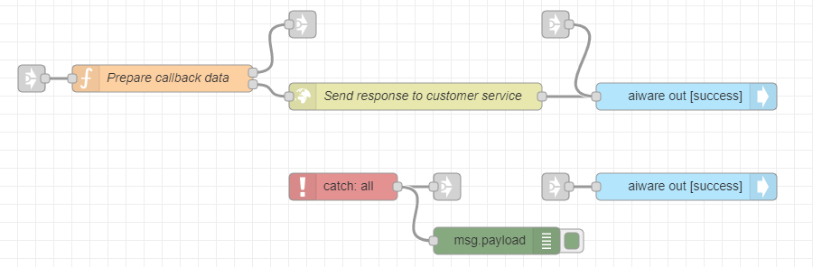

# Detection of Negative Social Media Posts Tutorial

**APPROXIMATE READING TIME: 10 MINUTES**

>**Tip** Before getting started, make sure to understand [Variables](/automate-studio/application/README?id=variables) and [Typed Inputs](/automate-studio/working-with-nodes/README?id=typed-inputs)

## Flow Description

In this tutorial, you will create a flow that analyzes the sentiment of social streams, emails, and text messages. When a post or a message falls below a certain sentiment threshold, the flow will send an email notification so that the issue can be escalated and addressed.

## Expected Result

At the end of the tutorial, you would have created a flow that looks like:


## Steps To Reproduce

#### Step 1: Set up the aiware-in Node

You will first add the aiware-in node and set it up to accept a JSON object.

**To set up the aiware-in node:**

1. Add the **aiware-in** node from the Node Palette and drop it to the canvas. Double-click on the Node to open the *Node Properties*. 

2. Click on the *Output format* dropdown menu, and select the *Simple* option.

3. Now, let's set up the **Manually Inject Data** area. 

   1. Click on the **Sample Input** dropdown and select the *Default* option. Optionally, you can select an existing sample input or create a new one.

   2. In the Edit JSON tab, paste the following JSON object and click on *Done*.

      ```json
      {
          "url": "http://s3.us-east-1.amazonaws.com/static.veritone.com/assets/negative.txt",
          "callbackUrl": "https://abc.com/", // for training purposes, you can create a free online http post bin and provide the URL here.
          "threshold": "0.5"
      }
      ```

      

   3. Once done, click the *Done* button once again to close the Node Properties and save the changes.

Once the flow is triggered, the JSON will be available in `msg.payload.aiwareChunk`

<hr/>

#### Step 2: Set up the first Function Node

You will next add a function node that does a little custom processing using a JavaScript code.

**To set up the function node:**

1. Drag the **Function** node from the Node Palette and drop it next to the **Input** node. 

2. Next, wire up the two nodes. The **Function** node will store some data in the **flow** variable. The **flow** variable is available to all nodes in the flow and does not getting overridden by changes made on the **msg** object.

3. Double-click on the **Function** node to open the node properties and rename it to *Set context*.

4. Copy the below code and paste it in the **Function** node. This code stores the *callbackUrl* and *threshold* variables to the **flow** variable.

   ```javascript
   let callbackUrl = msg.payload.aiwareChunk.callbackUrl;
   
   let threshold = msg.payload.aiwareChunk.threshold;
   
   flow.set('callbackUrl', callbackUrl);
   
   flow.set('threshold', threshold);
   
   return msg;
   ```

   

5. Once done, click on the *Done* button to close the Node Properties and save the changes.

<hr/>

#### Step 3: Set up the *Cognition* node

Next, you will configure the core cognition node that perform the facial recognition.

**To set up the cognition node:**

1. Drag the **Cognition - Core** node from the Node Palette and drop it next to the function node. Once done, wire up the two nodes.
2. Double-click on the **Cognition - Core** node to open the node properties, and rename the node to *Sentiment job*.
3. From the *Category* dropdown select the *Sentiment* option and from the *Engine* dropdown select the *Sentiment - G V3* option. 
4. Scroll down to **Advanced Settings**, and from the *Cluster* option select the *prd5 - Adhoc Cluster*.
5. Give the Job a high priority by selecting the *Very High* option from the *Job Priority* dropdown.
6. Check the *Wait for results* checkbox. This pauses the flow and proceeds to the next node **only** when the job is done and the results are generated. 
7. Once done, click on the *Done* button to close the node properties and save the settings.
8. Add a **link out** node from the Node Palette and place it just below the **Cognition** node. 
9. Wire the **error output** from the **Cognition** node to the **link out** node. 

Your flow should look like this:


<hr/>

#### Step 4: Set up the User Details node

Next, you will get the user details so that you can use it to send the email.

**To set up the user details node:**

1. Drag the **User Details** node from the Node Palette and drop it next to the previous node.

   The previous node is the **Cognition - Core** Node. As you can see it has two outputs. The upper grey square on the right side of the node represents the *Success* output. The grey square below represents the *Failure* or *Error* output. 

2. Wire the *Success output* from the **Cognition - Core** node to the *input port* of the **User details** Node. 

3. The **User Details** node doesn't need any special settings. It accepts *Username* and *Password* as inputs in the Node's properties. If not provided it will get the user details of the logged-in user by default.

4. You can view the user details in the **msg** object under **.payload.aiware.user**. The logged-in user email will be available under the **name** property in msg.payload.aiware.user. The full path to the logged-in user email is **msg.payload.aiware.user.name**.

5. Add a **link out** node and wire it to the **error output** of the **User Details** node. 

<hr/>


#### Step 5: Setup the Email Node

**To set up the email node:**

1. Drag the **email** node from the Node Palette.

2. Wire the success output from the **User Details** node to the **aiware email** node.

3. Double-click on the **email** Node to open the node properties.

4. Setup the properties in the following way:

   - **To Email**: Click on the *Input Type* dropdown and select the **msg.** type. This means that Node will look for the email in the **msg** object
     In the Input Field, paste the following path: **payload.aiware.user.name** . 
   - **Email Subject**: Click on the *Input Type* dropdown and select the **string** type. This means that Node will take the actual value provided in the Input Field as a string. In the Input Field, paste the 'Notification: Escalation of negative from customer'.
   - **Email Body**: Click on the *Input Type* dropdown and select the **expression** type. Using the expression type you will be able to provide values from the **msg** object to your email body directly in the node. Click on the horizontal menu button on the right edge of the Input.

   Paste the following expression. Once done, click on the *Done* button to close the editor, and then once again to close the Node Properties and save the changes:

   ```json
   "Hello, <br>Welcome to Veritone and Automate Studio! <br><br> Here is your results:" & payload.aiware.tdoId & "<br><br> Basic Engine Output: "&"<br>Positive value:"& payload.aiware.engineResult.sentiment.positiveValue &"<br>Negative value:"& payload.aiware.engineResult.sentiment.negativeValue  
   ```

   

5. Once done, click the *Done* button to close the Node Properties and save the changes.

6. Add a **link out** node and wire it to the **success output** of the **aiware email** node.

7. Add another **link out** node and wire it to the **error output** of the **aiware email** node. For now, we will leave it as is.

   

?> **Summary: If you followed the steps correctly, your flow should look something like the image below** 

<hr/>

#### Step 6: Setup the second Function node 

You will next add a function node to analyze the received *Engine Result* and prepare the callback data.

**To set up the function node:**

1. Drag the **Function** node from the Node Palette and drop it below the **Input** node. 

2. Add a **link in** node and wire it to the **Function** node port. Then wire the **link out** node which is wired to the **success output** of the **aiware email** node to the **link in** node you have just added.

3. Double-click on the **Function** node to open the node properties and rename it to *Prepare callback data*. We will add some javascript code to analyze the **Sentiment** result from the **Cognition** node. If the overall input text is negative, which means that the sentiment negative value is higher than the provided threshold, then we will prepare an http post to inform about the issue by sending it to the provided **callbackUrl**. Otherwise, the flow will end running and will send a success notification to **edge** 

4. Copy the below code and paste it in the **Function** node. This code stores the *callbackUrl* and *threshold* variables to the **flow** variable.

   ```javascript
   msg.headers = {};
   
   msg.headers['Content-Type'] = 'application/json'
   
   let callbackUrl = flow.get('callbackUrl')
   
   let threshold = flow.get('threshold')
   
   let postId = Math.random().toString().substring(3,23)
   
   msg.sentiment = msg.payload.aiware.engineResult.sentiment;
   
   if(msg.sentiment.negativeValue > threshold)
       msg.isNegative = true
   else
       msg.isNegative = false
       
   
   if( msg.isNegative ){
       
       msg.url = callbackUrl
   
       msg.payload = {
           "postId": postId,
           "positiveValue": msg.sentiment.positiveValue * 100,
           "negativeValue": msg.sentiment.negativeValue * 100,
           "isNegative": msg.isNegative
       }
       
       return [null, msg];
       
   } else {
       
       return [msg, null];
       
   }
   ```

   > When an array is returned from the function node, like in our case, make sure to create the same number of node outputs as the number of the elements in the returned array. The first element in the output will be returned from the upper node output and so on respectively. You can add outputs by setting the **Outputs** field to a higher number.

5. Once done, click on the *Done* button to close the Node Properties and save the changes.

6. Add a **link out** node and wire it to the upper output of the **Function** node. 

<hr/>

#### Step 7: Setup the http request node

The **http request** node is a part of **Automate Studio** and you can use it to perform http post request to the desired endpoint.

**To set up the http request node:**

1. Drag the **http node** node from the Node Palette, and wire the success output from the **Function** node to the **http node** port.
2. Double-click on the node to open the Node Properties dialog.
3. Set the **Method** to *POST*. The **URL** Input Field will remain empty. This is because we provide the *URL* via **msg.url**. In case this field is left empty, the node will take the mentioned value as the *URL* for the http request.
4. Check the *Enable connection keep-alive* box.
5. Set the **Return** option to *UTF-8 string*.
6. Set the node name to *Send response to customer service*.
7. Once done, click on the *Done* button to close the Node Properties and save the changes.

<hr/>

#### Step 8: Add output nodes, error handler and debugger

Let's add add output nodes to the flow - one for success and the other for failure.

**To add output nodes:**

1. Add two **aiware out** nodes, a **catch** node and a **debug** node, and wire up everything just like in the image below. Ensure you add the **link nodes**.

   


   

2. Rename the first **aiware out** to *Send Success To Edge*, and the output status to *Success*.

3. Rename the second **aiware out** node to *Send Error To Edge*, and the output status to *Failure*.

4. Wire the **link out** from the **Function** node to the **link in** of the **Send Success To Edge**.

   

5. Next, wire up the **link out** nodes for **error output** from the **Cognition** node, the **user details** and the **aiware email** node to the **link in** node for the **Send Error to Edge** node.

6. Open the **Debug** (msg) node properties and set the output to *complete msg object*. This will help us debug any potential error caught by the **catch** node.

The following screenshot is presenting the full flow with the link nodes selected. Go ahead and verify that your flow looks the same.


<hr/>

#### Step 9: Run your flow

If you followed the steps, your flow should look something like the flow from the beginning of this tutorial. Have a quick look.

If so, go to the **aiware in** node and click on the **Inject** button (the sky-blue square on the left side of the node). You can follow the job progress and debug your node from the **Debug** window by clicking on the *Bug* icon on the sidebar.

Within a few minutes, the flow will complete and you will be able to see the result in the email you signed up with. If you provided a valid **callbackUrl**, then you should receive a post request and be able to see it in your endpoint.


>Learn how to run your Flow via [HTTP API](/automate-studio/working-with-flows/README?id=run-via-http)