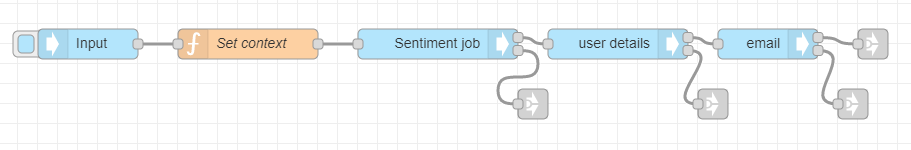

# Detection of Negative Social Media Posts Tutorial

**APPROXIMATE READING TIME: 10 MINUTES**

>**Tip** Before getting started, make sure to understand [Variables](/automate-studio/application/README?id=variables) and [Typed Inputs](/automate-studio/working-with-nodes/README?id=typed-inputs)

### Flow Description

The flow analyzes the sentiment of social streams, emails, & text messages. When a post or a message falls below a certain sentiment threshold, the flow will send a notification to a user-defined web address, so that the issue can be escalated and addressed.

### Expected Result


### Steps To Reproduce

#### Step 1: Set up the aiware-in Node

Drag the **aiware in** node from the Node Palette and drop it to the canvas. Double-click on the Node to open the *Node Properties*. 

First, let's rename the Node in the *Name* Input Field, and name it *Input*

Now, let's set up the **Inject Mock Data** Input. 

The Input is made of two main components. The **Input Type** dropdown menu defines the data format of the input field. The **Input Field** is where we put our data.

Click on the Input Type dropdown and select the *{} JSON* option. It lets the node know that the provided data should be passed to the next node in JSON format.

A horizontal menu button will appear on the right edge of the input field. Click on it to open the *JSON editor*

In the JSON editor, paste the following JSON object and click on *Done*

```json
{
    "url": "http://s3.us-east-1.amazonaws.com/static.veritone.com/assets/negative.txt",
    "callbackUrl": "https://abc.com/", // for training purposes, you can create a free online http post bin and provide the URL here.
    "threshold": "0.5"
}
```

Once done, click the *Done* button once again to close the Node Properties and save the changes.

Once the flow is triggered, the JSON will be available in msg.payload.aiwareChunk

<hr/>

#### Step 2: Set up the first Function Node

Drag the **Function** node from the Node Palette and drop it next to the previous node. Once done, wire up the two nodes.

We will use this **Function** node to store some data in the **flow** variable.

The **flow** variable is available to all nodes in the flow and does not getting overriden by changes made on the **msg** object.

Double-click on the **Function** node to open the Node Properties.

Let's rename the flow and name it *Set context*.

The following code will store the *callbackUrl* and *threshold* variables to the **flow** variable.

```javascript
let callbackUrl = msg.payload.aiwareChunk.callbackUrl;

let threshold = msg.payload.aiwareChunk.threshold;

flow.set('callbackUrl', callbackUrl);

flow.set('threshold', threshold)

return msg;
```

Once done, click on the *Done* button to close the Node Properties and save the changes.

<hr/>

#### Step 3: Set up the Cognition node

Drag the **Cognition - Core** node from the Node Palette and drop it next to the previous node. Once done, wire up the two nodes.

Double-click on the **Cognition - Core** node to open the node properties. 

First, let's rename the Node in the *Name* Input Field, and name it *Sentiment job*

From the *Category* dropdown select the *Sentiment* option.

Next, from the *Engine* dropdown select the *Sentiment - G V3* option.

Scroll down to **Advanced Settings**. 

From the *Cluster* option select the *prd5 - Adhoc Cluster* 

Give the Job a high priority by selecting the *Very High* option from the *Job Priority* dropdown.

Check the *Wait for results* checkbox to proceed to the next node **only** when the job is done and the results are generated. 

Once done, click on the *Done* button to close the node properties and save the settings.

Add a **link out** node from the Node Palette and place it just below the **Cognition** node. 

Wire the **error output** from the **Cognition** node to the **link out** node. For now, we will leave it as is.

<hr/>

#### Step 4: Set up the User Details node

Drag the **User Details** node from the Node Palette and drop it next to the previous node.

The previous node is the **Cognition - Core** Node. As you can see it has two outputs. The upper grey square on the right side of the node represents the *Success* output. The grey square below represents the *Failure* or *Error* output. 

Wire the *Success output* from the **Cognition - Core** node to the *input port* of the **User details** Node. Now you have a chain of four nodes.

The **User Details** node doesn't need any special settings. It accepts *Username* and *Password* as inputs in the Node's properties. If not provided it will get the user details of the logged-in user by default.

The user details will be available in the **msg** object under **.payload.aiware.user**.

The logged-in user email will be available under the **name** property in msg.payload.aiware.user.

The full path to the logged in user email is **msg.payload.aiware.user.name**.

Add a **link out** node and wire it to the **error output** of the **User Details** node. For now, we will leave it as is.

<hr/>


#### Step 5: Setup the Email Node

Drag the **aiware email** node from the Node Palette and repeat the steps above.

Double-click on the **aiware email** Node to open the node properties.

Setup the properties in the following way:

- **To Email**: Click on the *Input Type* dropdown and select the **msg.** type. This means that Node will look for the email in the **msg** object
In the Input Field, paste the following path: **payload.aiware.user.name** . 

- **Email Subject**: Click on the *Input Type* dropdown and select the **string** type. This means that Node will take the actual value provided in the Input Field as a string. In the Input Field, paste the 'Notification: Escalation of negative from customer'.


- **Email Body**: Click on the *Input Type* dropdown and select **expression** as the input type. Once done, paste the following expression:

```json
"Hello, <br>Welcome to Veritone and Automate Studio! <br><br> Here is your results:" & payload.aiware.tdoId & "<br><br> Basic Engine Output: "&"<br>Positive value:"& payload.aiware.engineResult.sentiment.positiveValue &"<br>Negative value:"& payload.aiware.engineResult.sentiment.negativeValue  
```
Once done, click the *Done* button to close the Node Properties and save the changes.

Add a **link out** node and wire it to the **success output** of the **aiware email** node.

Add another **link out** node and wire it to the **error output** of the **aiware email** node. For now, we will leave it as is.

<hr/>

?> **Summary: If you followed the steps correctly, your flow should look something like the image below** 

#### Step 6: Setup the second Function node 

Drag and drop a **Function** node from the Node Palette to the canvas, few lines below the existing flow.

>Look at the location of the *'Prepare callback data'* node in the beginning of this tutorial for reference.

Add a **link in** node and wire it to the **Function** node port. Then wire the **link out** node which is wired to the **success output** of the **aiware email** node to the **link in** node you have just added.

We will use this **Function** node to analyze the received *Engine Result* and prepare the callback data.

Double-click the node to open the Node Properties.

Rename the node to *Prepare callback data*.

Next, we will add some javascript code to analyze the **Sentiment** result from the **Cognition** node. If the overall input text is negative, which means that the sentiment negative value is higher than the provided threshold, we will prepare an http post to inform about the issue by sending it to the provided **callbackUrl**. Otherwise, the flow will end running and will send a success notification to **edge** 

```javascript
msg.headers = {};

msg.headers['Content-Type'] = 'application/json'

let callbackUrl = flow.get('callbackUrl')

let threshold = flow.get('threshold')

let postId = Math.random().toString().substring(3,23)

msg.sentiment = msg.payload.aiware.engineResult.sentiment;

if(msg.sentiment.negativeValue > threshold)
    msg.isNegative = true
else
    msg.isNegative = false
    

if( msg.isNegative ){
    
    msg.url = callbackUrl

    msg.payload = {
        "postId": postId,
        "positiveValue": msg.sentiment.positiveValue * 100,
        "negativeValue": msg.sentiment.negativeValue * 100,
        "isNegative": msg.isNegative
    }
    
    return [null, msg];
    
} else {
    
    return [msg, null];
    
}

```

>When an array is returned from the function node, like in our case, make sure to create the same number of node outputs as the number of the elements in the returned array. The first element in the output will be returned from the upper node output and so on respectively. You can add outputs by setting the **Outputs** field to a higher number.

Once done, click on the *Done* button to close the Node Properties and save the changes.

Add a **link out** node and wire it to the upper output of the **Function** node. 

<hr/>

#### Step 7: Setup the http request node

The **http request** node comes as part of **Automate Studion**. We will use it to perform http post request to the desired endpoint.

Drag and the **http node** from the Node Palette and drop it just below the **link out** node we have just added.

Wire the second node output from the **Function** node to the **http node** port.

Double-click on the node to open the Node Properties dialog.

First, let's set the **Method** to *POST*.

The **URL** Input Field will remain empty. This is because we provide the *URL* via **msg.url**. In case this field is left empty, the node will take the mentioned value as the *URL* for the http request.

Check the *Enable connection keep-alive* box.

Set the **Return** option to *UTF-8 string*

Finally, change the node name to *Send response to customer service*.

Once done, click on the *Done* button to close the Node Properties and save the changes.

<hr/>

#### Step 8: Add output nodes, error handler and debugger.

Since we already learned the basics in the previous steps, let's do this one very quickly.

Add two **aiware out** nodes, a **catch** node and a **debug** node, and wire up everything just like in the image below. Don't forget to add the **link nodes** as well.


Open the upper **aiware out** node properties and rename it to *Send Success To Edge*

Set the output status to *Success*

Open the second **aiware out** node properties and rename it to *Send Error To Edge*

Set the output status to *Failure*

First, wire the **link out** from the **Function** node to the **link in** of the **Send Success To Edge**


Now, wire up the **link out** nodes for **error output** from the **Cognition** node, the **user details** and the **aiware email** node to the **link in** node for the **Send Error to Edge** node.

Open the **Debug** Node Properties and set the output to *complete msg object*. This will help us debug any potential error caught by the **catch** node.

The following screenshot is presenting the full flow with the link nodes selected. Go ahead and verify that your flow looks the same.


<hr/>

#### Step 9: Run your flow

If you followed the steps, your flow should look something like the flow from the beginning of this tutorial. Have a quick look.

If so, go to the **aiware in** node and click on the **Inject** button (the sky-blue square on the left side of the node).

You can follow the job progress and debug your node from the **Debug** window by clicking on the *Bug* icon on the sidebar.

Within a few minutes, the flow will complete and you will be able to see the result in the email you signed up with.

If you provided a valid **callbackUrl** you should receive a post request and be able to see it in your endpoint.

Your screen should look something like this 


>Learn how to run your Flow via [HTTP API](/automate-studio/working-with-flows/README?id=run-via-http)