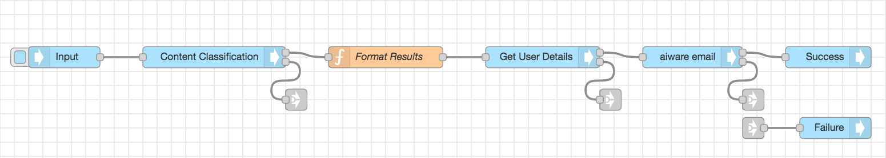
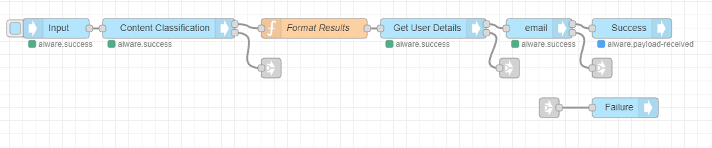

# Content Classification Flow Tutorial

**APPROXIMATE READING TIME: 4 MINUTES**

>**Tip** Before getting started, make sure to understand [Variables](/automate-studio/application/README?id=variables) and [Typed Inputs](/automate-studio/working-with-nodes/README?id=typed-inputs)

### Flow Description

The flow receives a text file URL, runs it through a Content Classification Engine, and creates an ouput of categories based on text excerpts. A summary email is sent to the user.

### Expected Result



### Steps To Reproduce

#### Step 1: Setup the 'aiware-in' Node

Drag the **aiware in** node from the Node Palette and drop it to the canvas. Double-click on the Node to open the *Node Properties*. 

Rename the Node by typing *Input* in the **Name** Input Field.

We rename the node only for clarity and to get a basic sense of the node's role in the flow.

Click on the *Output format* dropdown menu, and select the *Simple* option.

Now, let's set up the **Inject Mock Data** Input. 

The Input is made of two main components. The **Input Type** dropdown menu defines the data format of the input field. The **Input Field** is where we put our data.

Click on the Input Type dropdown and select the *{} JSON* option. It lets the node know that the provided data should be passed to the next node in JSON format.

A horizontal menu button will appear on the right edge of the input field. Click on it to open the *JSON editor*

In the JSON editor, paste the following JSON object and click on *Done*

```json
{
    "url": "https://pollin8-ab.s3-us-west-1.amazonaws.com/sample-2.txt"
}
```

Once done, click the *Done* button once again to close the Node Properties and save the changes.

<hr/>


#### Step 2: Setup the 'Cognition - Core' Node


Drag the **Cognition - Core** node from the Node Palette and drop it next to the previous node. Once done, wire up the two nodes.

Double-click on the **Cognition - Core** node to open the node properties. 

Just like the previous Node, let's rename this Node as well and name it *Content Classification*

From the *Category* dropdown select the **Content Classification** option.

Next, from the *Engine* dropdown select the **eContext Classify (IAB) V3** option.

Scroll down to **Advanced Settings**. 

From the *Cluster* option select the *prd5 - Adhoc Cluster* 

Give the Job a high priority by selecting the *Very High* option from the *Job Priority* dropdown.

Check the *Wait for results* checkbox to proceed to the next node **only** when the job is done and the results are generated. 

Once done, click on the *Done* button to close the node properties and save the settings.

<hr/>

#### Step 3: Setup the Function Node

Drag the **Function** node from the Node Palette and drop it next to the previous (cognition) node. Once done, wire up the two nodes.

We will use this node to add a little bit of custom javascript code, and format the Engine Result output into user friendly email.

Double-click on the **Cognition - Core** node to open the node properties. 

Just like the previous Node, let's rename this Node as well and name it *Format Results*.

The following javascript code iterates through the Engine Result. It groups all categories found by the **Cognition** node into javascript array. Finally, it generates a user friendly output that will be sent to the logged in user. The output of this function will be returned in the **msg** object in a new property that we created at runtime and named **emailBody**

```javascript
var output = []
msg.payload.aiware.engineResult.object.forEach(function(source, index) {
    var categories = [];
    
    (source.objectCategory || []).forEach(function(category) {
        if (category.class) {
            categories.push(category.class);
        }
    }); 

    output.push(`<i><b>${categories.length ? ('(' + categories.join(', ') + ')') : ''}</b></i> ${source.text !== undefined ? source.text : ''}`);
})

var last = msg.payload.aiware.engineResult.object.pop();
var summary = [];
(last.objectCategory || []).forEach(function(category, index) {
    if (category.class) {
        summary.push( (index+1) + '. '+category.class);
    }
}); 


var fullOutput = JSON.stringify(msg.payload.aiware.engineResult.object,null ,2);

msg.emailBody = `
Congratulations on running your Automate Studio flow! The Content Classification engine has just finished processing <a href="https://s3.amazonaws.com/static.veritone.com/sample.txt">this sample input file</a>, here are the results:
<br><br>   
    ${output.join(' ')}
<br>
<br>
Summary of Categories below
<br>
    ${summary.join('<br>')}
<hr>
<br>
Want to do more with this flow? Here are some suggestions to try out:
<br>
<br>
1. This email is sent via the aiware-email node. It is a great tool for debugging or notifying you when a process is complete. Try changing the email subject and re-run the flow. <a href="https://docs.veritone.com/#/automate-studio/getting-started/README?id=step-2-add-nodes-to-your-flow">Learn more</a>. 
<br>
<br>
2. Try changing the input data by editing the "url" within the input node. <a href="https://docs.veritone.com/#/automate-studio/getting-started/README?id=step-3-add-cognition">Learn more</a>.
<br>
<br>
3. Want to get even more technical? Check out the raw output below. Inside the flow, this output exists in the variable msg.payload.aiware.engineResult.object, try looking for it in the 'debug' panel on the right. <a href="https://docs.veritone.com/#/automate-studio/Training/crawl"> Learn more</a>.
<br>
<br>
<hr>    
    ${fullOutput}
`;
return msg
```

Copy the above code and paste it in the **Function** node.

Once done, click the *Done* botton to close the node properties and save the changes.

<hr/>

#### step 4: Setup the User Details Node

Drag the **User Details** node from the Node Palette and drop it next to the previous node.

The previous node is the **Cognition - Core** Node. As you can see it has two outputs. The upper grey square on the right side of the node represents the *Success* output. The grey square below represents the *Failure* or *Error* output. 

Wire the *Success output* from the **Cognition - Core** node to the *input port* of the **User details** Node. Now you have a chain of three nodes.

The **User Details** node doesn't need any special settings. It accepts *Username* and *Password* as inputs in the Node's properties. If not provided it will get the user details of the logged-in user by default.

The user details will be available in the **msg** object under **.payload.aiware.user**.

The logged-in user email will be available under the **name** property in msg.payload.aiware.user.

The full path to the logged in user email is **msg.payload.aiware.user.name**.

<hr/>

#### Step 5: Setup the Email Node

Drag the **aiware email** node from the Node Palette and repeat the steps above.

Double-click on the **aiware email** Node to open the node properties.

Setup the properties in the following way:

- **To Email**: Click on the *Input Type* dropdown and select the **msg.** type. This means that Node will look for the email in the **msg** object
In the Input Field, paste the following path: **payload.aiware.user.name** . 

- **Email Subject**: Click on the *Input Type* dropdown and select the **string** type. This means that Node will take the actual value provided in the Input Field as a string. In the Input Field, paste the 'Automate Hello World Content Classification'.


- **Email Body**: Click on the *Input Type* dropdown and select the **msg.** type. In the Input Field type *emailBody*. It means that the email body that is sent to the user will be taken from **msg.emailBody**, which appears to be the property we stored our result in in the **Function** node.

Once done, click on the *Done* bottun to close the node properties and save the changes.

<hr/>


#### Step 6: Add output nodes

Drag the **aiware out** Node from the Node Palette and drop it to the canvas next to the previous Node. 

Click on the **aiware out** node once to select it. 

Press `Control + C` and `Control + V` on your keyboard to copy and paste the node.

Grab one of the two identical **aiware out** nodes with the mouse and move it down a little bit. Let go of the mouse.

Double click on the node you have just moved to open the Node Properties, and from the  *Output Status* dropdown select *failure*.

Now we have two output nodes. One for success and one for failure.

Wire the **aiware email** node success output to the **aiware out \[success\]** node.

Next, we will add three **link out** nodes from the Node Palette and place them just below the **Cognition - Core**, **user details**, and **aiware email** node and wire each to the **failure output** of the node above.

Now grab a **link in** node, put it in front of the **aiware out \[failure\]]** node, and wire it to its port.

Finally, select the **link out** nodes one by one by clicking on them once and wire each of them to the **link in** node.

While moving the wire, you will notice it is dashed. Once the node is unselected, the wire becomes invisible. This is a good practice to keep the flow nice and clean.

<hr/>

#### Step 7: Run your flow

If you followed the steps, your flow should look something like the flow from the beginning of this tutorial. Have a quick look.

If so, go to the **aiware in** node and click on the **Inject** button (the sky-blue square on the left side of the node).

You can follow the job progress and debug your node from the **Debug** window by clicking on the *Bug* icon on the sidebar.

Within a few minutes, the flow will complete and you will be able to see the result in the email you signed up with.

Your screen should look something like this 



>Learn how to run your Flow via [HTTP API](/automate-studio/working-with-flows/README?id=run-via-http)