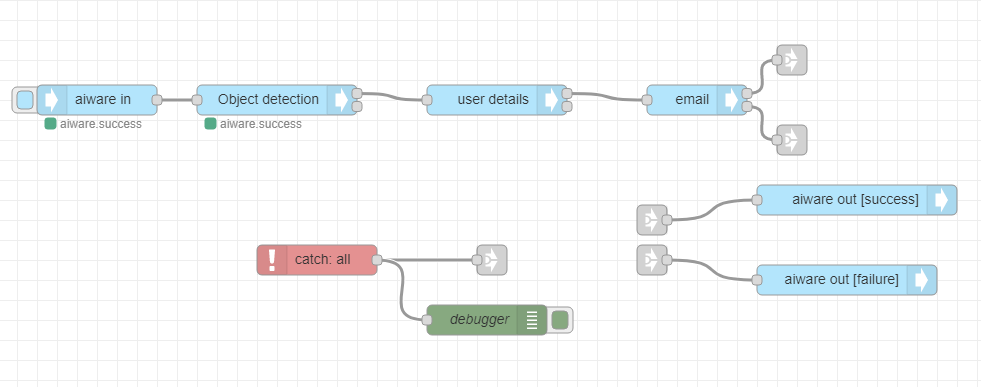
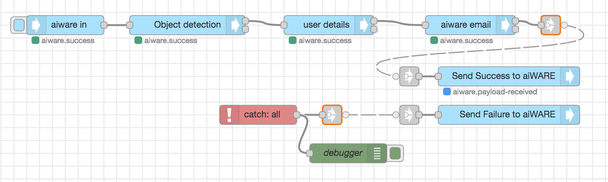

# Transcription Flow Tutorial

**APPROXIMATE READING TIME: 4 MINUTES**

>**Tip** Before getting started, make sure to understand [Variables](/automate-studio/application/README?id=variables) and [Typed Inputs](/automate-studio/working-with-nodes/README?id=typed-inputs). 

## Flow Description

In this tutorial, we will understand how we can create a transcription flow that transcribes a video. We will use the Object Detection engine to transcribe  the video. This flow receives a video URL, runs it through an Object Detection engine, and creates an annotated version of the file. The annotation link is emailed to the user.

## Expected Result

At the end of the tutorial, we would have created a flow that looks like:


## Steps To Reproduce

### Step 1: Setup the 'aiware-in' Node

We will first add the aiware-in node and set it up to accept a JSON object.

**To set up the aiware-in node:**

1. Add the **aiware-in** node from the Node Palette and drop it to the canvas. Double-click on the Node to open the *Node Properties*. 

2. Click on the *Output format* dropdown menu, and select the *Simple* option.

3. Now, let's set up the **Manually Inject Data** area. 

   1. Click on the **Sample Input** dropdown and select the *Default* option. Optionally, you can select an existing sample input or create a new one.

   2. In the Edit JSON tab, paste the following JSON object and click on *Done*.

      ```json
      {
          "url": "https://s3.amazonaws.com/static.veritone.com/sample%2Bvideos.mp4"
      }
      ```

      >Note: The URL leads us to the Apollo 11 countdown audio from the official NASA website.

   3. Once done, click the *Done* button once again to close the Node Properties and save the changes.


<hr/>

### Step 2: Setup the Cognition Node

Next, we will configure the core cognition node that transcribes the video.

**To set up the cognition node:**

1. Drag the **Cognition - Core** node from the Node Palette and drop it next to the previous node. Once done, wire up the two nodes.
2. Double-click on the **Cognition - Core** node to open the node properties. 
3. We will rename this node by typing *Object detection* in the name field.
4. From the *Category* dropdown, select the *Object Detection* option.
5. Next, from the *Engine* dropdown select the *Image Classification - A V3* option.
6. Scroll down to **Advanced Settings**, and from the *Cluster* option select the *prd5 - Adhoc Cluster*.
7. Give the Job a high priority by selecting the *Very High* option from the *Job Priority* dropdown.
8. Check the *Wait for results* checkbox. This pauses the flow and proceeds to the next node **only** when the job is done and the results are generated. 
9. Once done, click on the *Done* button to close the node properties and save the settings.

<hr/>

### Step 3: Setup the User Details Node

Next, we will get the user details so that we can use it to send the email.

**To set up the user details node:**

1. Drag the **User Details** node from the Node Palette and drop it next to the previous node.

   The previous node is the **Cognition - Core** Node. As you can see it has two outputs. The upper grey square on the right side of the node represents the *Success* output. The grey square below represents the *Failure* or *Error* output. 

2. Wire the *Success output* from the **Cognition - Core** node to the *input port* of the **User details** Node. 

3. The **User Details** node doesn't need any special settings. It accepts *Username* and *Password* as inputs in the Node's properties. If not provided it will get the user details of the logged-in user by default.

4. We can view the user details in the **msg** object under **.payload.aiware.user**. The logged-in user email will be available under the **name** property in msg.payload.aiware.user. The full path to the logged-in user email is **msg.payload.aiware.user.name**.

<hr/>

#### Step 4: Setup the Email Node

**To set up the email node:**

1. Drag the **email** node from the Node Palette.

2. Wire the success output from the **User Details** node to the **aiware email** node.

3. Double-click on the **email** Node to open the node properties.

4. Setup the properties in the following way:

   - **To Email**: Click on the *Input Type* dropdown and select the **msg.** type. This means that Node will look for the email in the **msg** object
     In the Input Field, paste the following path: **payload.aiware.user.name** . 

   - **Email Subject**: Click on the *Input Type* dropdown and select the **string** type. This means that Node will take the actual value provided in the Input Field as a string. In the Input Field, paste the 'Automate Hello World Object Detection'.

   - **Email Body**: Click on the *Input Type* dropdown and select the **expression** type. Using the expression type we will be able to provide values from the **msg** object to our email body directly in the node. Click on the horizontal menu button on the right edge of the Input.

     Paste the following expression. Once done, click on the *Done* button to close the editor, and then once again to close the Node Properties and save the changes:

     ```json
     "Hello, <br>Welcome to Veritone and Automate Studio! <br><br> Here is your annotated file: https://cms.veritone.com/#/media-details/" & payload.aiware.tdoId
     ```

     

     

>Everything between two 'Ampersands' will be taken as a path in the **msg** object. 


<hr/>

#### Step 5: Add output nodes

We will now add output nodes to the flow - one for success and the other for failure.

**To add output nodes:**

1. Drag the **aiware out** Node from the Node Palette and drop it to the canvas next to the previous Node. 

2. Click on the **aiware out** node once to select it. 

3. Press `Control + C` and `Control + V` on your keyboard to copy and paste the node. Now we have two output nodes. One for success and one for failure.

4. Move one of the two identical **aiware out** down a little bit.

5. Wire these nodes to the upper and the lower ports. 

6. Configure the upper and lower nodes such that the upper node is for success and lower node is for failure.

   1. Double-click on a node. 
   2. From the  *Output Status* dropdown select *success* or *failure* - success for the upper node and failure for the lower node.
   3. Now grab a **link in** node, put it in front of the **aiware out \[success\]]** node, and wire it to its port.
   4. Wire the **aiware email** node success output to the **aiware out \[success\]** node using the link nodes.
   5. Now grab a **link in** node, put it in front of the **aiware out \[failure\]]** node, and wire it to its port.

   


While moving the wire, you will notice it is dashed. Once the node is unselected, the wire becomes invisible. This is a good practice to keep the flow nice and clean.


<hr/>

#### Step 6: Error handling and debugging

Let us configure the flow to catch errors and help us debug errors. 

**To catch and debug errors:**

1. Add a **catch** and a **link out** node to the palette. 

2. Wire the **link out** node to the catch node output.

3. Add a **debug** node below the **catch** node, and wire the **catch** node output to the **debug** node port.

4. Now, let's set up the **debug** node. 
   1. Open the node properties. From the *Output* list, select the *Complete msg object* option.
   2. Let's rename this node as well and name it *debugger*.
   3. Once done click on the *Done* button to close the node properties and save the changes.
   4. Finally, wire up the **catch** node to the **Send Failure to aiWARE** node using the **link** nodes.

If you followed the steps correctly, your flow should look and be wired as presented below


#### Step 7: Run your flow

If you followed the steps, your flow should look something like the flow from the beginning of this tutorial. Have a quick look.

If so, go to the **aiware in** node and click on the **Inject** button (the sky-blue square on the left side of the node). You can follow the job progress and debug your node from the **Debug** window by clicking on the *Bug* icon on the sidebar.


Within a few minutes, the flow will complete and you will be able to see the result in the email you signed up with.



>Learn how to run your Flow via [HTTP API](/automate-studio/working-with-flows/README?id=run-via-http)