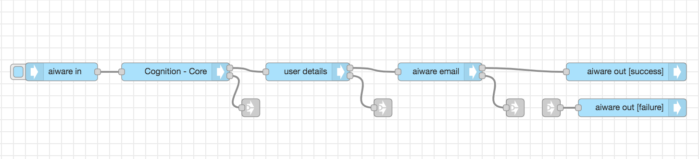
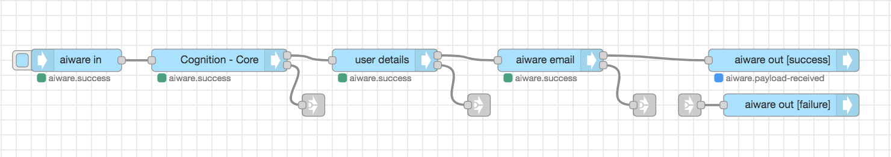

# Transcription Flow Tutorial

**APPROXIMATE READING TIME: 4 MINUTES**

### Flow Description

The flow receives a video or audio URL, runs it through a Speech-to-Text Engine, and creates a text transcription of the file. The transcript is emailed to the user along with a link to the Veritone CMS page that contains the full engine output.

### Expected Result



### Steps To Reproduce

#### Step 1: Setup the 'aiware-in' Node

Drag the **aiware in** node from the Node Palette and drop it to the canvas. Double-click on the Node to open the *Node Properties*. 

Click on the *Output format* dropdown menu, and select the *Simple* option.

Now, let's set up the **Inject Mock Data** Input. 

The Input is made of two main components. The **Input Type** dropdown menu defines the data format of the input field. The **Input Field** is where we put our data.

Click on the Input Type dropdown and select the *{} JSON* option. It lets the node know that the provided data should be passed to the next node in JSON format.

A horizontal menu button will appear on the right edge of the input field. Click on it to open the *JSON editor*

In the JSON editor, paste the following JSON object and click on *Done*

```json
{
    "url": "https://www.nasa.gov/mp3/590320main_ringtone_apollo11_countdown.mp3"
}
```

>The URL leads us to the Apollo 11 countdown audio from the official NASA website.

Once done, click the *Done* button once again to close the Node Properties and save the changes.


<hr/>


#### Step 2: Setup the 'Cognition - Core' Node


Drag the **Cognition - Core** node from the Node Palette and drop it next to the previous node. Once done, wire up the two nodes.

Double-click on the **Cognition - Core** node to open the node properties. 

From the *Category* dropdown select the *Transcription* option.

Next, from the *Engine* dropdown select the *Transcription - E - English V3* option.

Scroll down to **Advanced Settings**. 

From the *Cluster* option select the *prd5 - Adhoc Cluster* 

Give the Job a high priority by selecting the *Very High* option from the *Job Priority* dropdown.

Check the *Wait for results* checkbox to proceed to the next node **only** when the job is done and the results are generated. 

Once done, click on the *Done* button to close the node properties and save the settings.

<hr/>

#### step 3: Setup the 'User Details' Node

Drag the **User Details** node from the Node Palette and drop it next to the previous node.

The previous node is the **Cognition - Core** Node. As you can see it has two outputs. The upper grey square on the right side of the node represents the *Success* output. The grey square below represents the *Failure* or *Error* output. 

Wire the *Success output* from the **Cognition - Core** node to the *input port* of the **User details** Node. Now you have a chain of three nodes.

The **User Details** node doesn't need any special settings. It accepts *Username* and *Password* as inputs in the Node's properties. If not provided it will get the user details of the logged-in user by default.

The user details will be available in the **msg** object under **.payload.aiware.user**.

The logged-in user email will be available under the **name** property in msg.payload.aiware.user.

The full path to the logged in user email is **msg.payload.aiware.user.name**.

<hr/>

#### Step 4: Setup the Email Node

Drag the **aiware email** node from the Node Palette and repeat the steps above.

Double-click on the **aiware email** Node to open the node properties.

Setup the properties in the following way:

- **To Email**: Click on the *Input Type* dropdown and select the **msg.** type. This means that Node will look for the email in the **msg** object
In the Input Field, paste the following path: **payload.aiware.user.name** . 

- **Email Subject**: Click on the *Input Type* dropdown and select the **string** type. This means that Node will take the actual value provided in the Input Field as a string. In the Input Field, paste the 'Automate Hello World Transcription'.


- **Email Body**: Click on the *Input Type* dropdown and select the **expression** type. Using the expression type we will be able to provide values from the **msg** object to our email body directly in the node. Click on the horizontal menu button on the right edge of the Input.

Paste the following expression. Once done, click on the *Done* button to close the editor, and then once again to close the Node Properties and save the changes

```json
"Hello, <br>Welcome to Veritone and Automate Studio! <br><br> Here is your transcribed file: https://cms.veritone.com/#/media-details/" & payload.aiware.tdoId & "<br><br> Transcription Engine Output: "& payload.aiware.engineResultSimple 
```
>Everything between two 'Ampersands' will be taken as a path in the **msg** object. 

<hr/>

#### Step 5: Add output nodes

Drag the **aiware out** Node from the Node Palette and drop it to the canvas next to the previous Node. 

Click on the **aiware out** node once to select it. 

Press `Control + C` and `Control + V` on your keyboard to copy and paste the node.

Grab one of the two identical **aiware out** nodes with the mouse and move it down a little bit. Let go of the mouse.

Double click on the node you have just moved to open the Node Properties, and from the  *Output Status* dropdown select *failure*.

Now we have two output nodes. One for success and one for failure.

Wire the **aiware email** node success output to the **aiware out \[success\]** node.

Next, we will add three **link out** nodes from the Node Palette and place them just below the **Cognition - Core**, **user details**, and **aiware email** node and wire each to the **failure output** of the node above.

Now grab a **link in** node, put it in front of the **aiware out \[failure\]]** node, and wire it to its port.

Finally, select the **link out** nodes one by one by clicking on them once and wire each of them to the **link in** node.

While moving the wire, you will notice it is dashed. Once the node is unselected, the wire becomes invisible. This is a good practice to keep the flow nice and clean.

<hr/>

#### Step 6: Run your flow

If you followed the steps, your flow should look something like the flow from the beginning of this tutorial. Have a quick look.

If so, go to the **aiware in** node and click on the **Inject** button (the sky-blue square on the left side of the node).

You can follow the job progress and debug your node from the **Debug** window by clicking on the *Bug* icon on the sidebar.

Within a few minutes, the flow will complete and you will be able to see the result in the email you signed up with.

Your screen should look something like this 

