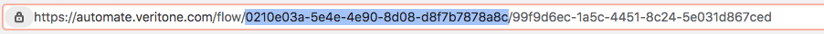

# Working With Flows

**APPROXIMATE READING TIME: 15 MINUTES**


?>Flow is a group of logically connected nodes that can run a certain process in **aiWARE**. Flow can be developed in **Automate Studio** by dragging-and-dropping nodes from the [Node palette](/automate-studio/application/README?id=node-palette) to the [Canvas](/automate-studio/application/README?id=canvas) and wiring them up together. Usually, the flow will contain at least one *Input Node*, one *Functional Node* and one *Output Node*, but also, can be way more complex.

In this section, we will explain how to create, edit and run flows in a few simple steps

## Overview <!-- {docsify-ignore} -->

- [Flow Basics](#flow-basics) 
  - [Create New Flow](#create-new-flow)
  - [Create New Flow From Template](#create-new-flow-from-template)
  - [Open An Existing Flow](#open-an-existing-flow)
  - [Flow Details](#flow-details)
- [Editing Flows](#editing-flows)
  - [Save Flow Settings](#save-flow-settings)
  - [Flow Revisions](#flow-revisions)
  - [Export and Import](#export-and-import)
- [Debugging a Flow](#debugging-a-flow)
- [Deploying Flows](#deploying-flows)
- [Running Flows](#running-flows)
    - [Run Flow in the studio](#run-in-the-studio)
    - [Run Flow via HTTP](#run-via-http)
    - [Run Flow as a Job](#run-as-a-job)
- [Graphql API for Flows](#graphql-api-for-flows)
  <!-- - [Run as a Job](#run-as-a-job) -->


## Flow Basics <!-- {docsify-ignore} -->

<hr/>

## Create New Flow <!-- {docsify-ignore} -->

There are multiple ways to create a new flow from scratch. The easiest one is from the [Automate Studio Home Page](https://automate.veritone.com/).
Just click on the *Add New* button in the upper left corner, and select *New*. You will be redirected to the **Flow Editor** instantly.

The same can be done by selecting the *New* command from the *hamburger* menu in the upper left corner on the same page.

If you already are in the **Flow Editor** and wish to create a new flow, you can do it by selecting *File -> New*. 

In each of the above-mentioned options, a brand new flow instance will be created. It will appear as a tab above the [Canvas](/automate-studio/application/README?id=canvas). To create a new flow tab in the same workspace, just double-click on the space next to the existing flow tab. 
At least one flow tab must exist at a given time and cannot be deleted.

<hr/>
<hr/>

## Create New Flow From Template <!-- {docsify-ignore} -->


Automate Studio provides a variety of flows in different levels of complexity. These flows are developed by the **Veritone** team to provide a ready-to-use AI solution out of the box. As any flow can be edited easily, the flow templates represent a great fundamental to easily create advanced business logic that fits your exact needs, without the need for in-depth coding skills or AI expertise.  

To create a flow from a template, click on the *Templates* button ( or *Add New -> New From Template* ) in the upper left corner of the [Automate Studio Home Page](https://automate.veritone.com/). You can scroll through the list of templates manually, or apply filtering by checking the *Tags* or using the *Search Bar* in the *Header Bar* above.

Once the desired **Flow Template** is found, open the **Template info** sidebar by clicking on the Template name. The **Template Info** provides a quick overview of the flow capabilities and functionalities, as well as a screenshot of the flow itself. 

Click on the *Create New From Template* button to create a new instance of the flow.

<hr/>
<hr/>

## Open An Existing Flow <!-- {docsify-ignore} -->


All flows are available in your organization. If you want to use, test, or update an existing flow, click on the *Org Flows* button in the upper left corner of the [Automate Studio Home Page](https://automate.veritone.com/). Scroll through the list of available flows or apply filtering using the *Search Bar* in the *Header Bar* above. Once the desired flow is found, click on the flow name to open it in the **Flow Editor**

<hr/>
<hr/>

## Flow Details <!-- {docsify-ignore} -->


If you are on the [Automate Studio Home Page](https://automate.veritone.com/), click on the *Org Flows* button.
Hover with the mouse on the desired flow, and click on the vertical menu button that appears on the right side of the flow.
Choose the *View Detail* option. This will open the **Flow details** sidebar for that particular flow.

If you are in the **Flow Editor** page, click on the *` i `* icon in the upper right corner to open the **Current Flow Details** 

**Flow Details** gives you the overall information about the flow: Flow Name, Flow State, Versions, Running or Complete Jobs, etc. 

The **Overview Tab** contains a quick flow overview such as Flow Description, Developer Name, Category, and more.

The **Version History Tab** contains the list of all Flow Revisions and Builds. Use the *Switch* button to switch between the lists.

The **Activity Tab** contains the list of all *Deployed* builds and *Executions* and their respective status


[Back to Top](#overview)

<hr/>
<hr/>

## Editing Flows <!-- {docsify-ignore} -->

<hr/>

As we learned [here](#open-an-existing-flow), flow can be reopened at any time and also edited by any developer in the same organization with appropriate permissions. 
Once the Flow is open in the Flow Editor, the flow can be edited (redesigned, renamed). The flow changes will be saved as *Revisions*

<hr/>

## Save Flow Settings <!-- {docsify-ignore} -->

The **Save** action is performed automatically. No special action is required. On each automatic save a new *Flow Revision* will be created. 

<hr/>
<hr/>

## Flow Revisions <!-- {docsify-ignore} -->

Each periodical *Save* action creates a **Flow Revision**. It represents the *Flow State* (in terms of development) in the given time. 
By such behavior, we prevent work loss and achieve continuous development and integration.

**Flow Revision** can be found in the [Flow Details](#flow-details) Version History Tab. From there, any of the following actions can be chosen from the menu (hover with the mouse on the desired revision and click on the vertical menu button):
- **Restore this Version** - Opens the current flow with the selected version
- **Edit Description** - Edit the basic revision info
- **Open as New Flow** - Opens the selected flow revision in a new flow
- **Export** - Copies the selected flow revision JSON to the system clipboard
- **Share** - Share the selected flow revision with other users
- **Copy Link** - Copies the selected flow revision link to the system clipboard. Paste the link in your browser to open the flow revision in the Flow Editor.
- **Delete** - Delete the selected flow revision (not available for deployed revision)

<hr/>
<hr/>

## Export and Import <!-- {docsify-ignore} -->

Flows can be Exported and Imported from the editor using their JSON format, making it very easy to share flows with others.

**Export Flow**

Open the Export dialog by selecting *File -> Export*. The Export dialog can be used to copy flow JSON out of the editor by the following methods:

- Copying the JSON to the system clipboard
- Downloading the JSON as a file

It can export either the selected nodes, the current flow, or the complete flow configuration.

It offers the option to export compact or formatted JSON. The compact option generates a single line of JSON with no whitespace. The formatted JSON option is formatted over multiple lines with full indentation - which can be easier to read.

**Import Flow**

Open the Import dialog by selecting *File -> Import*. The Import dialog can be used to import a flow by the following methods:

- Pasting in the flow JSON directly
- Uploading a flow JSON file
- In all cases, the dialog offers the option to import the nodes into the current flow, or to create a new flow for them.


[Back to Top](#overview)

<hr/>
<hr/>

## Debugging a Flow <!-- {docsify-ignore} -->

There are a few useful tools available in **Automate Studio** which can help us debug our Flow:

- **Debug Sidebar**

    The *Debug/Info Sidebar* is located on the right side of the Automate Studio Flow Editor. 

    Click on the *Bug* Icon to switch to the *Debug* window.

    Click on the *Filter* Icon to choose which nodes output to preview. 

    Clear The *Debug* window by clicking on the *Recycle Bin* Icon. 

- **Debug Node**

    The *Debug Node* can be found in the *Node Palette* as part of the core nodes provided by Automate Studio. Drag and Drop it to the canvas and wire another node output to the *Debug Node* port. For output settings, double click on the *Debug Node* to open the node properties. The node will receive the previous node output and log it to the *Debug Sidebar* (console).

- **Catch (Error) Node**

    The *Catch Node* is used for error catching on runtime. It has no input port. The error catching happens automatically, globally on flow level.
    The caught error is then provided to the output. To see the error, wire the *Catch Node* to the *Debug Node* to see the error log in the *Debug Sidebar*   (console).   


[Back to Top](#overview)

<hr/>
<hr/>

## Deploying Flows <!-- {docsify-ignore} -->

Flows have a binary state: **Active** or **Not Active**. A flow is considered Active only if it has a deployed revision, which means it has a deployed build too. Only one Revision can be published at a given time, and it does not have to be the latest (HEAD) Revision.

Flow can be deployed by opening the desired *Flow Revision* in the Automate Studio Flow Editor (as described at the [Flow Revision](#flow-revision)) and clicking the *Rocket Icon* in the flow taskbar.

Another way is clicking the *File -> Deploy* command.

Once *Deployed* The Revision becomes **Active**. It will be marked as *Deployed* in the Revision List in the Flow Details window.

An **Active** (Published) Flow Revision is now available to the outside world via **HTTP** or as a **Job** 

!> The Flow **must** start with the **aiWARE in** node as the first node in the flow to be triggerable.

## Running Flows <!-- {docsify-ignore} -->

<hr/>
<hr/>

## Run in the studio <!-- {docsify-ignore} -->


Each Flow, whether **Active** or ** Non-Active**, can run in the Automate Studio Flow Editor.

Just Click on the button-like square on the left side of the **aiWARE in** node, and the flow will start running.

<hr/>
<hr/>

## Run via HTTP <!-- {docsify-ignore} -->

Before we start, make sure to have an active (deployed) flow.

>To create a flow in few simple steps visit our [quickstart]((/automate-studio/getting-started/README)) tutorial. 

Running a deployed flow is easy.

First, let's get the Flow ID, as it is required for the API. The Flow ID is available in the **Flow Details** dialog.

> Here is how to open [Flow Details](#flow-details)

Another way is just cutting it from the Flow URL. The selected part of the URL in the image below is the Flow ID.



Once you have your **Deployed** flow ID we can now construct the API URL the following way:

```string
    https://controller-edge1.veritone.com/flow/<flow-id>/process
```

Replace the ```<flow-id>``` with your actual Flow ID. You will get something like this:

```string
    https://controller-edge1.veritone.com/flow/0210e03a-5e4e-4e90-8d08-d8f7b7878a8c/process
```

The default revision used in this url is always the **DEPLOYED** revision (not the latest). As a reminder, only one revision can be deployed at a time.

If the Flow is not deployed, the API will return an **Error Message**.

Anyway, we can explicitly call a specific revision for testing purposes using the following URL format: 
```string
    https://controller-edge1.veritone.com/flow/<flow-id>/<rev id OR rev number OR 'latest'>/process. 
```
An HTTP POST to this endpoint will trigger the flow. The **payload** provided in the request body will be passed to the **aiware-in** node in the Flow.

The **payload** must be in a valid **json** format.

```json
    {
        "...": "..." //Injected into msg.payload.aiwareChunk.payload
    }
```

For example, If we want to provide a **media url** to our AI Cognition Flow ( click [here](/automate-studio/tutorials/basic/transcription) to build your first AI Flow), the request body would look something like the following:

```json
    {
        "url": "https://s3.amazonaws.com/static.veritone.com/assets/Obama_15s.mp4"
    }
```

?>Regardless of how you initiate the **POST**, be sure to set the header: **“content-type”: “application/json”**

If the Flow is started successfully, we will receive a response in the following format:
```json
{
	"FlowId": "string",
    "FlowRevisionId": "string",
    "FlowExecutionId": "string"
}
```
<hr/>
<hr/>

## Authentication  <!-- {docsify-ignore} -->

To run the request we need to Authentication. For that we need to get the **token**.

The Easiest way to find the token using our [Graphql API playground](https://api.veritone.com/v3/graphql)

Run this query 
```graphql
mutation {
  userLogin(
    input: {
      userName: "email@veritone.com"
      password: "xxx"
    }
  ) {
    token
    organization {
      id
      name
    }
  }
}
```

Once we have the **token**, we can use it in a post request by setting the Authentication header in the request.

Here is a **curl** example to run from the terminal:

```bash
curl --location --request POST 'https://automate-controller-v3f.aws-prod-rt.veritone.com/edge/v1/flow/7ec7fdef-bcd8-42b1-8d67-82b6286fce60/afce5bc7-74af-41f3-94f1-d91ebb621f4b/process' \
--header 'Authorization: Bearer <user token>'
```
So for example, if the user token received from the mentioned graphql query is `abcd1234`, the request would look as the following:

```bash
curl --location --request POST 'https://automate-controller-v3f.aws-prod-rt.veritone.com/edge/v1/flow/7ec7fdef-bcd8-42b1-8d67-82b6286fce60/afce5bc7-74af-41f3-94f1-d91ebb621f4b/process' \
--header 'Authorization: Bearer abcd1234'
```

## Run as a Job <!-- {docsify-ignore} -->

This section is under construction


[Back to Top](#overview)

<hr/>
<hr/>

 ## Graphql API for Flows <!-- {docsify-ignore} -->

>To get started with **Veritone's Graphql API** click [here](/apis/using-graphql) 

Flows, Revisions and Executions can be managed and edited usign the **Graphql API**

<hr/>

## QUERIES <!-- {docsify-ignore} -->

<hr/>

### **flow** 

Query to get the flow record

**Arguments**

`id:` The flow ID

```graphql
    flow(id: ID!): Flow
```
<hr/>

### **getFlowRevisions**

Returns all revisions

**Arguments**

`id:` The flow ID

```graphql
    getFlowRevisions(id: ID!): [Revision]
```
<hr/>

### **getFlowExecutions**

Returns execution details, including status, result (from aiware-out node) and logs (node red debug logs).

**Arguments**

`flowID:` The flow ID

`revisionID` (optional): revision ID in the same flow

`executionID` (optional): execution ID in the same flow

```graphql
    getFlowExecutions(flowId: ID!, revisionId: ID, executionId: ID): [Execution]
```
<hr/>
<hr/>

## MUTATIONS <!-- {docsify-ignore} -->

<hr/>

### **createFlow**

Creates a new flow with only default fields.

```graphql
    mutation{
        createFlow(): Flow
    }
```
<hr/>

### **copyFlow**

Creates a copy of an existing flow.

**Arguments**

`flowID:` The flow ID

`revisionID` (optional): revision ID in the same flow

```graphql
    mutation{
        copyFlow(flowId: ID!, revisionId: ID): Flow
    }
```
<hr/>

### **updateFlow**

Update an existing flow

**Arguments**

`flowID:` The flow ID

```graphql
    mutation{
        updateFlow(flowId: ID!): Flow
    }
```

<hr/>

### **deleteFlow**

True deletion of the flow record

**Arguments**

`flowID:` The flow ID

```graphql
    mutation{
        deleteFlow(flowId: ID!): Flow
    }
```
<hr/>

### **pauseFlow**

Moves the flow to status Not Active. It will remain in this status until the unpauseFlow API is called

**Arguments**

`flowID:` The flow ID

```graphql
    mutation{
        pauseFlow(flowId: ID!): Flow
    }
```
<hr/>

### **unpauseFlow**

Moves the flow to status Active

**Arguments**

`flowID:` The flow ID

```graphql
    mutation{
        unpauseFlow(flowId: ID!): Flow
    }
```
<hr/>

### **createFlowRevision**

Creates the next revision

**Arguments**

`flowID:` The flow ID
`revision:` Flow Revision Type

```graphql
    mutation{
        createFlowRevision(flowId: ID!,revision: Revision!): Revision
    }
```
<hr/>

### **deleteFlowRevision**

Marks the the revision deleted

**Arguments**

`flowID:` The flow ID
`revisionID:` The ID of the revision

```graphql
    mutation{
        unpauseFlow(flowId: ID!, revisionID: ID!): Revision
    }
```
<hr/>

### **deployFlowRevision**

- Creates a new build from the revision specified, or the latest (HEAD) revision if none specified. 
- Change the build status to deployed.
- Change the deployed flag to true on the IS_DEPLOYED revision record.

**Arguments**

`flowID:` The flow ID
`revisionID` (optional):  The ID of the revision

```graphql
    mutation{
        deployFlowRevision(flowId: ID!, revisionID: ID): Revision
    }
```
<hr/>

[Back to Top](#overview)
