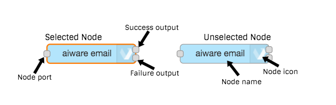
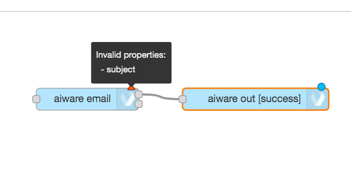
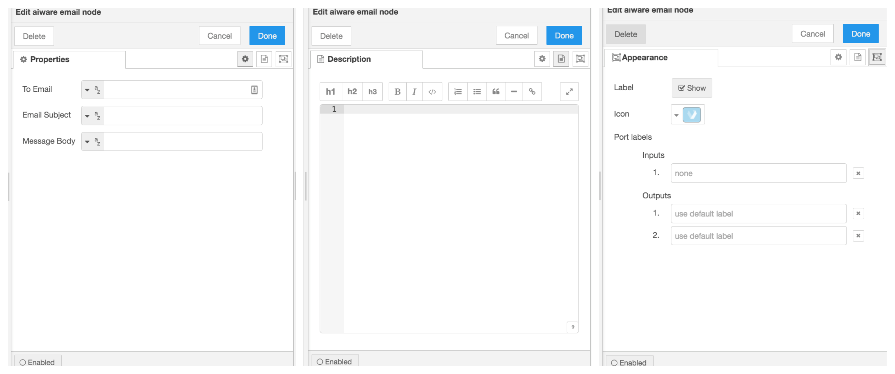
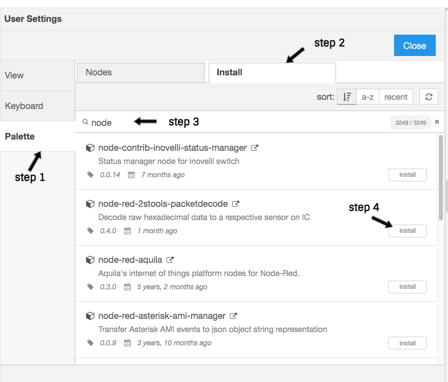

# Working With Nodes 

**APPROXIMATE READING TIME: 4 MINUTES**

?>Nodes are the main development tool in **Automate Studio**. 
A node can be defined as an autonomous mini web app with a user-friendly **_UI_** and **_NodeJS_** backend server. 
Each node is developed to take care of a certain part of the large app (flow).

### Overview

- [Nodes Basics](#nodes-basics)
  - [Node Structure](#node-structure)
  - [Node Properties](#node-properties)
  - [Node Help](#node-help)
- [aiWARE Nodes](#aiware-nodes)
- [Add Nodes To Palette](#add-nodes-to-palette)

### Nodes Basics

Nodes are the building blocks of flows you create in Automate Studio.

Nodes allow your flow to receive input data, execute custom logic, and/or output data, within a flow. They can encapsulate custom business logic (written in JavaScript), or run GraphQL queries, as need be. Individual nodes are typically responsible for discrete actions, such as executing a script, receiving input, transmitting outputs, etc. They can be triggered either by receiving a message from a previous node or by an external event.

Various types of prebuilt, ready-to-use nodes are available to you from the [Node Palette](/automate-studio/application/README?id=node-palette).

1. **Input nodes** act as their data source; hence, they have only a single port, namely an output port (the little circle on the right).

2. **Output nodes** typically occur at the end of a flow or subflow. They can receive data but do not pass data to any downstream node(s).

3. **Transformational** or "Function" nodes that take data in, modify it (or augment it), then pass the modified data out.

#### Structure

1. **Select and unselect node:** Node is selected by a single click anywhere on the node. The orange border should appear. Unselect the node by clicking anywhere on the canvas. Multiple nodes are selected by holding the *ctrl* button on the keyboard.
2. **Node port:** The grey square on the left side of the node. It is used to connect the node to a previous node(s) using the wires. 
3. **Node output on success:** The upper grey square on the right side of the node.
4. **Node output on failure (error):** The bottom grey square on the right side of the node.
5. **Node name on canvas:** The name of the node on the canvas. Usually, it defaults to the node name on the palette and can be changed in the node UI settings
6. **Node icon:** The Icon on the right or left side of the node. In aiWARE nodes, it defaults to the **Veritone** logo. The icon can be changed in the appearance section in the node UI.
7. **Node changes indicator:** When initially added, or any changes have been applied to the node, a blue circle will appear on the upper right corner of the node. It indicates that the current changes have not been saved yet, and will not be reflected in runtime. The changes are saved automatically, so once the blue circle disappears it means that our changes are registered.
8. **Node misconfiguration indicator:** Typically, nodes have user input validation added by the node developer. If the node is saved with invalid changes, a red triangle will appear in the upper right corner. We can see which validations failed by hovering the red triangle.

#### Properties

If we double click on the node, the **Node UI editor** will slide in from right to left. This is where we manage the node properties, add descriptions or modify the appearance. Each node has its properties based on its purpose and functionality.

#### Help

The right side of the screen is reserved for node info (help). The node specifications and description, as well as requirements, expected input and output, and more info, are all available there. This part is especially helpful during development, as it contains all required information without leaving your workstation.

Select the node by a single-click on it to display the node help in the sidebar. 

### aiWARE Nodes

aiWERE nodes are developed by the **Veritone team** to simplify the usage of AI technology by bringing it down to low code.
They can be recognized by the sky-blue color. The aiWARE nodes are divided into three categories: **aiWARE common**, **aiWARE data lake**, and **aiWARE tools**

1. **aiWARE common** category provides the basic set of nodes that allow us to build a flow in Automate Studio.

2. **aiWARE data lake** category provides a set of Transformational nodes that allow us to perform a wide spectrum of operations on data objects.

3. **aiWARE tools** category provides a set of nodes that help us perform some standard operations like getting the logged-in user details, send custom Graphql queries to Veritone's API, and more.

>For full aiWARE nodes list visit [@veritone/node-red-contrib-aiware](https://flows.nodered.org/node/@veritone/node-red-contrib-aiware).
For the source code, please visit our [github repo](https://github.com/veritone/node-red-contrib-aiware)

### Add Nodes To Palette

Automate Studio provides a wide range of ready-to-use nodes out-of-the-box.

1. **aiWERE** nodes are developed by the **Veritone team** to simplify the usage of AI technology by bringing it down to low code.
They can be recognized by the sky-blue color and the Veritone logo on the right or left side of the node. The aiWARE nodes are divided into three categories: **aiWARE common**, **aiWARE data lake**, and **aiWARE tools**

2. **Node-Red core** are the native Node-Red nodes. They cover almost every basic and many advanced backend processes in a NodeJS application. 

>Learn more about Node-Red core nodes [here](https://nodered.org/docs/user-guide/nodes)

3. ** Third-party nodes** can be added easily. Node-Red is an open-source community with many contributors that generously share their node packages.
Any of the node packages can be installed in Automate Studio in a few simple steps:

Click on the *File -> Settings* to open the settings menu

Next, in the *User Settings* menu click on *Palette* in the left menu. Then, in the *search bar* type the package name you would like to install. The packages will be rendered in the section below the search bar. Once you find the desired package, just click the *Install* button. Then submit by clicking on *Install* again. Within a few seconds, the nodes will be available in the palette.

