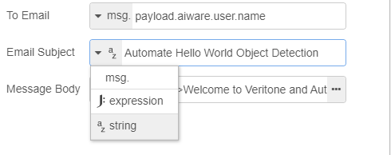

# Working With Nodes 

**APPROXIMATE READING TIME: 4 MINUTES**

> Before getting started, we recommend that you review the [quickstart](..\getting-started\README.md), [understand basic concepts](..\application\README.md) and [working with flows](working-with-flows\README.md) of Automate Studio.

## Overview <!-- {docsify-ignore} -->

A node can be defined as an autonomous little web app with a user-friendly **_UI_** and **_NodeJS_** backend server. Each node is developed to take care of a certain part of the large app (flow). 

?>Nodes are the main development tools in **Automate Studio**. 

In this page, we will learn about:

- [Nodes Basics](#nodes-basics)
  - [Node Structure](#node-structure)
  - [Node Properties](#node-properties)
    - [Typed Inputs](#typed-inputs)
  - [Node Help](#node-help)
- [aiWARE Nodes](#aiware-nodes)
- [Adding Nodes To Palette](#adding-nodes-to-palette)

## Nodes Basics <!-- {docsify-ignore} -->

Nodes are the building blocks of flows you create in Automate Studio. They let your flow to receive input data, execute custom logic, and output data within a flow. They can encapsulate custom business logic (written in JavaScript), or run GraphQL queries, as need be. 

Individual nodes are typically responsible for actions, such as executing a script, receiving input, transmitting outputs, and so on. We can trigger them either by receiving a message from a previous node or by an external event. There are various types of prebuilt nodes are available to you from the [Node Palette](/automate-studio/application/README?id=node-palette):

1. **Input nodes** act as data sources. They have only a single port namely an output port (the little circle on the right).
2. **Output nodes** typically are at the end of a flow or subflow. They can receive data but do not pass data to any downstream node(s).
3. **Transformational** or "Function" nodes that take data in, modify it (or augment it), then pass the modified data out. They have two ports - input and output.

The right side of the screen is reserved for node info (help). We can view the node details by selecting it. The node specifications and description, as well as requirements, expected input and output, and more info, are all available in the Node info pane. We use this extensively during flow development, as it contains all required information. 

### Node Structure <!-- {docsify-ignore} -->

We can select a node by a single click anywhere on the node. A select node has an orange border around it. We can unselect the node by clicking anywhere on the canvas. We can select multiple nodes by holding the *ctrl* button on the keyboard and selecting them.

A node includes multiple aspects that determines its characteristics:

- **Node port:** The grey square on the left side of the node. It is used to connect the node to a previous node(s) using the wires. 
- **Node output on success:** The upper grey square on the right side of the node.
- **Node output on failure (error):** The bottom grey square on the right side of the node.
- **Node name on canvas:** The name of the node on the canvas. Usually, it defaults to the node name on the palette and can be changed in the node UI settings
- **Node icon:** The icon on the right or left side of the node. In aiWARE nodes, it defaults to the **Veritone** logo. We can  change the icon in the appearance section of the node UI.
- **Node changes indicator:** When initially added, or any changes have been applied to the node, a blue circle will appear on the upper right corner of the node. This indicates that the current changes have not been saved yet, and will not be reflected in runtime. The changes are saved automatically, and then the blue circle disappears to indicates that our changes are registered.
- **Node misconfiguration indicator:** Typically, nodes have user input validation added by the node developer. If the node is saved with invalid changes, a red triangle will appear in the upper right corner. We can see which validations failed by hovering over the red triangle.

### Node Properties <!-- {docsify-ignore} -->

We can double click on the node, to view the **Node UI editor**. We can manage node properties, add descriptions, or modify node appearance in this pane. Each node has its properties that manage its purpose and functionality.

#### Typed Inputs <!-- {docsify-ignore} -->

The **Input Fields** in the **Node Properties** is where we provide the required information for the node to successfully complete the process. Each Node, dependent on it's functionality, may expect different parameters and data inputs. In some cases, we would define those parameters manually in the node, but mostly, we would like it to dynamically receive the data from the previous node to continue some process.

We use **Typed Inputs** to define and "tell" the node where it should take the data from, how to treat the manually provided data, or even combination of both. [Automate Studio]() makes it easy to manage these thanks to an intuitive user interface. We will cover some of the most common **Input Types** in Automate Studio, but these concepts apply to any other case.

We must understand that almost every input field in Automate Studio is a **Typed Input**. We can recognize it by the grey-color menu button on the left edge of the Input Field. By clicking on it, we will be able to choose the desired input type.

- **JSON (J:)**

    The `JSON` input type allows us to manually add JSON input. It also adds the horizontal menu button on the right edge of the Input Field that we can use to open the JSON editor. The value of the input field will be used as JSON data in the node process.

- **String**

    The `string` input type simply tells the node that the manually provided data is a string. The value of the input field will be used as a string in the node process.

- **msg.** 

    The `msg.` input is used when we want to pass data from one node to another. In such case we will specify the full path to the desired property starting from `msg.` (message dot). 

For example, let's say we want to send an email to the logged-in user in our flow (see [Quickstart](/automate-studio/getting-started/README)). The **User Details** node returns the logged-in user details at runtime as part of the `msg` object. The email address specifically, can be found in `msg.payload.aiware.user.name`.

The next node is the **aiware email** node. It has a typed input for the *To Email* Input Field. If we were to use the logged-in user's email from the previous node, we would choose the `msg.` type and provide the full path to the name property like this: `payload.aiware.user.name`

[Back to Top](#overview)

## aiWARE Nodes <!-- {docsify-ignore} -->

aiWERE nodes are default nodes developed by the **Veritone team** to simplify the usage of AI technology by bringing it down to low code. They are in sky-blue color and are divided into three categories: **aiWARE common**, **aiWARE data lake**, and **aiWARE tools**

- **aiWARE common** includes basic set of nodes that allow us to build a flow in Automate Studio.
- **aiWARE data lake** includes a set of transformational nodes that allow us to perform a wide spectrum of operations on data objects.
- **aiWARE tools** includes a set of nodes that help us perform some standard operations like getting the logged-in user details, sending custom Graphql queries to Veritone's API, and more.

>For full aiWARE nodes list visit [@veritone/node-red-contrib-aiware](https://flows.nodered.org/node/@veritone/node-red-contrib-aiware). For the source code, please visit our [github repo](https://github.com/veritone/node-red-contrib-aiware)

[Back to Top](#overview)

## Adding Nodes To Palette <!-- {docsify-ignore} -->

Automate Studio provides a wide range of ready-to-use nodes out-of-the-box that we can add to the palette. You can view the palette by clicking on File >  Flow Settings > Manage Palette

- **aiWARE** nodes are developed by the **Veritone team** and are in sky-blue color. The aiWARE nodes are divided into three categories: **aiWARE common**, **aiWARE data lake**, and **aiWARE tools**

- **Node-Red core** are the native Node-Red nodes. They cover almost every basic and many advanced backend processes in a NodeJS application.  Learn more about Node-Red core nodes [here](https://nodered.org/docs/user-guide/nodes).
- **Third-party nodes** can be added easily. Node-Red is an open-source community with many contributors that generously share their node packages.

**To add a node package:**

1. From the flow editor, click on the *File -> Flow Settings*, Manage Palette to open the settings menu.
2. In the *User Settings* pane, click on *Palette* in the left menu. Then, in the *search bar* type the package name you would like to install. The packages will be rendered in the section below the search bar. 
3. Once you find the desired package, just click the *Install* button. Then submit by clicking on *Install* again. Within a few seconds, the nodes will be available in the palette.

[Back to Top](#overview)

