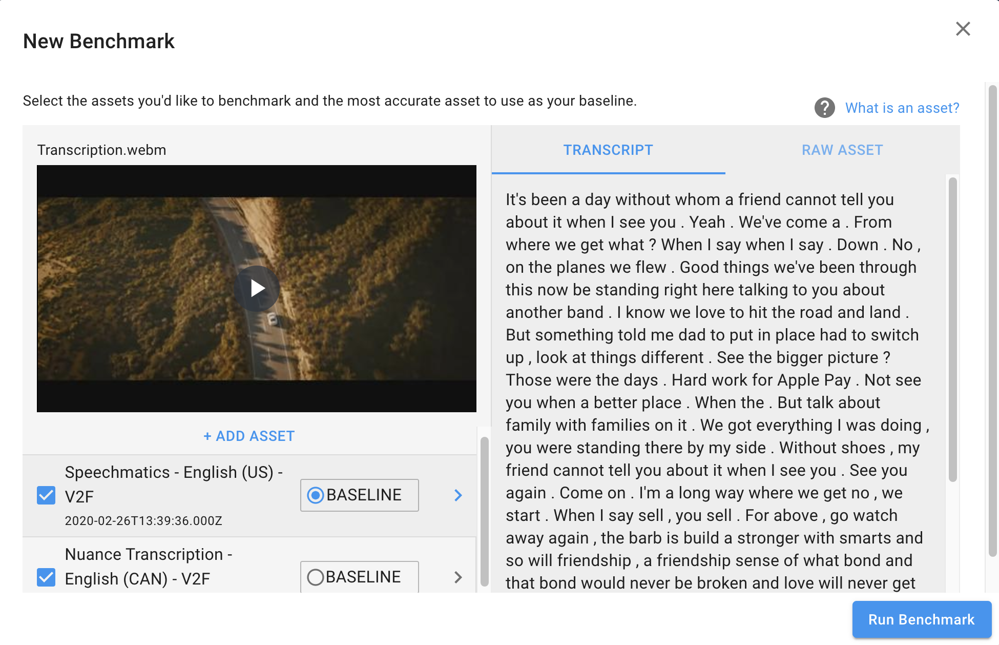
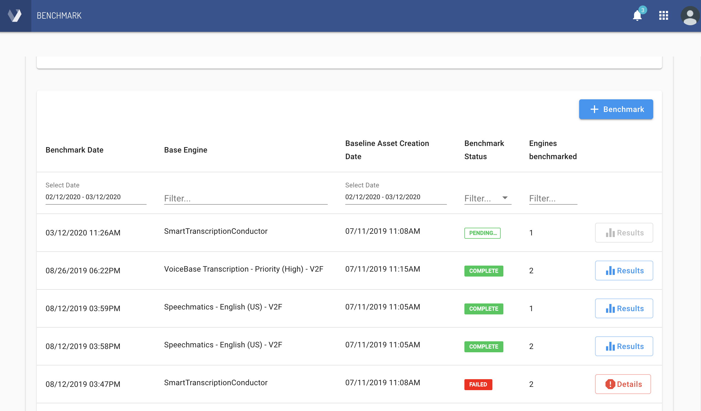
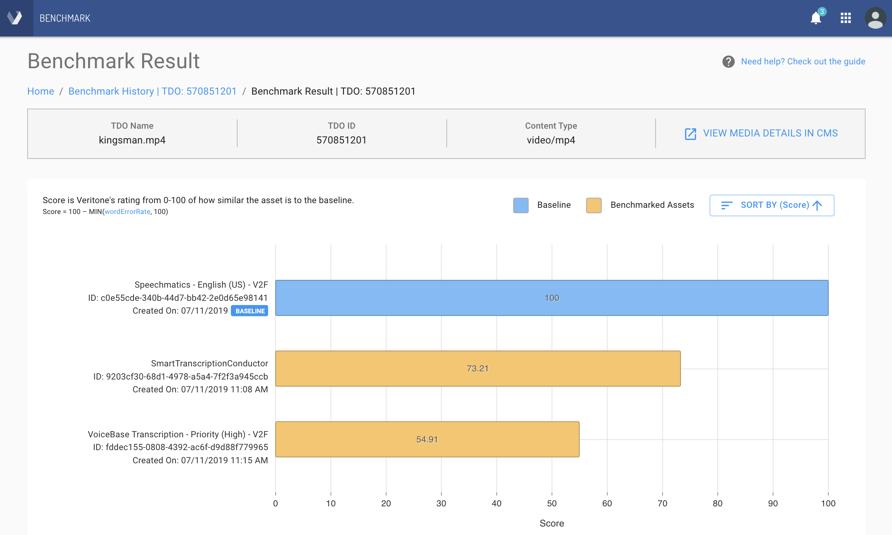
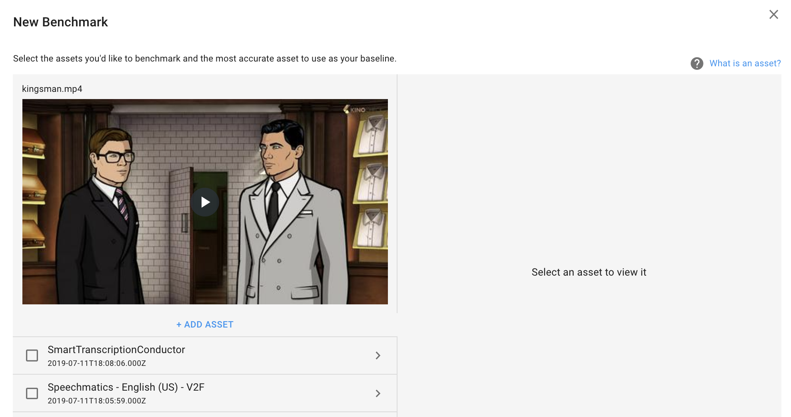

# Veritone Benchmark (Beta)

**Veritone Benchmark** is a self-service tool that allows you to compare the results generated by cognitive engines against each other. For AIWare developers, this allows you to compare your engine against other engines, so that you can refine your engines to be best in class. For AIWare users, Benchmark allows you to figure out which engines generate the best combination of speed, accuracy, and performance all while minimizing cost -- allowing AIWare to deliver more business value to you versus individual AI providers.

## Introduction

One of the main benefits of AIWare is the ability to run engines from different providers to process your media. With this choice comes the problem: _How do I know which engines will provide the best results?_ Benchmark is designed to make it easy for you to compare results of engines against each other, allowing you to visualize engine performance over time, and see apples-to-apples comparisons of engines against one another.

> **What is an asset?** An asset is simply a piece of data on a [TDO](apis/tutorials/upload-and-process?id=_1-create-a-temporal-data-object-tdo). Most of the time an asset will be the result from a specific run of a cognitive engine for a specific engine capability. For example, a transcription job will produce a _transcript_ as an asset on the appropriate TDO.

## How do I Run a Benchmark?

First, go to [benchmark.veritone.com](https://benchmark.veritone.com). (Obtain a Veritone account, if you have not already done so.)

1\. From the Benchmark Home page, **click the SELECT TDO button.** 

2\. Use the navigation dialog to **find the media file (or TDO) that you want to use as the basis of benchmarking.** 

Select (highlight) the TDO of interest. Click the **Open** button.

> Choose a TDO that has 2 or more assets shown under the Assets column. You will need to select one Asset as the _baseline_ asset (see Step 5 below).

3\. In the dialog that opens, called Benchmark History (below), you will see a list of previous Benchmarks (if they exist), or else some summary info about the TDO you selected, plus the words NO BENCHMARKS YET. At the bottom of the dialog, you will see an engine-capability picker (shown as "Transcription" by default) next to a **Start New Benchmark** button.


4\. Click the **Start New Benchmark** button to bring up the New Benchmark configuration dialog. 

5\. **Designate a Baseline asset.** Using the checkbox to the left of the asset names, select an Asset. This will make a BASELINE radio button visible. Click the radio button for the asset you wish to use as the *baseline* (or ground truth) for purposes of benchmarking. (This means your benchmarking will assume that the selected asset is the *reference asset* for determining accuracy. A more detailed discussion of accuracy can be found below under [What do these numbers mean?](#what-do-these-numbers-mean)).

> If you wish to define a baseline asset manually, you can do so! See [How to Add an Asset Manually](#how-to-add-an-asset-manually) below.

6\. **Designate additional assets/engines for benchmarking.** Check the checkboxes of other files in the list to select their respective engines for benchmarking. (This UI may change in the future. For now, this is the mechanism for choosing engines.)

7\. Click the **Run Benchmark** button to begin benchmarking. A status window will open.



In the status window, current and (if available) past benchmarks will be shown as line items, with a color-coded badge on the right to indicate the status of each benchmarking attempt (shown as PENDING, COMPLETE, or FAILED).

> You may need to refresh the page to see the badges update.

8\. Click the **Results** button at the far right edge of any line item to see the results of that row's benchmark. The screen that appears will look something like the following:



In this screen, you can see horizontally running histogram bars representing accuracy results for the engines that were tested (along with a blue histogram at the top representing the baseline results).

> Use the **Sort By** button near the upper right to sort histrograms by Score, File Name, or Date, as desired.

## How to Add an Asset Manually

Sometimes, instead of choosing a baseline (or reference) asset from among _existing_ assets &mdash; none of which might be 100% perfect in terms of accuracy &mdash; you might want to add your own known-good custom baseline data, and use _that_ as the "ground truth." Here's how to do that:

1\. Click the **Start New Benchmark** button to get to the New Benchmark window (following Steps 3 and 4 further above). Alternatively: From an individual Benchmark History window (with a URL like `https://benchmark.veritone.com/tdo/570851201`), click the blue **Benchmark** button. The New Benchmark window appears:



2\. Under the preview image, notice the presence of a clickable label called **+ ADD ASSET**. Click it to open the Manually Add Asset dialog:


3\. In this dialog, you can listen to your content (using the built-in player), type or paste "ground truth" text into a text area on the right, and then **Save** your work (or Cancel out). When you click **Save**, a confirmation dialog will appear. Click **CONFIRM ASSET** to save the custom asset.

When you create a Benchmark, you can now designate this custom asset as the baseline asset.

## How Does Benchmarking Work?

Benchmark works by allowing you to select TDOs that have already been processed through aiWARE, and selecting the assets that have already been generated by cognitive engines on the TDO. Once multiple assets selected, the user selects the most accurate asset to be the baseline, and a benchmark job is fired to compare the rest of the assets against the baseline asset.

> **Why do I have to pick a baseline manually?** The key difference between AI vs traditional computation algorithms is that with AI processing the computer can generate, but not understand, the results. Before the computer can compare the results against each other, a human fluent in the transcribed language needs to "train" or "teach" the machine which asset is the most accurate.  &nbsp;

Once the benchmark job is completed, you can view the results of the benchmark by selecting the benchmark job from the Benchmark Jobs page. The results show how similar each benchmarked asset is compared to the baseline from a range of 0-100 -- 0 being not similar at all and 100 being perfectly identical. The higher the score, the closer the benchmarked asset is to the baseline.

> **What if I select the wrong baseline asset?** If you select the wrong baseline asset, the scores reported by benchmark will not match the reality of which transcript is most accurate to people fluent in the transcribed language.

## What Do the Numbers Mean?

Based on our research, Veritone has determined [word error rate](https://en.wikipedia.org/wiki/Word_error_rate) to be the best overall indicator of transcript similarity. Word error rate is simply any extra words inserted, deleted, or substituted in the benchmarked asset divided by the total number of words in the baseline asset. Benchmark "scores" assets each other by giving a benchmarked asset 100 points to start with. Points are then removed for differences from the baseline.

> The formula for calculating score is: 100 – MIN(wordErrorRate, 100)

For example, let's use the following sentence as our baseline transcript and compare various other "assets" to it and see how the score would be calculated.

**Baseline Asset:** ```The quick brown fox jumped over the lazy dog```

| Score         | 100 | N/A |
|---------------|-----|---|
| Insertions    | 0   | N/A |
| Deletions     | 0   | N/A |
| Substitutions | 0   | N/A |

**Asset from Hypothetical Engine 1:** ```The quick brown fox jumped over the lazy cat```

| Score         | 88.9 |    |
|---------------|-----|---|
| Insertions    | 0   | N/A |
| Deletions     | 0   | N/A |
| Substitutions | 1   | cat |

Calculation: 100 - ( 1 substitution / 9 * 100)

**Asset from Hypothetical Engine 2:** ```The quick brown fox jumped over the cat```

| Score         | 77.8 |    |
|---------------|-----|---|
| Insertions    | 0   | N/A |
| Deletions     | 1   | lazy |
| Substitutions | 1   | cat |

Calculation: 100 - ( 1 substitution + 1 deletion ) / 9 * 100

## Limitations

Benchmarking is currently limited to _transcription_ results, single TDOs, and existing results in the system. We are working hard to improve the capabilities of Benchmark to make it easier to store and find results, aggregate results across multiple TDOs, and fire off engines in realtime &mdash; as well as encompassing other engine capabilities. So be sure to check back here for updates! This page will update as new functionalities become available.