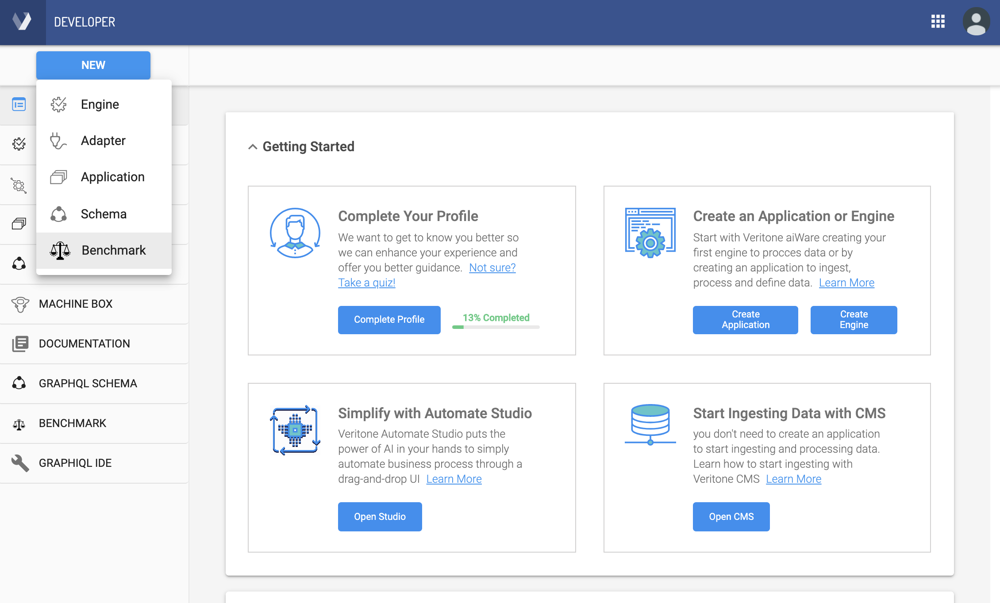
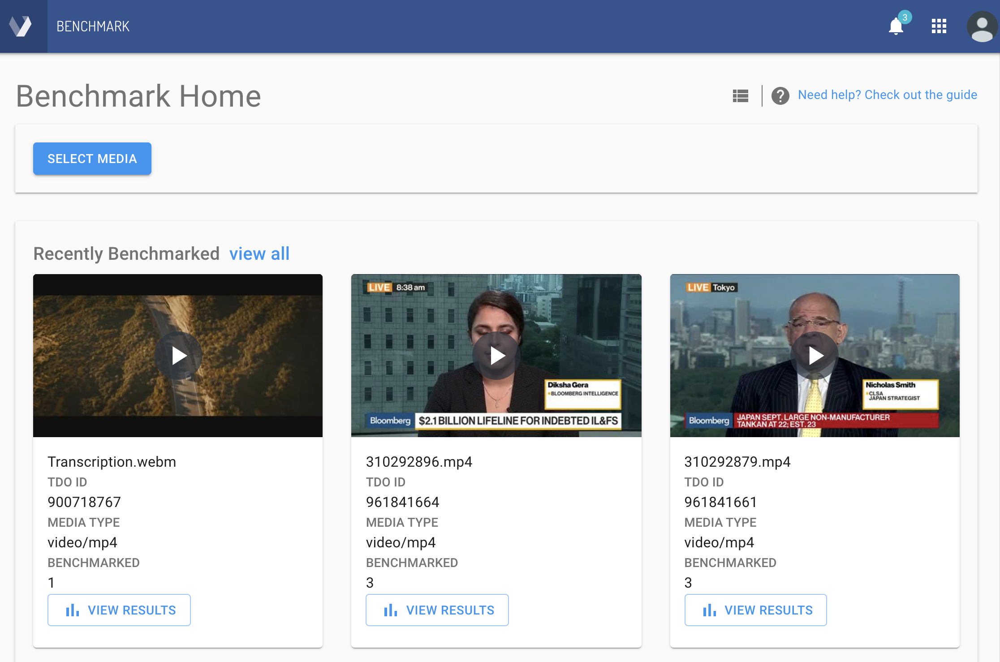
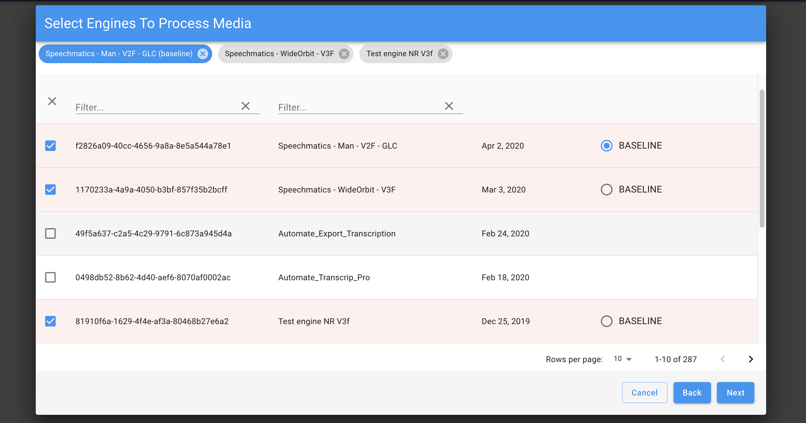
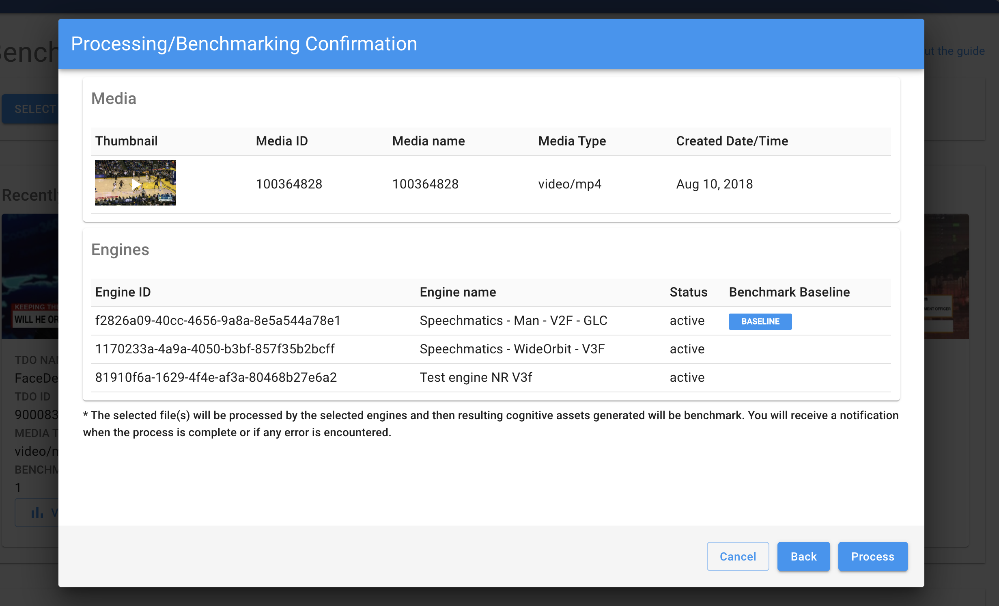
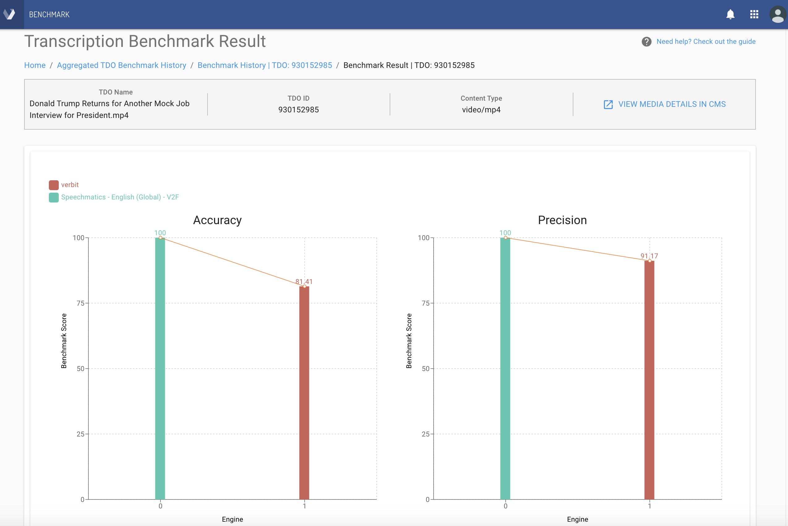
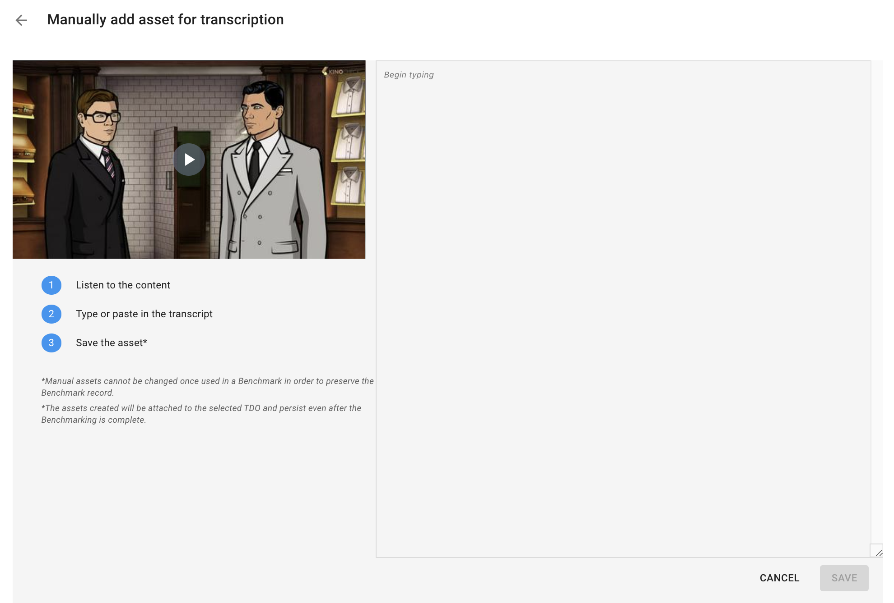

# Veritone Benchmark (Beta)

**Veritone Benchmark** is a self-service tool that allows you to compare the results generated by cognitive engines against each other. For AIWare developers, this allows you to compare your engine against other engines, so that you can refine your engines to be best in class. For AIWare users, Benchmark allows you to figure out which engines generate the best combination of speed, accuracy, and performance all while minimizing cost -- allowing AIWare to deliver more business value to you versus individual AI providers.

## Introduction

One of the main benefits of AIWare is the ability to run engines from different providers to process your media. With this choice comes the problem: _How do I know which engines will provide the best results?_ Benchmark is designed to make it easy for you to compare results of engines against each other, allowing you to visualize engine performance over time, and see apples-to-apples comparisons of engines against one another.

> **What is an asset?** An asset is simply a piece of data on a [TDO](/apis/tutorials/upload-and-process?id=_1-create-a-temporal-data-object-tdo). Most of the time an asset will be the result from a specific run of a cognitive engine for a specific engine capability. For example, a transcription job will produce a _transcript_ as an asset on the appropriate TDO.

## Where Can I Find Benchmark?

There are several ways to access Benchmark. All of them require a Veritone account, so be sure to [get a free Veritone account](https://www.veritone.com/login/#/), if you have not already done so.

Once you have your Veritone account, you can:

* Go directly to [benchmark.veritone.com](https://benchmark.veritone.com) &mdash; This is the **Benchmark Home** page.  Alternatively:

* Go to [Veritone CMS](https://cms.veritone.com/#/) and access Benchmark from the **Switch Apps** ("hamburger") button on the far right of the banner bar, next  to the Profile button. Or:

* Go to [developer.veritone.com/](https://developer.veritone.com/) and access Benchmark from the nav sidebar. Or:

* Go to [developer.veritone.com/](https://developer.veritone.com/), click the **NEW** button (at the top of the nav sidebar), and then choose **Benchmark**. See below:



## How Can I Run a Benchmark?

1\. From the Benchmark Home page, **click the SELECT MEDIA button.** 

2\. Use the navigation dialog to **find the media file (or TDO) that you want to use as the basis of benchmarking.**


Select (highlight) the file(s) of interest.

?> If you don't see the file(s) you wanted to see, you can add files from your local storage or from YouTube.
To do this, simply use the **+ New** button at the top left corner of the dialog to bring up the File Upload dialog.

Click the **Process and Benchmark** button to continue to the Engine Selection dialog.



3\. In the engine selection dialog (above), you will see a list of engines (10 per page; use  the arrow buttons at the bottom to go through the available choices).
Check the checkboxes next to any engines you would like to include in this benchmark.  Using the radio buttons in the far right column, select one engine as the **Benchmark Baseline** engine.

!> You must designate a Benchmark Baseline in order to make the **Next** button (at the bottom right corner of the dialog) change to an active state.

When the **Next** button becomes active (through selection of a Baseline engine), click it. The **Processing/Benchmarking Confirmation** dialog appears.



4\. Review the summary of media files and engines shown in the **Processing/Benchmarking Confirmation** dialog (above). If the information is not correct, use the **Back** button to go back and change any selections as necessary. Otherwise, click the **Process** button to begin the benchmarking job. The **Benchmarks** page appears (see below).


This page shows the status of currently running jobs in the top portion (under **Processing and Benchmarking**) as well as a summary of **Completed Benchmarks** further below.

?> In the Status column under **Processing and Benchmarking**, you'll see a green PROCESSING... badge with an Information icon (circle-i) next to it. Click the Information icon to see a progress dialog showing which engines have finished.

Note that you can click the Notifications (bell) icon in the page header, on the right, to see a status summary of the last few Benchmark jobs that have run.


## Viewing Results

1\. Go to the Benchmark Home page at [https://benchmark.veritone.com/](https://benchmark.veritone.com/).

2\. Under **Recent Jobs**, find the job that interests you. Then click the **VIEW RESULTS** button at the far right edge of that row (or else click **DELETE** if the job is running but you wish to cancel it). The results screen that appears will look something like the following:



In this screen, you can see histograms representing accuracy and other metrics for the engines that were tested.

?> The screen shot above shows results for a Transcription benchmark. The results will have a different appearance for other cognitive capabilities.

## How to Add an Asset Manually

Sometimes, instead of choosing a baseline (or reference) asset from among _existing_ assets &mdash; none of which might be 100% perfect in terms of accuracy &mdash; you might want to add your own known-good custom baseline data, and use _that_ as the "ground truth." Here's how to do that:

1\. Click the **Start New Benchmark** button to get to the New Benchmark window (following Steps 3 and 4 further above). Alternatively: From an individual Benchmark History window (with a URL like `https://benchmark.veritone.com/tdo/570851201`), click the blue **Benchmark** button. The New Benchmark window appears:


2\. Under the preview image, notice the presence of a clickable label called **+ ADD ASSET**. Click it to open the Manually Add Asset dialog:



3\. In this dialog, you can listen to your content (using the built-in player), type or paste "ground truth" text into a text area on the right, and then **Save** your work (or Cancel out). When you click **Save**, a confirmation dialog will appear. Click **CONFIRM ASSET** to save the custom asset.

When you create a Benchmark, you can now designate this custom asset as the baseline asset.

## How Does Benchmarking Work?

Benchmark works by allowing you to select TDOs that have already been processed through aiWARE, and selecting the assets that have already been generated by cognitive engines on the TDO. Once multiple assets selected, the user selects the most accurate asset to be the baseline, and a benchmark job is fired to compare the rest of the assets against the baseline asset.

> **Why do I have to pick a baseline manually?** The key difference between AI vs traditional computation algorithms is that with AI processing the computer can generate, but not understand, the results. Before the computer can compare the results against each other, a human fluent in the transcribed language needs to "train" or "teach" the machine which asset is the most accurate.  &nbsp;

Once the benchmark job is completed, you can view the results of the benchmark by selecting the benchmark job from the Benchmark Jobs page. The results show how similar each benchmarked asset is compared to the baseline from a range of 0-100 -- 0 being not similar at all and 100 being perfectly identical. The higher the score, the closer the benchmarked asset is to the baseline.

> **What if I select the wrong baseline asset?** If you select the wrong baseline asset, the scores reported by benchmark will not match the reality of which transcript is most accurate to people fluent in the transcribed language.

## What Do the Numbers Mean?

Based on our research, Veritone has determined [word error rate](https://en.wikipedia.org/wiki/Word_error_rate) to be the best overall indicator of transcript similarity. Word error rate is simply any extra words inserted, deleted, or substituted in the benchmarked asset divided by the total number of words in the baseline asset. Benchmark "scores" assets each other by giving a benchmarked asset 100 points to start with. Points are then removed for differences from the baseline.

> The formula for calculating score is: 100 – MIN(wordErrorRate, 100)

For example, let's use the following sentence as our baseline transcript and compare various other "assets" to it and see how the score would be calculated.

**Baseline Asset:** ```The quick brown fox jumped over the lazy dog```

| Score         | 100 | N/A |
|---------------|-----|---|
| Insertions    | 0   | N/A |
| Deletions     | 0   | N/A |
| Substitutions | 0   | N/A |

**Asset from Hypothetical Engine 1:** ```The quick brown fox jumped over the lazy cat```

| Score         | 88.9 |    |
|---------------|-----|---|
| Insertions    | 0   | N/A |
| Deletions     | 0   | N/A |
| Substitutions | 1   | cat |

Calculation: 100 - ( 1 substitution / 9 * 100)

**Asset from Hypothetical Engine 2:** ```The quick brown fox jumped over the cat```

| Score         | 77.8 |    |
|---------------|-----|---|
| Insertions    | 0   | N/A |
| Deletions     | 1   | lazy |
| Substitutions | 1   | cat |

Calculation: 100 - ( 1 substitution + 1 deletion ) / 9 * 100

## Limitations

Benchmarking is currently limited to _transcription_ results, single TDOs, and existing results in the system. We are working hard to improve the capabilities of Benchmark to make it easier to store and find results, aggregate results across multiple TDOs, and fire off engines in realtime &mdash; as well as encompassing other engine capabilities. So be sure to check back here for updates! This page will update as new functionalities become available.