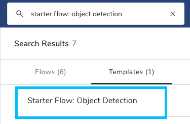
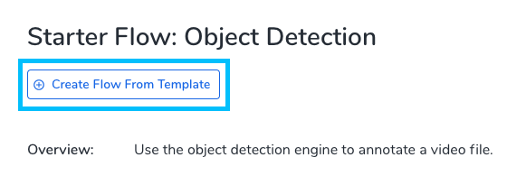
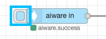
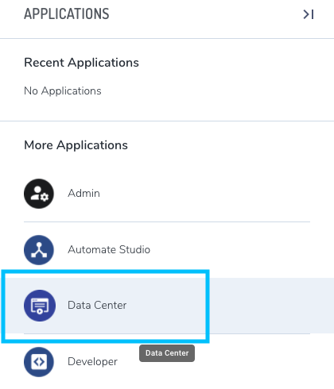
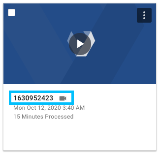

<!-- markdownlint-disable no-inline-html no-trailing-spaces blanks-around-headings heading-increment no-multiple-blanks-->

# Quickstart for First-time Users <!-- {docsify-ignore} -->

**APPROXIMATE READING TIME: 8 MINUTES**

It's easy to use Veritone's aiWARE platform. Follow this quickstart to run your first engine in just a few steps.

## Register <!-- {docsify-ignore} -->

1. [Register for Veritone's platform and applications](https://www.veritone.com/onboarding/#/signUp?type=developer). If you've already registered and chosen a password, [login](https://login.veritone.com/) and skip to [Learn about Veritone Apps](#learn-about-veritone-apps).

2. After registering, open the email you received from the Veritone team, then confirm your account by selecting **Confirm account**. A new tab will open for you to create a password.

3. Create your password, then select **Continue**. Your application (app) will load. Congratulations, you're registered!

## Learn about Veritone Apps <!-- {docsify-ignore} -->

The Veritone aiWARE platform includes a set of modern web apps that make AI easy to use. To view the Veritone apps menu, select the grid icon in the upper right corner of the screen.

Some of the most frequently used apps are:

* Admin

    The [Admin app](https://admin.veritone.com/) enables you to manage your organization details, edit profiles, add, edit, or remove users, grant permissions, generate API keys, and manage your billing info.

* Automate Studio

    The [Automate Studio app](https://automate.veritone.com/) is a low-code workflow designer that enables you to design and deploy AI-powered business processes at scale in days. Leverage an intuitive drag-and-drop UI to easily create advanced business logic on a digital canvas, without the need for in-depth coding skills or AI expertise. Automate Studio enables Intelligent Process Automation (IPA) and workflow enrichment across both new and existing systems and apps.

* Developer

    The [Developer app](https://developer.veritone.com/) is the development platform where you can build your own custom engines, schemas, and adapters, or create your own apps.

## Run your First Engine <!-- {docsify-ignore} -->

Veritone provides over 100 active and ready-to-use [engines (flows)](/developer/engines/README) out of the box. You'll learn how to run an existing engine using Automate Studio in just a few steps.

1. Select the grid icon to open the Apps menu.

    

1. From the Apps menu, select **Automate Studio**. It'll open in a new tab.

2. In the upper left corner, select **+New Flow**, then search for _Starter Flow: Object Detection_. The search results will appear.

4. Select the **Templates** tab, then select **Starter Flow: Object Detection**.

    

    A pane called **Starter Flow: Object Detection** will appear on the right. 

5. In the pane, select **+Create Flow From Template**. A new tab will open and load the flow (engine).

    

5. Once the engine has loaded, select **Deploy** in the grey header. A green "Changes deployed" message will appear.

    

6. In the **aiware-in** node (the first node in the engine), select the blue checkbox to start the engine.

    

7. Once you're done, open the Apps menu, then select **Data Center**. The **Data Center** will open in a new tab.

    

8. In the **Files** tab of the **Data Center**, find your video file that the engine just processed. Next, select the file's bold text, which is the ID of the Temporal Data Object (TDO). The result of the engine process will appear. You'll see a list of timestamps describing the objects that appear each second of the video. To see the frame of the video where a specific object was detected, select that timestamp. Congratulations, you've run your first engine!

    

## Next Steps <!-- {docsify-ignore} -->

* [Learn more about Engines](/developer/engines/getting-started/)
* [Learn more about Apps](/developer/applications/app-tutorial/)
* [Create your first flow in Automate Studio](/automate-studio/getting-started/README)

## Need Help? <!-- {docsify-ignore} -->

Need help or have a question? Contact us in our [Slack Community](http://veritonedev.slack.com/).
