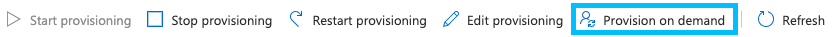

# Setting up an Azure Active Directory Application and OpenID

**APPROXIMATE READING TIME: 30 MINUTES**

This tutorial will show you how to configure SCIM (System for Cross-Domain Identity Management) endpoints and create an aiWare organization, Azure Active Directory (AD) application, and users.

## Create an organization

1. Login to super-admin user and create a new organization. If you've already setup an organization and org admin, skip to the next section. 

1. Create a new org admin to manage the new organization.
<!-- keeping this link as a comment in case I need it later. step 1 and 2 recording: https://drive.google.com/file/d/1AO5VQjzD9YROl1M1ZeB4iCkPyjaQvaSU/view
 -->

## Create a new Enterprise Application


<!-- Record: https://drive.google.com/file/d/151ubvL-Cui3Y2qENuu0AE4s0tvcGCBAH/view -->

1. Go to [Azure AD](https://portal.azure.com) and create a new Enterprise Application for testing.

1. Select **Azure Active Directory**.

1. Select **Enterprise applications** from the left panel.
 
1. Select **+ New Application**.

1. Select **+ Create your own application**. The **Create your own application** panel will appear.

1. In the **Create your own application** panel, name your application and select the **Integrate any other application you don't find in the gallery** radio button.

1. Select **Create**. The app overview page will load and show your app's properties.

      

1. Select **Home** in the breadcrumb menu at the top of the page.

## Collect values for a GraphQL call

1. Select or search for **Azure Active Directory**.

1. In the panel on the left, select **App registrations**.

      

1. Select the **All applications** tab. Your newly created app should appear in the **Display name** list.

      

1. Select your app from the list.

1. Copy the **Application (client) ID** and save it for later.

      

1. Select the **Endpoints** tab. The **Endpoints** panel will appear.

1. Copy the **OpenID Connect metadata document** value and save it for later.

      

1. Select the **Certificates and secrets** tab from the menu on the left.

      

1. Select **+ New Client Secret**. An **Add a client secret** panel will appear.

1. Enter a description, select an expiration, and then select **Add**.

1. In the **Client secrets** section, copy the value for your new secret and save it for later.

      

## Create a new OpenID Connect Provider in aiWare using GraphQL

1. [Login to your Veritone account](https://login.dev.veritone.com/) using your org admin credentials, then go to Veritone's [GraphQL interface](https://api.us-1.veritone.com/v3/graphql) (use the domain of the environment you are logged into, if not `us-1`).

1. Run the following mutation after you replace the values of **clientId**, **clientSecret**, and **issuerURL** with the values you saved earlier:
 
      <!-- Video: https://drive.google.com/file/d/1DVc2iBFMP2rJqQ8GMEEm5ldWtVKWWBjQ/view -->

      ```graphql
      mutation {
      createOpenIdProvider(
            input: {
                  name: "Veri-Tutorial-Scim-Test"
                  description: "Test OpenID Azure Description"
                  websiteUrl: "https://login.microsoftonline.com"
                  clientId: "<YOUR CLIENT ID>"
                  clientSecret: "<YOUR CLIENT SECRET>"
                  issuerUrl: "<YOUR OPENID CONNECT METADATA DOCUMENT>"
                  btnText: "Veri Tutorial Login"
                  btnLogo: "https://seeklogo.com/images/A/azure-active-directory-logo-C196F4B2D3-seeklogo.com"
                  btnColor: "#FFFFFF"
                  isGlobal: false
            }
            ) {
                  id
                  name
                  description
                  websiteUrl
                  loginUrl
                  loginButtonStyle {
                  btnText
                  btnLogo
                  btnColor
                  }
                  isGlobal
            }
      }
      ```

      Your response should look like this:

      

1. Copy the **id** and the **loginUrl** that are returned from GraphQL and save them somewhere.

## Configure a platform

1. Go to [Azure AD](https://portal.azure.com).

1. Select **Azure Active Directory**.

1. Select **App registrations** from the left panel.

1. Select the **All applications** tab and then select your application.

1. Select **Authentication** from the left panel.
 
1. Select **+ Add a platform**.

      

      A **Configure platforms** panel will appear on the right.

1. In the **Configure platform** panel, select **Web**. The **Configure Web** panel will appear.

1. Paste the **loginUrl** you had saved into the text field.

1. Modify the URL by adding _/callback_ before "login" at the end of the URL. Your URL should look like this:

      https://api.dev.us-1.veritone.com/v1/admin/openid/16f982b7-17fa-4c6c-a17b-9e7e018d42c0/callback/login

1. Select **Configure**. The panel will close, and a **Web** section containing your redirect URI will appear under the **Platform configurations** section.

1. In the left panel, select **Token configuration**.

1. In the **Optional claims** section, select **+ Add optional claim**.

      

      An **Add optional claim** panel will appear on the right.

1. In the **Add optional claim** panel, select the **ID** radio button. A list of claims will appear.

1. Select the first checkbox, called **Claim**. This will select all the checkboxes.

1. Select **Add**. A pop-up window will tell you that some claims require OpenID Connect scopes.

1. Select the checkbox in the pop-up window, then select **Add**. The pop-up window and panel will close, and a list of claims will appear. Your list of claims should look like this, but with more claims:

      

      <!-- Video https://drive.google.com/file/d/1x84zycnEXwD2sCkySovqi4-NXBp2O8GE/view -->

## Create a new user and add them to your Azure AD app

### Create the user

1. Go to [Azure AD](https://portal.azure.com).

1. Select **Azure Active Directory**.

1. In the left panel, select **Users**.

1. Select the **+ New user** tab at the top of the main panel.

      

      The **New user** page will appear.

1. In the **Identity** section, enter a username and a name. In the **Password** section, choose to either auto-generate or manually set a password, then fill out any other sections or fields you want.

1. Select **Create**. A list of all users will appear.

      

1. Select the user you created. Their profile will load. Once it loads, ensure their email is in the **Contact info** section.

      

      >? If the user's email is in the **Contact info** section, skip to Step 10. Otherwise, continue to Step 8.

1. Select the **Edit** tab.

      

1. Enter the user's email in the **Contact info** section, then select the **Save** tab.

### Add the user

1. Go to [Azure AD](https://portal.azure.com).

1. Select **Azure Active Directory**.

1. Select **Enterprise applications** from the left panel.

1. Select your application.

1. Select **Users and groups** from the left panel.

1. Select the **+ Add user/group** tab at the top of the center panel.

1. Select **None Selected** under **Users**. The **Users** panel will appear on the right.

1. In the **Users** panel, select the user you created earlier, then select **Select**.

1. Select **Assign** at the bottom of the center panel.

<!-- Recording: https://drive.google.com/file/d/1WhICbOLavCs9iG32GmRNEc_ldVHWp1Cp/view
https://drive.google.com/file/d/19DmYILxPMSrNshJiC95eRHLK59H0NBFp/view -->

## User provisioning with Azure AD via SCIM Endpoints

### Generate an API token

1. Sign into [Veritone Admin Console](login.veritone.com) with your User Admin account.

      

1. Select **API Keys**.

1. Select **New API Key**. A **New API Key** window will appear.

1. Enter a **Key Name** for your token.

1. In the **Select Permissions** section, select the **User** checkbox.

1. Select **Generate Token**. The **Token Generated** window will appear. Select **Copy**, and paste the token in a safe place.

      

### Create credentials and test the connection

1. Go to [Azure AD](https://portal.azure.com).

1. Select **Azure Active Directory**.

1. Select **Enterprise applications** from the left panel.

1. Select your application.

1. Select **Provisioning** from the left panel.

1. Select **Get Started** from the center panel.

      

      The **Provisioning** page will load.

1. In the **Provisioning Mode** dropdown, select **Automatic**. An **Admin Credentials** section will appear.

1. Add the string in your **loginUrl** you copied at the end of Step 23 in the **Create a new Enterprise Application** section to this URL: https://api.dev.us-1.veritone.com/v1/admin/scim/\<YOUR LOGINURL\>.

      Your URL should look like this: https://api.dev.us-1.veritone.com/v1/admin/scim/16f982b7-17fa-4c6c-a17b-9e7e018d42c0.

1. Paste the URL into the **Tenant URL** field.

1. Paste the API token you created in Step 6 into the **Secret Token** field.

1. Select **Test Connection**. After a few seconds, a message should appear in the upper right with a green checkmark, indicating the test was successful.

1. Select **Save** at the top of the panel.

### Finalize the provisioning settings

1. Go to [Azure AD](https://portal.azure.com).

1. Select **Azure Active Directory**.

1. Select **Enterprise applications** from the left panel.

1. Select your application.

1. Select **Provisioning** from the left panel.

1. Select **Edit Provisioning**.

      

      The **Provisioning** page will load.

1. Expand the **Mappings** section, then select **Provision Azure Active Directory Groups**. The **Attribute Mapping** page will load.

1. Ensure the name field says "Provision Azure Active Directory Groups".

1. Toggle **Enabled** to **No**.

1. Select **Save** at the top. When prompted to save your changes, select **Yes**.

1. Select the **Provisioning** breadcrumb. The **Provisioning** page will load.

      

1. Toggle **Provisioning Status** at the bottom to **On**, then select **Save**.

1. Close by selecting **X** in the upper right.

>? Provisioning cycles every 40 minutes, but you can also provision immediately with [Provision on demand](#provision-on-demand).

## Provision on demand

1. Select **Provision on demand**.

      

      The **Provision on demand** page will load.

1. In the search bar, search for and select the user to provision, then select **Provision**.

1. Login to Veritone's Admin Console and verify the new user was created.

      

<!-- 
- User admin account to generate a new API Token which will be used for the SCIM Endpoints. Then save the token somewhere to use in step 2
Video: https://drive.google.com/file/d/1x0HO2_Qffoz75kmO_D1hlorLiguKIYq_/view

- Go to Provisioning page of Azure AD Application to install our aiWare SCIM Endpoint (Our Tennant URL is https://api.dev.us-1.veritone.com/v1/admin/scim/{connectId}, Secret Token is from step 1)
Recording: https://drive.google.com/file/d/1THzAaLFuWMnlAKSeBMNHfDMF-02ttYNN/view

- The Provisioning usually automatically runs per 40 minutes. But we can run on demand so we don’t need to wait for logging in a new User.
Video: https://drive.google.com/file/d/10nzOiZ9T4wHlpXlzsk534FqwjT_8RGDH/view
Login for the new User of Azure AD in aiWare system

-->

## Set up Microsoft Graph

### Add the admin account as an owner

1. Go to [Azure AD](https://portal.azure.com).

1. Select **Azure Active Directory**.

1. Select **App registrations** from the left panel.

1. Select the **All applications** tab, then select your application.

1. Select **Owners** from the left panel.

1. Select **Add Owners**.

      

      The **Owners** panel will appear on the right.

1. In the **Owners** panel, search for and select your administrator account, not the user you recently created.

1. Select **Select**. Your administrator account should be listed in the center panel.

      

### Update permissions

1. Select **API Permissions** from the left panel.

1. In the **Configured permissions** section, select **+ Add a permission**.

      

      The **Request API permissions** panel will appear.

1. At the top of the **Request API permissions** panel, select the **My APIs** tab, then select your application.

1. Check the box next to user_impersonation, then select **Add permissions** at the bottom of the panel.

      

      The panel will close, and your updated permissions will appear in the center panel.

       

1. In the **Configured permissions** section, select **+ Add a permission**. The **Request API permissions** panel will appear.

1. At the top of the **Request API permissions** panel, select the **APIs my organization uses** tab, then search for and select **Microsoft Graph**.

1. Select **Delegated Permissions**. A **Select permissions** section will appear in the panel.

1. In **OpenId permissions**, select all 4 boxes.

      

1. Select **Add permissions** at the bottom of the panel. The panel will close, and your Microsoft Graph permissions will appear in the **Configured permissions** section of the center panel.

1. Select the **Grant Admin Consent for \<your AD\>** in **Configured Permissions**. When prompted to confirm, select **Yes**.

      

      All the permissions should now have a green checkmark in the **Status** column.

      


## Use GQL to query the OpenID Connect Provider

 1. In the browser, enter the **loginUrl** you received from the mutation you ran in **Create a new enterprise application**. 

 1. Login using the email of the user you created.
 
 1. Use GraphQL to query the OpenID Connect Provider using this query:

      ```graphql
      query {
      openIdProviders(isGlobal: false) {
      records {
            id
            name
            description
            loginUrl
            loginButtonStyle {
            btnText
            btnLogo
            btnColor
            }
            id
            isGlobal
            websiteUrl
      }
      }
      }
      ```

 1. Enter the **loginUrl** returned from the query to login the new user.