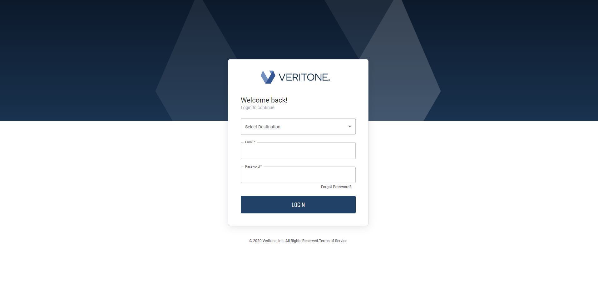
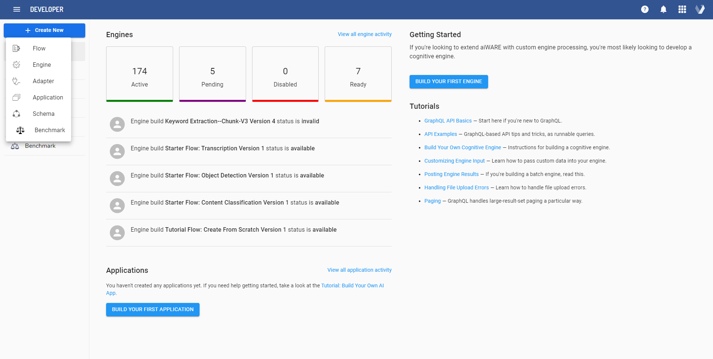

# Build your First Engine using Developer App

**APPROXIMATE READING TIME: 50 MINUTES**

## Before we begin <!-- {docsify-ignore} -->

If you're new to Veritone aiWARE and Developer app, we recommend you read about them using the links below.

[aiWARE Overview](https://docs.veritone.com/#/aiware/README)

[aiWARE Applications](https://docs.veritone.com/#/aiware/aiWARE-in-depth/apps/)

[Developer App Guide](https://docs.veritone.com/#/tutorials/pages/developer-app/)

## Building your own Engine <!-- {docsify-ignore} -->

In this guide, we will provide steps to build your first engine using the [Veritone Developer](https://docs.veritone.com/#/developer/) App. Engines are the building blocks of cognitive computing in the Veritone aiWARE operating system. Each engine has different analytical capabilities and has been divided based on the type of data they analyze to derive actionable insights and solve complex problems.

With aiWARE, you can easily create your own engine or support the preexisting engine types specified in our [Capabilities Table](https://docs.veritone.com/#/developer/engines/cognitive/?id=capabilities)

## Expected Result <!-- {docsify-ignore} -->
After following this step-by-step tutorial, you will be successfully able to build your own Keyword Extraction Engine using the Developer App.

## Creating an Engine: Overview <!-- {docsify-ignore} -->

All Engines in aiWARE are packaged as executable [Docker](https://www.docker.com/) containers, which are exposed via webhook through a Veritone's Engine Developer Toolkit. An engine webhook can pass data as a JSON object, which makes them widely compatible with all the programming languages. The most common languages used for implementing engines are Go, Node.js, and Python.

For building a cognitive engine, you will need to choose what type of extraction capabilities you want to derive insights. For the sake of the demonstration, we are choosing a simple text-processing engine that extracts words from a file.

At a high level, there are six steps you need to carry out to build your first engine using the developer app.

- Step 1: Setting up your project - Initalizing the development environment.

- Step 2: Configuring the Engine ‐ During this step, the engine will be configured using Veritone Developer App.

- Step 3: Creating an Engine Build

- Step 4: Testing  the Engine Locally

- Step 5: Pushing the engine build to Veritone aiWARE

- Step 6: Testing the Engine in aiWARE

 Okay. Ready to get started? Let's go.

## Step 1: Setting up the project <!-- {docsify-ignore} -->
### A Developer Veritone Account.

  Sign up [here](https://www.veritone.com/onboarding/#/signUp?type=automate?) using your email and username.

  
### Docker installed on your (Mac, Linux, or virtualized Linux) development machine.

Docker Installation Instructions for Mac can be found [here](https://docs.docker.com/docker-for-mac/install/)

Steps for Installing Docker on Ubuntu Linux can be found below

1. Update the `apt` package index and install packages to allow `apt` to use a repository over HTTPS:

   ```
   sudo apt-get update

   sudo apt-get install \
       apt-transport-https \
       ca-certificates \
       curl \
       gnupg \
       lsb-release
   ```

2. Add Docker's official GPG key:

   ```
   curl -fsSL https://download.docker.com/linux/ubuntu/gpg | sudo gpg --dearmor -o /usr/share/keyrings/docker-archive-keyring.gpg
   ```

3. Use the following command to set up the **stable** repository.

   ```
   echo \
     "deb [arch=amd64 signed-by=/usr/share/keyrings/docker-archive-keyring.gpg] https://download.docker.com/linux/ubuntu \
     $(lsb_release -cs) stable" | sudo tee /etc/apt/sources.list.d/docker.list > /dev/null
   ```

4. Update the `apt` package index, and install the *latest version* of Docker Engine and containerd.

```
 sudo apt-get update
 sudo apt-get install docker-ce docker-ce-cli containerd.io
```

5. Verify that Docker Engine is installed correctly by running the `hello-world` image.

```
sudo docker run hello-world
```

This command downloads a test image and runs it in a container. On a successful install, it prints an informational message.

Sample Response after successful Docker Installation:

### Cloning the Code Repository

1. Clone the V3-Engine Examples code [repository](https://github.com/veritone/V3-Engine-Examples), which contains sample code for the Veritone Keyword Extraction Engine.

```
git clone https://github.com/veritone/V3-Engine-Examples
```

Response:

```
Cloning into 'V3-Engine-Examples'...
remote: Enumerating objects: 192, done.
remote: Counting objects: 100% (192/192), done.
remote: Compressing objects: 100% (126/126), done.
remote: Total 192 (delta 75), reused 97 (delta 36), pack-reused 0
Receiving objects: 100% (192/192), 196.46 KiB | 4.01 MiB/s, done.
Resolving deltas: 100% (75/75), done.

```

2. Navigate to the directory

```
cd V3-Engine-Examples/
```

 The directory contains code for different types of cognitive engines as follows.

- A EXIF engine written in Go

- Sentiment Analysis using Python

- Hello World Keyword Extraction Engine using Javascript


In our case, we are building a simple test processing engine, so we will have a look at the files located in the  `javascript/hello-world ` folder. It contains the following files:

  ```
Dockerfile  index.js               manifest.json
README.md   keyword-extraction.js  package.json
  ```

| File                                                         | Action                                                       |
| ------------------------------------------------------------ | ------------------------------------------------------------ |
| [Dockerfile](https://github.com/veritone/V3-Engine-Examples/blob/master/javascript/hello-world/Dockerfile) | Contains all the commands that a user would call to assemble an engine docker image |
| [index.js](https://github.com/veritone/V3-Engine-Examples/blob/master/javascript/hello-world/index.js) | Executes javascript code in the keyword-extraction.js file and responds to HTTP requests ( `GET` or `POST`) |
| [keyword-extraction.js](https://github.com/veritone/V3-Engine-Examples/blob/master/javascript/hello-world/keyword-extraction.js) | Contains a simple vocabulary-extraction logic that automatically detects vocabulary words from unstructured text data received as input. |
| [manifest.json](https://github.com/veritone/V3-Engine-Examples/blob/master/javascript/hello-world/manifest.json) | Holds information about your engine (such as its engine id, concurrent request handling limits, supported input formats, and type of engine). Manifests are included with your build docker image. |
| [package.json]()                                             | Holds various metadata relevant to the project dependencies. Express web application framework and Multer node package is used as a middleware for handling multipart/form-data . |

## Step 2: Configuring the Engine <!-- {docsify-ignore} -->

1. Go to https://developer.veritone.com/ and sign in using your Veritone developer account credentials created earlier.



2. Click on the blue Create New button (upper left) and select engine from the dropdown list.
   
3. Select the Engine Class and capability type. In our case, we are selecting a Text engine that has Keyword Extraction capabilities.


4. Scroll down the page, select segment as **Engine Mode**.


The rationale for choosing a segment engine mode over a stream is its stateless queue operations. A segment engine does not have to keep track of data that came before or after it. In contrast, Stream Engines process data in streams and keeps track of the order in which it is processed.

Since the text processing engine does not have to keep track of words coming before or after it, a segment engine is the best use case here.
Note: Batch Engine Mode is also available as an engine mode, but it is deprecated. We will recommend using segment message or stream engine modes instead.

5. Select the supported input types. Since we are creating a test processing engine,select `text/csv`, `text/plain`, and `text/plain;charset=utf-8`.


6. Leave custom fields for inputs blank for now. Read more about [Custom Fields](https://docs.veritone.com/#/developer/engines/custom-fields/) if you want to set a custom input field.


7. Click the **NEXT** button to proceed to the Testing Detail page.


Here you can provide a processing flow for your engine; they are not a mandatory field to specify. You can click **NEXT** and come back later to supply default job mutations after your engine is created.

> If you see a prompt of "Are you sure you want to continue?" click **CONTINUE ANYWAY**.

8. Click the **NEXT** button to select the deployment model for the engine


All the model types are self-explanatory, and for the test processing engine, we will select Network Isolated as it does not have to connect with the external web endpoints.

9. Click **NEXT** to go to the final step to specify the engine name and add a description.

   

10. Specify an optional icon, provide other information info about the engine and click on review. (See the screenshot below)


> Specifying whether your engine requires a library is mandatory to move to the review step. A library-enabled engine typically identifies assets from the provided library and acts on an engine execution. Depending on the type of engine, you might require a specific library, but in our case, it is not a requirement.(Read more about [Library Engines](https://docs.veritone.com/#/developer/libraries/engines?id=library-enabled-engines))

11. Clicking the **REVIEW** button will bring up an **Engine Summary** dialog in which you can check the accuracy of the selections you've made thus far. Edit the selections before clicking on the **CREATE ENGINE PROFILE** button as some of the variables cannot be changed after creation.


12. On successful creation, you will be redirected to the **Builds** overview page (which would have three tabs: **BUILDS** **TASKS** and **LOGS**). *Note that your engine's ID is shown near the top of the page, under the engine name.*

 

13. Now, you can generate a `manifest.json` file for creating docker builds and testing your engine  by clicking on **GENERATE MANIFEST**

 A **Manifest** dialog will appear, containing the text of your `manifest.json` file.


14. Copy the contents from the `manifest.json` file into the `V3-Engine-Examples/javascript/hello-world/manifest.json`  file of the development machine. Delete the old manifest configuration and make sure the `engineId`  field must match the ID assigned to your engine. Also the `url` field must be a valid URL, which is recommended to point to your project's main page on Github. The `category` must also be filled out with the category of the engine you created. For this engine, it is "text".

## Step 3: Creating an Engine Build <!-- {docsify-ignore} -->

This step assumes that you have already configured an engine and generated a `manifest.json` file. The `manifest.json` file will be used to create a deployable engine *build*.

1. Navigate to the `V3-Engine-Examples/javascript/hello-world` folder and ensure all the project files are in place. The project files should look like this:

```
/hello-world
    |— Dockerfile
    |— index.js
    |— keyword-extraction.js
    |— manifest.json
    |— package.json
```

2. Create the Dockerfile to build an image. For our test processing engine, the Dockerfile is already created.

Here's the Dockerfile for our  project:

```
FROM veritone/aiware-engine-toolkit as vt-engine-toolkit //Base Image for custom Docker Engine Build
FROM mhart/alpine-node:14.8  ///Alpine Linux Base Image

COPY . /app
COPY manifest.json /var/    //Copy Manifest file to var folder

WORKDIR /app               ///make `/app` the working directory

EXPOSE 8080                ///Expose 8080 Port for Engine Interaction

RUN apk update \                      //Update Packages
  && apk upgrade \
  && apk --no-cache add ca-certificates \
  && apk add --no-cache libc6-compat
RUN npm install                       // Install Dependencies

ENV VERITONE_WEBHOOK_READY="http://0.0.0.0:8080/readyz"
ENV VERITONE_WEBHOOK_PROCESS="http://0.0.0.0:8080/process"

COPY --from=vt-engine-toolkit /opt/aiware/engine /opt/aiware/engine

RUN ["chmod", "+x", "/app/index.js"]         //Grant Execution Rights

ENTRYPOINT [ "/opt/aiware/engine", "node", "index.js" ]  //Defining the starting point for engine
```

3. To build your engine, run the following command in a terminal (e.g., a bash shell):

```
docker build -t hello-world .
```
> Do not omit the trailing period(.) in the above command as it specifies the `PATH`  to find the files for the "context" of the build on the Docker daemon.  

The process for building the image will start. In the console output, you will notice the build process consists of many steps.
Here is a sample console output:

```
"`pre
Sending build context to Docker daemon  9.728kB
Step 1/13 : FROM veritone/aiware-engine-toolkit as vt-engine-toolkit
latest: Pulling from veritone/aiware-engine-toolkit
540db60ca938: Pull complete
3b25bd464356: Pull complete
0d734ba72ba1: Pull complete
b495f1fc40c5: Pull complete
Digest: sha256:a7ecfc5ba04cd3a0f5ba905bb61229faa0d614f9c75995447b3c8e51cb6cbc84
Status: Downloaded newer image for veritone/aiware-engine-toolkit:latest
 ---> 3696df9a4a05
Step 2/13 : FROM mhart/alpine-node:14.8
14.8: Pulling from mhart/alpine-node
cbdbe7a5bc2a: Pull complete
206eb87fc785: Pull complete
Digest: sha256:7f26d33262a43626a78875fb4d92e1cb7bde163beac9b7202214d082f76584aa
Status: Downloaded newer image for mhart/alpine-node:14.8
 ---> 54b360c1ca60
Step 3/13 : COPY . /app
 ---> f0e078d283bb
Step 4/13 : COPY manifest.json /var/
 ---> 89e35a813934
Step 5/13 : WORKDIR /app
 ---> Running in 03a00e167b22
Removing intermediate container 03a00e167b22
 ---> 8736ee1d0dc9
Step 6/13 : EXPOSE 8080
 ---> Running in 42f9d7f2f411
Removing intermediate container 42f9d7f2f411
 ---> c7a2baeec9f5
Step 7/13 : RUN apk update   && apk upgrade   && apk --no-cache add ca-certificates   && apk add --no-cache libc6-compat
 ---> Running in 1d5317f63ae9
fetch http://dl-cdn.alpinelinux.org/alpine/v3.11/main/x86_64/APKINDEX.tar.gz
fetch http://dl-cdn.alpinelinux.org/alpine/v3.11/community/x86_64/APKINDEX.tar.gz
v3.11.11-43-ge6ce8b0c63 [http://dl-cdn.alpinelinux.org/alpine/v3.11/main]
v3.11.11-24-g127ddb5cee [http://dl-cdn.alpinelinux.org/alpine/v3.11/community]
OK: 11281 distinct packages available
Upgrading critical system libraries and apk-tools:
(1/1) Upgrading apk-tools (2.10.5-r0 -> 2.10.6-r0)
Executing busybox-1.31.1-r9.trigger
Continuing the upgrade transaction with new apk-tools:
(1/6) Upgrading musl (1.1.24-r2 -> 1.1.24-r3)
(2/6) Upgrading busybox (1.31.1-r9 -> 1.31.1-r10)
Executing busybox-1.31.1-r10.post-upgrade
(3/6) Upgrading libcrypto1.1 (1.1.1g-r0 -> 1.1.1k-r0)
(4/6) Upgrading libssl1.1 (1.1.1g-r0 -> 1.1.1k-r0)
(5/6) Upgrading ssl_client (1.31.1-r9 -> 1.31.1-r10)
(6/6) Upgrading musl-utils (1.1.24-r2 -> 1.1.24-r3)
Executing busybox-1.31.1-r10.trigger
OK: 7 MiB in 16 packages
fetch http://dl-cdn.alpinelinux.org/alpine/v3.11/main/x86_64/APKINDEX.tar.gz
fetch http://dl-cdn.alpinelinux.org/alpine/v3.11/community/x86_64/APKINDEX.tar.gz
(1/1) Installing ca-certificates (20191127-r2)
Executing busybox-1.31.1-r10.trigger
Executing ca-certificates-20191127-r2.trigger
OK: 8 MiB in 17 packages
fetch http://dl-cdn.alpinelinux.org/alpine/v3.11/main/x86_64/APKINDEX.tar.gz
fetch http://dl-cdn.alpinelinux.org/alpine/v3.11/community/x86_64/APKINDEX.tar.gz
(1/1) Installing libc6-compat (1.1.24-r3)
OK: 8 MiB in 18 packages
Removing intermediate container 1d5317f63ae9
 ---> 149cc5df7709
Step 8/13 : RUN npm install
 ---> Running in f142c1d35b3f
npm notice created a lockfile as package-lock.json. You should commit this file.
npm WARN hello-world@1.0.0 No repository field.
npm WARN hello-world@1.0.0 license should be a valid SPDX license expression

added 71 packages from 47 contributors and audited 71 packages in 3.044s
found 0 vulnerabilities

Removing intermediate container f142c1d35b3f
 ---> 50fb58e76ac3
Step 9/13 : ENV VERITONE_WEBHOOK_READY="http://0.0.0.0:8080/ready"
 ---> Running in 572e6740904b
Removing intermediate container 572e6740904b
 ---> 9e83d3dc336c
Step 10/13 : ENV VERITONE_WEBHOOK_PROCESS="http://0.0.0.0:8080/process"
 ---> Running in 373661b28c5a
Removing intermediate container 373661b28c5a
 ---> 077d6cdbe2b7
Step 11/13 : COPY --from=vt-engine-toolkit /opt/aiware/engine /opt/aiware/engine
 ---> b57bda389875
Step 12/13 : RUN ["chmod", "+x", "/app/index.js"]
 ---> Running in 1a1bd892d4ba
Removing intermediate container 1a1bd892d4ba
 ---> 5151373be238
Step 13/13 : ENTRYPOINT [ "/opt/aiware/engine", "node", "index.js" ]
 ---> Running in 50b0ed1074c0
Removing intermediate container 50b0ed1074c0
 ---> bd5d0ffba828
Successfully built bd5d0ffba828
Successfully tagged hello-world:latest
```
After successful completion of the built process, you will see a `Successfully built` message.

## Step 4: Test your engine Locally <!-- {docsify-ignore} -->

This step assumes that you have already configured and created an engine build. Now the engine will be tested locally using Veritone's Engine Developer's Toolkit **test mode**.

1. Open a terminal and run the following command:

```bash
docker run -e "VERITONE_TESTMODE=true"  -p 9090:9090 -p 8080:8080 --name hello-world --rm -it hello-world
```

This will fire up the 'hello-world` container in *test mode*, exposing ports 9090 and 8080 for WebHooks and Test Console App.

> `--rm` tag is added in the [run](https://docs.docker.com/engine/reference/commandline/run/) command to remove the container when it exits. This mitigates the  `container is already running` error when you re rerun it.

2. If your engine launched normally, you should see a console message something like this:

```pre
2021/06/03 15:08:23 Veritone Engine Toolkit [linux/amd64] 0.0.0:HEAD:bc2cfa3dc1a5e8e9f9a68ed62ccec3123182a82a, built on 2021-06-01_19:04:52 (1622574327)
2021/06/03 15:08:23 PATH=/usr/local/sbin:/usr/local/bin:/usr/sbin:/usr/bin:/sbin:/bin
2021/06/03 15:08:23 HOSTNAME=fb3353bdfef7
2021/06/03 15:08:23 TERM=xterm
2021/06/03 15:08:23 VERITONE_TESTMODE=true
2021/06/03 15:08:23 VERITONE_WEBHOOK_READY=http://0.0.0.0:8080/ready
2021/06/03 15:08:23 VERITONE_WEBHOOK_PROCESS=http://0.0.0.0:8080/process
2021/06/03 15:08:23 HOME=/root
time="2021-06-03T15:08:23Z" level=debug msg="EI [EI:71eaaa5a-015e-4d71-bf8b-baf805601b83] engine: running"
time="2021-06-03T15:08:23Z" level=debug msg="EI [EI:71eaaa5a-015e-4d71-bf8b-baf805601b83] WARNING: Test mode (remove VERITONE_TESTMODE before putting into production)"
time="2021-06-03T15:08:23Z" level=debug msg="EI [EI:71eaaa5a-015e-4d71-bf8b-baf805601b83] running subprocess for testing..."
no push IP configured ... not pushing to pushgatewway
time="2021-06-03T15:08:23Z" level=debug msg="EI [EI:71eaaa5a-015e-4d71-bf8b-baf805601b83] running test console..."

        The Engine Toolkit Test Console is now running.

        Go to: http://localhost:9090/
Running test mode on port %s9090
```

3. Open a web browser on your development machine and go to http://localhost:9090/. You should see the **Veritone Engine Toolkit Test Console** page:


4. If you scroll down further in the test console, you will see a **Process webhook test** subheading; this is where you test the engine for results.


#### How it Works:

A **Chunk file** File-picker is used to specify a test file for input. For the MIME type, enter a supported MIME type by your engine.

The various other form fields (`startOffsetMS,` `width,` `height,` etc.) apply only to visual media, so our test processing engine code will ignore these fields.

To get the results, specify a text file for your engine; for example, we are specifying a text file that contains the following phrase: `How much wood would a wood chuck chuck if a wood chuck could chuck wood`.

Click on the green **Submit request** button and the `engine` driver will hit our `/process` webhook with the test-mode data chunk we've configured. The output from the engine code will extract "vocabulary words" from (`testfile`) and captured them in the appropriate output format as results.


## Step 5: Push your engine build to Veritone <!-- {docsify-ignore} -->  

1. Log in to Veritone [Developer App]((https://developer.veritone.com/))

2. Click the **ENGINES** link in the upper left, which will show your engine (along with any other engines you've onboarded and all public engines you have access to): Your engine will show engine state inactive since it is not deployed


3. Click on your engine's name to reveal the Builds page. If you've never uploaded any builds, the page will show **Create a New Build** near the top, with instructions shown underneath that heading:


4. To create a new build, you have to specify the Docker image URL.

5. To get a docker image URL, you need to create an account on the Docker hub and upload the image there.Signup on the docker hub using this [link](https://hub.docker.com/) and create a new repository.

6. To upload a new image to the repository open the terminal and sign in to your Dockerhub account using the `docker login` command.

7. Tag the hello-world engine using the command below:

   ```
   docker tag hello-world my-docker-account/hello-world
   ```
Note: Make sure to change the repo name(hello-world) and docker username(my-docker-account) in the above command with your docker username and repo.

8. Push the build using the command below :

   ```bash
   docker push my-docker-account/hello-world
   ```
Note: Make sure to change the repo name(hello-world) and docker username(my-docker-account) in the above command with your docker username and repo.

9. Now copy the docker image URL, which is `my-docker-account/hello-world` in our case, and click on create a new build.

Note: Make sure to change the repo name, docker username, and build name before specifying your docker image URL.


10. Once you provide the image URL, you should see the engine build listed with approved status.


11. Now click on deploy on the right, and you will see the status Deployed in few minutes


Note:  If an abnormal status is showing, use the menu control at the right edge of the list item to expose (and select) the **Download Build Report** command. (The Build Report is a JSON file that will contain clues as to what's wrong with the build.)


## Step 6: Test your engine in aiWARE <!-- {docsify-ignore} -->

 Now that you've onboarded an engine (and set its status to DEPLOYED), you can test the engine in a live Job, in aiWARE.

One of the easiest ways to do this is, of course, to use the [GraphQL Sandbox IDE](https://api.veritone.com/v3/graphql) web IDE.

1. Navigate to the [GraphQL Sandbox IDE](https://api.veritone.com/v3/graphql).
   The IDE would look similar to the screenshot below:

   

2. In the GraphQL Sandbox, create — and then execute — a query like the following, using *your* engine's ID:

```graphql
query myEngine{
  engine(id:"2c8ac7d7-cf3c-4a65-8a2d-d41d09cdc00f"){
    builds {
      records {
        id
        status
      }
    }
    name
    state
    ownerOrganizationId
    isPublic
    manifest
    mode
    outputFormats
    supportedInputFormats
    supportedSourceTypes
  }
}
```

This query will show you the status of each build of your engine. If one of your builds is shown as `"status": "deployed"`, that specific build is the one that will be invoked when you try to run a job using your engine.

Response:

```
{
  "data": {
    "engine": {
      "builds": {
        "records": [
          {
            "id": "2c8ac7d7-cf3c-4a65-8a2d-d41d09cdc00f",
            "status": "deployed"
          }
        ]
      },
      "name": "Keyword Extraction--Chunk-V3",
      "state": "active",
      "ownerOrganizationId": "36267",
      "isPublic": false,
      "manifest": {
        "engineMode": "chunk",
        "supportedInputTypes": [
          "text/csv",
          "text/html",
          "text/plain",
          "text/plain; charset=utf-8"
        ]
      },
      "mode": "Chunk",
      "outputFormats": null,
      "supportedInputFormats": null,
      "supportedSourceTypes": null
    }
  }
}
```

3. To test the engine, run a GraphQL mutation given below (being sure to substitute your engine's ID in the appropriate place):
The mutation below has four tasks: an ingestion task involving the Veritone Webstream Adapter , a chunking task (in case the data is large enough to need chunking), our cognition engine, and Output Writer (a Veritone engine that aggregates JSON results).
(Text file used for testing the engine can be found [here](http://se.cs.depaul.edu/Java/Chapter04/Lincoln.txt))

```graphql
mutation createVocabExtractionJob{
  createJob(input: {
    target: { startDateTime:1574311000, stopDateTime: 1574315000 }
    # targetId: 1121185051    # comment this line if using without a TDO
    clusterId :"rt-1cdc1d6d-a500-467a-bc46-d3c5bf3d6901"
    tasks: [
       {
        # webstream adapter (WSA)
        engineId: "9e611ad7-2d3b-48f6-a51b-0a1ba40fe255"
        payload: { url: "http://se.cs.depaul.edu/Java/Chapter04/Lincoln.txt" }
        ioFolders: [
          { referenceId: "wsaOutputFolder", mode: stream, type: output }
        ],
      }
      {
        # data-chunking engine  
        engineId: "8bdb0e3b-ff28-4f6e-a3ba-887bd06e6440"  
        payload:{ ffmpegTemplate: "rawchunk" }
        ioFolders: [
          { referenceId: "chunkInputFolder", mode: stream, type: input },
          { referenceId: "chunkOutputFolder", mode: chunk, type: output }
        ],
        executionPreferences: { parentCompleteBeforeStarting: true }
      }
      {
        # The hello-world engine -- PUT YOUR ENGINE'S ID HERE:
        engineId: "60e9e757-9638-44c9-bb48-67c65332a70f"
        ioFolders: [
          { referenceId: "engineInputFolder", mode: chunk, type: input },
          { referenceId: "engineOutputFolder", mode: chunk, type: output }
        ],
        executionPreferences: { parentCompleteBeforeStarting: true }
      }
      {
        # output writer
        engineId: "8eccf9cc-6b6d-4d7d-8cb3-7ebf4950c5f3"  
        ioFolders: [
          { referenceId: "owInputFolder", mode: chunk, type: input }
        ],
        executionPreferences: { parentCompleteBeforeStarting: true }
      }
    ]
    routes: [
      {  ## WSA --> chunk
        parentIoFolderReferenceId: "wsaOutputFolder"
        childIoFolderReferenceId: "chunkInputFolder"
        options: {}
      }
      {  ## chunk --> Engine
        parentIoFolderReferenceId: "chunkOutputFolder"
        childIoFolderReferenceId: "engineInputFolder"
        options: {}
      }
      {  ## Engine --> output writer
        parentIoFolderReferenceId: "engineOutputFolder"
        childIoFolderReferenceId: "owInputFolder"
        options: {}
      }
    ]
  }) {
    targetId
    id
  }
}
```

Sample Response:

```json
{
  "data": {
    "createJob": {
      "targetId": "1610398547",
      "id": "21072706_NM714cPLpl"
    }
  }
}
```

The `id` of `"21072706_NM714cPLplh"` is the Job ID. The `targetId` is the ID of the TDO (Temporal Data Object) associated with this job.

5. To determine the job's status, go back to developer app -> engines and check tasks you should see the job status as queued. Over time, this would change, and the task would become from `queued` to `running` to `complete` (or `failed` if something went wrong).


## Final Result <!-- {docsify-ignore} -->

When the job finishes (with a `status` of `complete`), run the following query to obtain the engine's results (but again, substitute the correct `jobId`):

```
query getEngineOutput {
  engineResults(jobId:"21072706_NM714cPLpl") {
    records {
      tdoId
      engineId
      startOffsetMs
      stopOffsetMs
      jsondata
      assetId
      userEdited
    }
  }
}
```

For our Hello World engine, results will typically look similar to this:

```json
{
   "taskId": "21072706_NM714cPLpl",
   "generatedDateUTC": "0001-01-01T00:00:00Z",
   "validationContracts": [
      "keyword"
   ],
   "object": [
      {
         "label": "the",
         "type": "keyword"
      },
      {
         "label": "Gettysburg",
         "type": "keyword"
      },
      {
         "label": "Address",
         "type": "keyword"
      },
      {
         "label": "Fourscore",
         "type": "keyword"
      },
      {
         "label": "and",
         "type": "keyword"
      },
      {
         "label": "seven",
         "type": "keyword"
      },
      {
         "label": "years",
         "type": "keyword"
      },
      {
         "label": "ago",
         "type": "keyword"
      }
   ]
}
```

(NOTE: The keyword-object array in this JSON fragment has been edited for length.)

<!--- ## Next Steps <!-- {docsify-ignore} -->

<!--- [How to build an adapter using developer app]()
- [How to build a schema using developer app]()
- [How to build an app using developer app ]()

