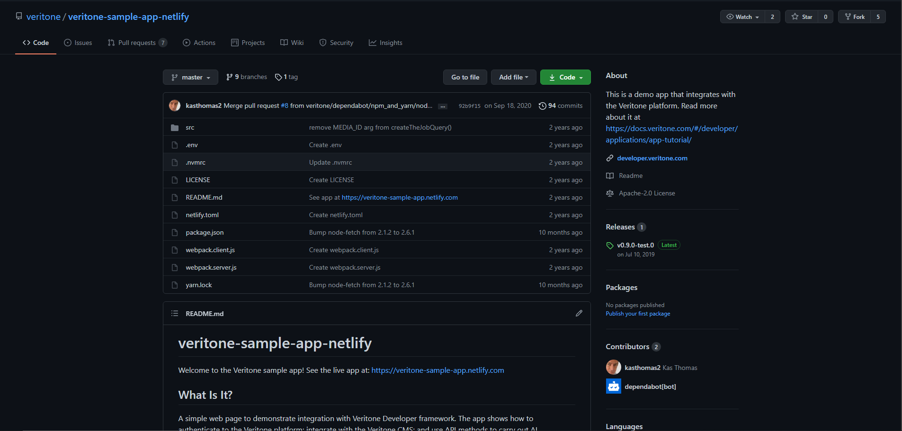
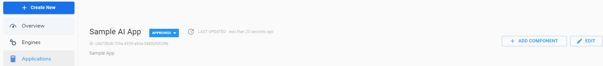

# Create an Application using Developer App

**APPROXIMATE READING TIME: 50 MINUTES**

## Before we begin <!-- {docsify-ignore} -->

If you're new to Veritone aiWARE and Developer app, we recommend you read about them using the links below.

[aiWARE Overview](https://docs.veritone.com/#/aiware/README)

[aiWARE Applications](https://docs.veritone.com/#/aiware/aiWARE-in-depth/apps/)

[Developer App Guide](https://docs.veritone.com/#/tutorials/pages/developer-app/)

## Building your own Application <!-- {docsify-ignore} -->

In this guide, we will provide steps to build your first application using the [Veritone Developer](https://docs.veritone.com/#/developer/) App. We'll create a simple single-page browser app that can perform object detection on a video of your choice. Object detection can be useful for making video clips searchable (e.g. "Search for all scenes containing motor vehicles"), or as a preliminary step in positively identifying faces, weapons, logos, license plates, etc.

Once you understand how to do basic object detection on a video, you can make use of other cognitive analysis such as voice transcription and many more.

## Expected Result <!-- {docsify-ignore} -->

After following this step-by-step tutorial, you will be successfully able to build your own AI applications using Veritone Developer App.

## Creating an Application: Overview <!-- {docsify-ignore} -->

For building an app, you will need to choose a development framework that will serve your application. For demonstration, we are choosing a plain-vanilla JavaScript and HTML, with no reliance on web development frameworks (no React, no Vue, etc.) and no server-side logic.

At a high level, there are six steps you need to carry out to build your application using the developer app.

- Step 1: Setting up the Application
- Step 2: Registering your Application with Veritone .
- Step 3 : Creating a Context Menu Extension for the App
- Step 4: Set up Authentication to use the Veritone API.
- Step 5: Adding Processing Logic
- Step 5: Perform Object/Face Detection on a video using the Application.

## Steps <!-- {docsify-ignore} -->

## Step 1: Setting up the Project <!-- {docsify-ignore} -->

The setup for this tutorial is super-duper simple. You just need the following :

- ### A Developer Veritone Account.

  Sign up [here](https://www.veritone.com/onboarding/#/signUp?type=automate?) using your email and username.

- ### Deploy your code repository to server

  Deploy the code files of your sample web app to a static server if you are using a different development framework. The files for our sample HTML app are available [here](https://github.com/veritone/veritone-sample-app-netlify). The app mainly consists of three files:

  - `index.html` contains the markup for the page
  - `styles.css` contains CSS for the page
  - `scripts/utils.js` contains the client-side logic.

To deploy these 3 static files we are using [Netlify](https://www.netlify.com/) as a hosting server . It provides all the basics for **personal projects** such as git automated builds, live site previews for free.

  1. Fork our project code [here](https://github.com/veritone/veritone-sample-app-netlify).

  

  2. Sign-in to your hosting server/Netlify Account and click on new site from Git.

  3. Click on new site from Git,provide your own or forked repository name and click on deploy site. Our repo includes  `yarn.lock`, `package.json`, and other files to allow Netlify to deploy the files automatically, straight from the Github repo.

  4. You app will be automatically deployed. Preview the deploy using the app link it should be similar to the screenshot below containing the sign in box and log in,TDO details and New Job links at the bottom.

     

## Step 2: Register Your App with Veritone <!-- {docsify-ignore} -->

 In this step, we'll register the deployed "app" with the Veritone Developer portal. Once this app is registered, we can go ahead with various kinds of integration, such as OAuth integration, Context Menu integration, and so on.

1. Go to https://developer.veritone.com/ and sign in using your Veritone developer account credentials created earlier.

2. Click on the blue Create New button (upper left) and select application from the dropdown list.

   

3. Give the application a Name and a Description, and specify a URL for the app as well as the URL to which OAuth responses should go.

   Note : If you have deployed the app using Netlify it can be fetched from sites section in your netlify dashboard.

   

4. Click the **Submit** button and you app will be registered with the system however it will be in the draft state.

   

> Take note of the fact that the app has an ID shown in grey, under the title. In this case, it is `ID:c06758d8-709a-4339-a83a-5488bfdf29fe`. We will need this ID later, when setting up authentication.

5. Now you have to submit the app for approval by clicking the grey DRAFT button next to the app's Name  to expose a menu of choices ("Edit," "Submit," and "Delete"). Select **Submit**. (See the screenshot below)

  

The Veritone system administrator will be notified of your submission. Within 24 hours, you should receive an e-mail approving your app (or, possibly, asking for additional information).

7. Once your app has been approved,the pending status will be changed to Approved

   

8. Now you can use the drop-down menu (the one that currently says "Approved") to select "Deploy."

​    

9. This, in turn, will cause the app's status to change to "Active."

​    

 Once it has been set to Active, it will be visible (in Veritone's App Switcher menu) to all registered users within your organization.

## Step 3: Creating a Context Menu Extension <!-- {docsify-ignore} -->

**What is a CME (Context Menu Extension) :** A custom command in the UI that's seen when a user clicks the "three dots" icon on a media file in the [Veritone CMS](https://cms.veritone.com/).

Here is a sample screenshot of a CME .


**Why it is necessary to setup a CME (Context Menu Extension) ?**

As mentioned earlier we are creating an app that can perform object detection on a video. To specify a video file for object detection that is stored in Veritone CMS we have to specify a CME for our app so it can perform cognitive functions on it.

In the example above, clicking the "three" in the upper right corner of a video's tile makes a context menu appear, with two commands: "Export" and "Sample AI app assets". The "Sample AI app assets" command is a custom CME command that can be configured by the CME's parameters, as shown below

1. Go to https://developer.veritone.com/applications.

2. Click **Applications** in the sidebar menu on the left. A list of applications will appear. Find your app in the list, and click it. A detail view will appear. In the detail view, find and click the **+ ADD COMPONENT** button, in the upper right, to expose a menu (as shown above).Select **Context Menu Extension**.

   

3. The "Add Context Menu Extension" dialog appears.

   In the dialog, choose "Media (Temporal Data Objects)" from the picker list to set the value of the dialog's first field.

   Enter a string for **Label**.

   > This string will be visible to users, in the context menu UI of [Veritone CMS](https://cms.veritone.com/), as the CME command name.

    In the third field of the dialog, enter the URL that will call your app. Use the app's public URL plus a parameter string with the syntax of `tdoId=${tdoId}` to pass the ID of the user-selected media asset to your app.

   ```
   https://<your-app-URL>/?tdoId=${tdoId}#process
   ```

   


4. To test your CME, go to the [Veritone CMS](https://cms.veritone.com/), and click the "three dots" icon in the upper right corner of any media tile. You should see your CME's Label string in the list of context menu commands. If you select that command, it should make your browser open your app in a new tab.

​      

## Step 4: Set Up Authentication <!-- {docsify-ignore} -->

In order to use the Veritone API, you need to obtain a session token (or API key) to make API calls through your application. The most secure way to obtain such a token is to implement [OAuth](https://oauth.net/) with your application.

To construct the OAuth link in your application,follow the steps below.  For more complete discussion of OAuth strategies check [here](https://docs.veritone.com/#/developer/applications/oauth).

1. The following code is available in `src/scripts.utils.js` file of the project [repo](https://github.com/veritone/veritone-sample-app-netlify).  

```javascript
const AUTH_BASE =
  'https://api.veritone.com/v1/admin/oauth/authorize?scope=all&response_type=token&client_id=';
const CLIENT_ID = 'caf06532-6787-45f3-a2e4-8ff02a55012f';
const HOME_URL = 'https://veritone-sample-app.netlify.com';

function getOAuthLink() {
  let clientID = CLIENT_ID;
  let auth_base = AUTH_BASE;
  let redirect = '&redirect_uri=' + HOME_URL;
  var OAuthLink = auth_base + clientID + redirect;

  return OAuthLink;
}
```

2. Change the `CLIENT_ID` and `HOME_URL` fields with your App id and URL and deploy the app to server again. In our case Netlify will the deploy the app to server automatically.

   Note: You can find your app id under **Applications** in the sidebar menu of Developer App. A list of applications will appear. Find your app in the list, and click it. A detail view will appear. In the detail view you app id will be listed below your app name .

3. Once the app is deployed,open it in your browser and on the first screen of our app (see below), there's a line of text: "Or try the *OAuth link*."

  

   The link, in that text, points to line 15 of `index.html` file

  ```
  javascript:location.href=getOAuthLink();void(0);
  ```

  which, in turn, expands to

  ```
  https://api.veritone.com/v1/admin/oauth/authorize?scope=all&response_type=token&client_id=<CLIENT_ID>&redirect_uri=<HOME_URL>
  ```

Here `CLIENT_ID` and `HOME_URL` are your app id and URL.

4. When the user clicks on the "try the OAuth link" URL , the Veritone log-in screen appears.

5. Provide your Veritone credentials and click the login button ,an oauth token will be generated on successful login(see the screenshot below)

   

6. During the life of the token, you can access the aiWARE resources or app for making API calls. Once the user logs out or quits an app, the token is invalidated.

7. Also,if you look in the address bar of your browser ,your app will be invoked with a URL of

   ```
   https://<APP_URL>/#access_token=<Access_Token-Value>s&token_type=Bearer
   ```

  which in our case is

   ```
https://sample-app-veritone.netlify.app/#access_token=eyJhbGciOiJIUzI1NiIsInR5cCI6IkpXVCJ9.eyJ1c2VySWQiOiI0OWYyOWIzOC0xMDBmLTQyMTMtYTI0NS1mY2MyN2NlYWZhMTYiLCJjb250ZW50QXBwbGljYXRpb25JZCI6ImY1Nzc5MDk1LTQ3ZmUtNDZmZS05YjQ2LWEyM2E5MTBlMmY3MiIsIm9yaWdpbkhvc3QiOiJzYW1wbGUtYXBwLXZlcml0b25lLm5ldGxpZnkuYXBwIiwic2NvcGUiOlt7ImFjdGlvbnMiOlsiaW5nZXN0aW9uOmRlbGV0ZSIsImluZ2VzdGlvbjp1cGRhdGUiLCJpbmdlc3Rpb246cmVhZCIsImluZ2VzdGlvbjpjcmVhdGUiLCJqb2I6Y3JlYXRlIiwiam9iOnJlYWQiLCJqb2I6dXBkYXRlIiwiam9iOmRlbGV0ZSIsInRhc2s6dXBkYXRlIiwicmVjb3JkaW5nOmNyZWF0ZSIsInJlY29yZGluZzpyZWFkIiwicmVjb3JkaW5nOnVwZGF0ZSIsInJlY29yZGluZzpkZWxldGUiLCJyZWNvcmRpbmc6Y2xvbmUiLCJyZXBvcnQ6Y3JlYXRlIiwiYW5hbHl0aWNzOnVzYWdlIiwibWVudGlvbjpjcmVhdGUiLCJtZW50aW9uOnJlYWQiLCJtZW50aW9uOnVwZGF0ZSIsIm1lbnRpb246ZGVsZXRlIiwiY29sbGVjdGlvbjpjcmVhdGUiLCJjb2xsZWN0aW9uOnJlYWQiLCJjb2xsZWN0aW9uOnVwZGF0ZSIsImNvbGxlY3Rpb246ZGVsZXRlIiwiYXNzZXQ6dXJpIl19XSwiZXhwaXJlc19pbiI6NjA0ODAwLCJpYXQiOjE2MjY5MDczMjAsImV4cCI6MTYyNzUxMjEyMCwic3ViIjoib2F1dGgyIiwianRpIjoiYjYxODJiYWYtOTg5My00M2FlLWI3ZmUtNjZiZDMyZWRhMzRmIn0.saM0fBG2Z0mi3TXow8ih52yoBRrXX628W63_0GLgGw8&token_type=Bearer
   ```

7. Our app implements a `load` event handler which inspects if the URL contains a token. The load event handler code can be found in `src/scripts.utils.js` file of the project [repo](https://github.com/veritone/veritone-sample-app-netlify) .(Starting at line 40)

   ```javascript
   window.addEventListener('load', function(event) {
     let TOKEN_MARKER = 'access_token=';
     let OUR_URL = location.href;

     // Eagerly try to load token from cookie (every time)
     if (!_token) _token = getCookie('token');

     // Check if our URL contains a token
     if (OUR_URL.indexOf(TOKEN_MARKER) != -1) {
       _token = OUR_URL.split(TOKEN_MARKER)[1].split('&')[0];
       if (_token) {
         showSnackbar('Token obtained via OAuth.');
         showToken('#smallToken', _token);
         setCookie('token', _token, DAYS_TO_STORE_TOKEN);
       }
     }
   });
   ```

## Step 5: Adding Processing Logic <!-- {docsify-ignore} -->

This step assumes that you have implemented an OAuth link and Custom menu extension for your registered app. When somebody within your organization execute the context-menu extension (CME) on a media file through [Veritone CMS](https://cms.veritone.com/), your app should perform any kind of AI processing we object detection on that media file.

To implement the logic for object detection through Veritone aiWARE platform :

1. We have to first recieve the [Temporal Data Object](https://api.veritone.com/v3/graphqldocs/temporaldataobject.doc.html) (TDO) associated with the media file on which the menu command was invoked.

> What is  [Temporal Data Object](https://api.veritone.com/v3/graphqldocs/temporaldataobject.doc.html) (TDO) ?
> The Temporal Data Object is a kind of "central switchboard" data object that holds metadata and web addresses (URIs) of *assets* associated with the AI job. For example, if you run a transcription job on a video, the transcript becomes an asset of the video's TDO.

Recall that when we have created the Context Menu Extension for the App in step 3 we have it setup with the URL that will call the app plus the parameter string with the syntax of `tdoId=${tdoId}` to pass the ID of the user-selected media asset to your app. We can use that ID (and our API token) to run GraphQL queries/AI processing jobs against that media file.

2. For example lets implement a GraphQL query that can show a detail listing of TDO contents for a particular TDO ID. The steps are as follows:

- Add code to the page `load` event handler, to detect the `tdoId` (if any) in our `location.href`.

- Define a custom query, based on the Veritone `  temporalDataObject` API method, that brings back detailed  information about a given TDO.

- Create a JavaScript function that runs the query and displays the results, in the browser, in an interesting way.

### Add TDO-Detection Code to the 'onload' Handler

When our app loads, we need to know if it was called from our Veritone context menu extension (CME). We can determine that by inspecting `location.href` at load time. If the URL contains a parameter string with a `tdoId` in it, we know the app was invoked from the Context Menu ExtensionCME.

To do this bit of inspection, we have added the following lines of code to our `load` event handler in `src/scripts/utils.js` file of the code [repo](https://github.com/veritone/veritone-sample-app-netlify)(line 60).

```javascript
let TDO_MARKER = 'tdoId=';

// Check if URL contains a tdoId
else if (OUR_URL.indexOf(TDO_MARKER) != -1) {
  TDO_ID = OUR_URL.split(TDO_MARKER)[1].split(/[#&]/)[0];
  showSnackbar('TDO ID detected.'); // for debug
  showTDO(TDO_ID, '#rawdata');
}
```

This code says "if the string `'tdoId='` exists in our URL, parse out the TDO ID, and call the function named `showTDO()`.

### Define the Query

The Veritone API exposes more than 200 GraphQL-based methods you can call. One of those methods, `temporalDataObject()`, brings back information on a given TDO. We'll use that method to get detailed information on the TDO whose ID was passed to our app.

One of the nice things about GraphQL is that it lets you specify exactly how much or how little information you want to receive in response to your query. For example, the `temporalDataObject()` method can be as simple as this:

```graphql
query {
  temporalDataObject(id: "1590892180") {
    assetCount
  }
}
```

This query says "invoke the method called `temporalDataObject` for the TDO with ID `1590892180`, and bring me back just the `assetCount` for that TDO."

But in our case, our app will ask for considerably more information than just the `assetCount`. Here is the JavaScript String version of the query we are actually using:

```javascript
let TDO_QUERY_TEMPLATE = `{
  temporalDataObject(id: theID) {
    name
    id
    details
    description
    assets {
      records {
        id
        assetType
        name
        signedUri
        details
        container {
          id
        }
      }
      count
    }
    status
    engineRuns {
      count
    }
    sourceData {
      source {
        name
        details
      }
      taskId
      sourceId
      scheduledJobId
      engineId
    }
    thumbnailUrl
    organizationId
    jobs {
      count
    }
  }
}
`;
```

The query is located in `src/scripts/utils.js` file of the code [repo](https://github.com/veritone/veritone-sample-app-netlify)(starting from line 197) and asks for a *lot* of information through various fields. You can edit this query (adding or removing fields as you wish) to get back just the information you want for your app.

To invoke the query for TDO, the following code needs to be invoked inside the `showTDO` function located in `src/scripts/utils.js` at line 226 of the code [repo](https://github.com/veritone/veritone-sample-app-netlify):

```javascript
// Query to get TDO data
let query = TDO_QUERY_TEMPLATE.replace(/theID/, '"' + tdoId + '"');
let payload = createVeritonePayload(query, _token);
let json = fetchJSONviaPOST(API_ENDPOINT, payload).catch(e => {
  showSnackbar('Check the console... ', 1);
  console.log('Welp. Got this message: ' + e.toString());
});

// Check for error messages in the json:
if ('errors' in json) {
  // handle the error(s)
}

// Do something with the json:
else if (json.data.temporalDataObject) {
  // maybe log the TDO's name to the console:
  console.log("The TDO's name is " + json.data.temporalDataObject.name);
}
```

If there were problems with our query at the transport level, the `catch()` on our fetch method will catch them. If the query was processed by Veritone but yielded other (non-transport) types of errors (maybe involving authentication, or query syntax, or something else), we can detect that by looking for an `errors` field in the JSON response.

### Create Custom Logic to Display the TDO Data

Now lets create a custom logic that extract various kinds of information from the TDO query and display that information nicely in the web page.

The steps are as follows:

1. Determine if any *assets* (artifacts associated with a media file) are present in the Temporal Data Object (TDO).

2. If assets do exist, they will be present in an array of `records`. Each asset (each entry in the array) will contain a `signedUri` field as clickable links.

   Here's a function that implements the above steps in `src/scripts/utils.js` at line 240 of the [code](https://github.com/veritone/veritone-sample-app-netlify):  

```javascript
// Find assets in TDO, and make links out of their signedUri data
function getAssetsAsMarkup(json) {
  if ('assets' in json.data.temporalDataObject) {
    let records = json.data.temporalDataObject.assets.records;
    let link = '<a href="URL" target="_blank">TARGET</a>';
    let results = [];
    records.forEach(item => {
      if (item.signedUri && item.signedUri.length > 0) {
        var a = link
          .replace('URL', item.signedUri)
          .replace('TARGET', item.assetType);
        results.push(a);
      }
    });

    if (results.join('').length == 0)
      return '<div style="font-size:var(--mediumFontSize);"><b>No assets in this TDO</b><br/><div>';

    return (
      '<div style="font-size:var(--mediumFontSize);"><b>Assets in this TDO:</b><br/>' +
      results.join('<br/>') +
      '</div>'
    );
  }

  return '';
}
```

### Sample Run

1. Open your App link in browser. In our case it is https://sample-app-veritone.netlify.app/

2. Click on try the *OAuth link*."

  

3.  The Veritone log-in screen appears, enter your veritone credentials.On successful login you will obtain a oauth token.

4. Now open a new tab in browser and open [Veritone CMS](https://cms.veritone.com/)

5. Select or upload a File . Click the Context Menu Extension (CME) you have created .In our case it is Sample AI App assets.


6. The new browser tab will open displaying the TDO contents for that media file

​ 


## Step 4: Run Object/Face Detection on a Video <!-- {docsify-ignore} -->

In the previous section we have seen how TDO ID can be used to invoke Graphql queries ,but we haven't actually invoked any AI related queries/mutations.

To run an AI job on the aiWARE platform, you need to submit a `createJob` mutation, designating a temporal data object (TDO) and one or more *tasks*. Each task, in turn, designates an AI *engine* that will handle cognitive processing.

**Example**: Suppose we have an `.mp4` file (in Veritone CMS) that's associated with a TDO ID and we want to run object detection on this video, using the cognitive engine with ID . This is the GraphQL mutation we would use:

The mutation is emedded in our application [code](https://github.com/veritone/veritone-sample-app-netlify) at line 508 .

```graphql
mutation createJob {
  createJob(
    input: {
      targetId: "<TDO_ID>"
      isReprocessJob: true
      tasks: [{ engineId: "<ENGINE_ID>" }]
    }
  ) {
    id
  }
}
```

Note: Substitute your `TDO_ID` and `ENGINE_ID` in the above code.

In our object detection case we are using a mp4 video file uploaded in our CMS (TDO ID - 1630191921 ) and Veritone, Inc - Face Detection (Objects) engine with Engine ID: 42ac5bc0-83d5-425c-ab5e-916a6584f4fd1 from List of Engines in developer app. We set `isReprocessJob` to `true` because the media file has already been ingested (it does not need to be reingested).

```
mutation createJob {
  createJob(
    input: {
      targetId: "1630191921"
      isReprocessJob: true
      tasks: [{ engineId: "42ac5bc0-83d5-425c-ab5e-916a6584f4fd1" }]
    }
  ) {
    id
  }
}
```

Just by POSTing the above GraphQL mutation to the API server, we can kick off a Face detection processing job in the App.

### Sample Object Detection Run

1. Open your App link in browser  .In our case it is https://sample-app-veritone.netlify.app/

2. Click on try the *OAuth link*."


3.  The Veritone log-in screen appears, enter your veritone credentials On successful login you will obtain a oauth token.

4. Now open a new tab in browser and open [Veritone CMS](https://cms.us-1.veritone.com/#/)

5. Select or upload a Video File that contains faces. Click the Context Menu Extension (CME) you have created .In our case it is Sample AI App assets.


5. The new browser tab will open displaying the TDO contents for that media file  


6. Now scroll below in the app and you will see a start button to kick off an object detection job. Click on it and your job will begin


7. If the job ran successfully the results will come back in a (potentially large) JSON blob, in [vtn-standard format](https://docs.veritone.com/#/developer/engines/standards/engine-output/?id=engine-output-standard-vtn-standard), which our app dutifully displays in the browser window


