# Veritone Developer App Guide

**APPROXIMATE READING TIME: 8 MINUTES**

## Before we begin <!-- {docsify-ignore} -->

If you're new to Veritone aiWARE and Developer app, we recommend you read about aiWARE and its applications using the links below.

[aiWARE Overview](https://docs.veritone.com/#/aiware/README)

[aiWARE Applications](https://docs.veritone.com/#/aiware/aiWARE-in-depth/apps/)

[aiWARE-in-depth](https://docs.veritone.com/#/aiware/aiWARE-in-depth/)

## Veritone Developer App <!-- {docsify-ignore} -->

In this guide, we will provide an overview of [Veritone Developer](https://docs.veritone.com/#/developer/) App, a self-service environment through which registered developers get easy access to tools, documentation, APIs, adapters, cognitive engines, or data schemas to extend aiWARE for their use.

Sign up to the Developer app [here](https://www.veritone.com/onboarding/#/signUp) using your email and username.

## Expected Result <!-- {docsify-ignore} -->

After following this step-by-step tutorial, you will be successfully able to use the Developer App for extending aiWARE capabilities.

## Guide Overview <!-- {docsify-ignore} -->

As of now, the Developer app includes the resources on the upper left for configuring and extending aiWARE. See the screenshot below.

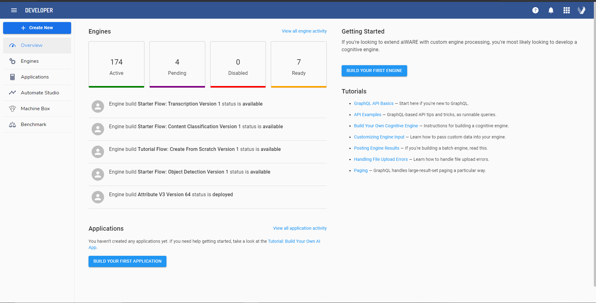

At a high level, you will see seven options on the upper left corner to carry out AI operations.

- (+)Create New
- Engines
- Applications
- Automate Studio               
- Machine Box                
- Benchmark

We will divide these options into respective sections in this tutorial to get a better understanding of the developer app.

Ready to get started? Let's go.

## Developer App: Overview <!-- {docsify-ignore} -->

Once you sign in to the developer app using the Veritone account, by default, you are redirected to an overview page that provides the status of created engines and applications.

To know more about Engines and how to create an Engine, check [getting started with engines](https://docs.veritone.com/#/developer/engines/getting-started/).

To know how to create an AI app, check out the [building applications](https://docs.veritone.com/#/developer/applications/) section in the documentation.

## Developer App : (+)Create New <!-- {docsify-ignore} -->

Clicking on the create new button will list the AI resources you can create using the developer app.

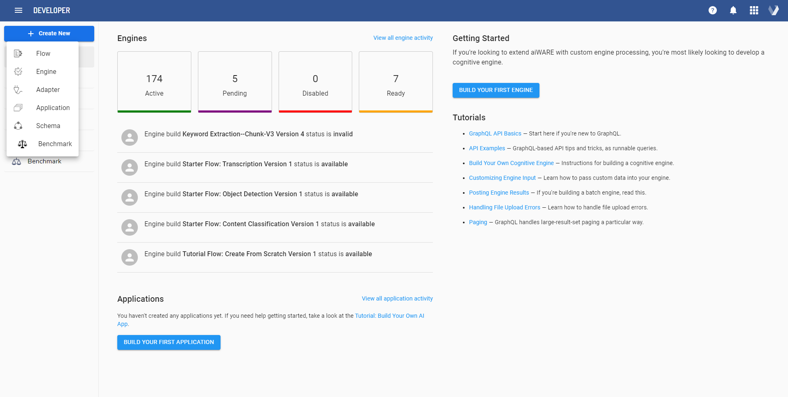

As seen in the above screenshot, these are the following resources you can create

### Flow:

A Flow in a Veritone aiWARE system is a group of logically connected nodes that run certain processes. The flow of nodes is developed using Veritone Automate Studio- a low-code workflow designer that leverages an intuitive drag-and-drop UI to easily create advanced AI solutions without the need for in-depth coding skills or AI expertise.

To know what a typical Veritone Automate studio flow contains, check the [overview and concepts](https://docs.veritone.com/#/automate-studio/application/README) section for more information. If you want to quickly build some basic and advanced AI Flows using check our [Automate Studio step-by-step guides](https://docs.veritone.com/#/automate-studio/tutorials/README).

### Engine:

An Engine is a building block of cognitive computing in the Veritone aiWARE operating system. Each Engine has different analytical capabilities and has been divided based on the type of data they analyze to derive actionable insights and solve complex problems.

With aiWARE, your Engine can easily support the preexisting engine types specified in our [Capabilities Table](https://docs.veritone.com/#/developer/engines/cognitive/?id=capabilities).  (For more info on the specific engine type, click on the particular capability in the table to get detailed information about the engine input and output).

### Adaptor:

An adaptor in the Veritone developer platform helps consume data from external sources and parse output in a format that can be easily processed by the aiWARE system.

Veritone provides a lot of inbuilt adapters for popular external data sources such as Amazon Web Services S3, YouTube, Google Drive, Box, Dropbox, and RSS feeds. Depending on your needs, you can also create your own custom adaptor based on the source and the format of the incoming data.

For more info regarding the specific adaptor type, check the [Building adapters](https://docs.veritone.com/#/developer/adapters/) section.
If you want to begin development instantly, check our  [Quickstart](https://docs.veritone.com/#/adapters/quick-start/) guide to adaptors here.

### Application

An application in the Veritone developer platform utilizes aiWARE APIs to provide cognitive capabilities. Veritone's robust APIs provide a wide range of functions that can do all the heavy lifting and allows you to focus on building creative and meaningful  AI-based solutions.

As of now, the Veritone platform provides the API's for

- Uploading your own Media or gain permission to Private Media from partners

- Cognitive Engine Processing across 11 categories (e.g., transcription, object detection)

- Search

- Metadata Storage

- Administration Tools via the GraphQL interface to build a customized app that meets specific needs.

  To know more about API's visit our [API section](https://docs.veritone.com/#/apis/) in the documentation. Our documentation covers everything you require for building and integrating an app using GraphQL API in the Veritone Platform. 
  
  To create your own AI application, check our step by step instructions for [building your own AI app](https://docs.veritone.com/#/developer/applications/app-tutorial/)

### Schema

A schema in the Veritone developer platform provides the necessary information to properly ingest, store and index your data. Indexing your data with well-defined fixed fields and structure allows the Veritone platform to easily process and transform a vast swath of the world's data to extract actionable intelligence.

To register and upload a schema for your data in the Veritone platform, it should be expressed in the JSON format. Other formats will be supported in the future.
For step-by-step instructions on how to register a schema within the Veritone platform, check out the [Quick Start Guide](https://docs.veritone.com/#/developer/data/quick-start/).

### Benchmark:

Benchmark in a Veritone developer platform allows result comparisons between a group of engines. The results are generated using  [Veritone Benchmark](https://docs.veritone.com/#/benchmark/)- a self-service tool that compares your Engine against other engines for the best combination of speed accuracy and performance while maximizing business value.

To learn the basics of Veritone Benchmark and run benchmarks, check out the [Benchmark Overview](https://docs.veritone.com/#/benchmark/?id=introduction) section in the documentation. The section covers everything to get acquainted with key concepts and capabilities of Benchmark .

## Developer App: Engines <!-- {docsify-ignore} -->

Clicking on the Engines tab on the upper left will provide you with a list of engines you have access to on the Veritone network. This will include both private engines you have created as well as public engines that you can use. See the screenshot below.

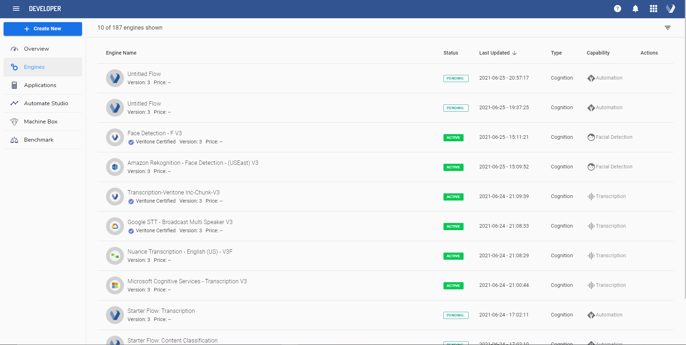

For every Engine listed, their capabilities, type, last updated, and status(active, pending) are also specified. To know which capabilities each Engine can support, check our [Capabilities Table](https://docs.veritone.com/#/developer/engines/cognitive/?id=capabilities). 

You can also get build information, logs, and how many tasks are running on an engine, etc., by choosing the specific one on the list. For example, we will check additional information about the "Face Detection - F V3" engine.

Clicking on the "Face Detection - F V3" engine will redirect you to a new page where you will see the unique engine id, option to generate manifests for docker builds, see build information, tasks, and logs. See the screenshot below.

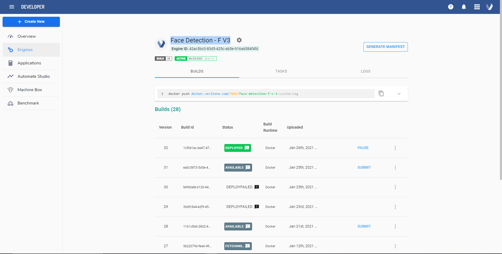

Builds: Provide specific information on how many times an engine was built and deployed.

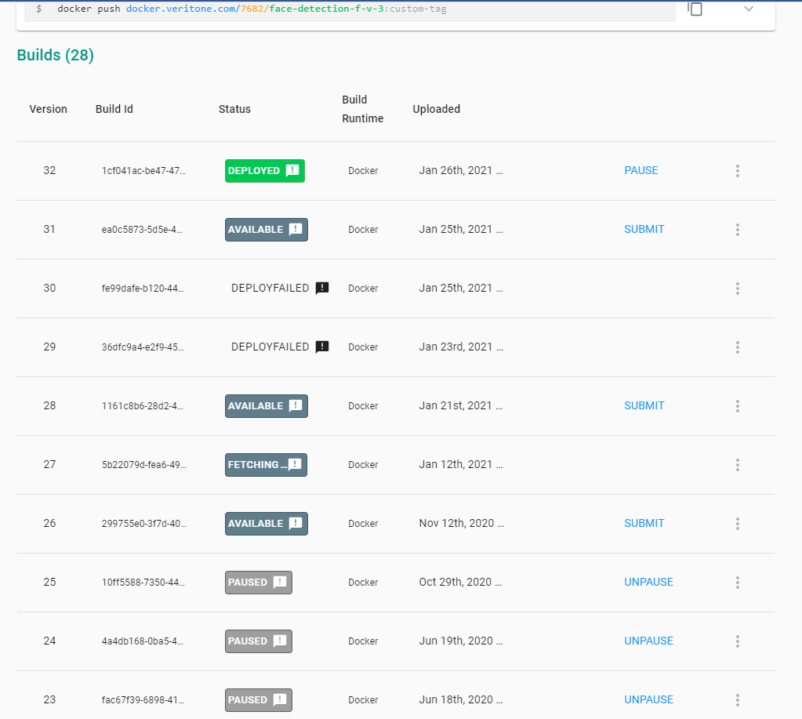

Tasks: Processed run by users on that Engine.

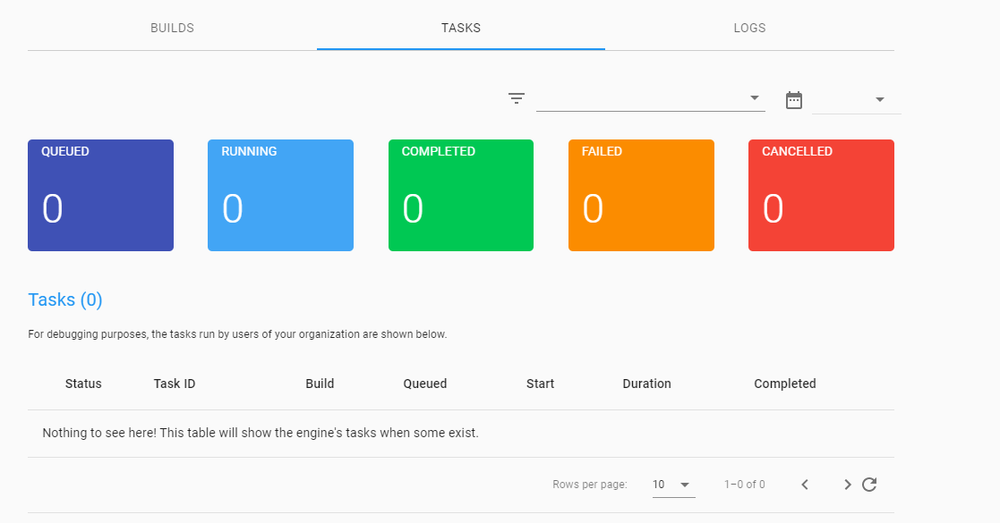

Logs: Record of events that occur during the run of an engine

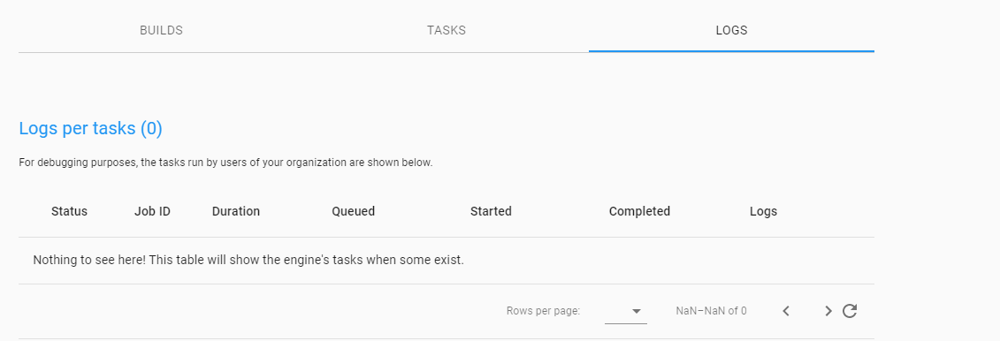

## Developer App: Applications <!-- {docsify-ignore} -->

Clicking on the Applications tab on the upper left will list the applications created using the Veritone developer platform.

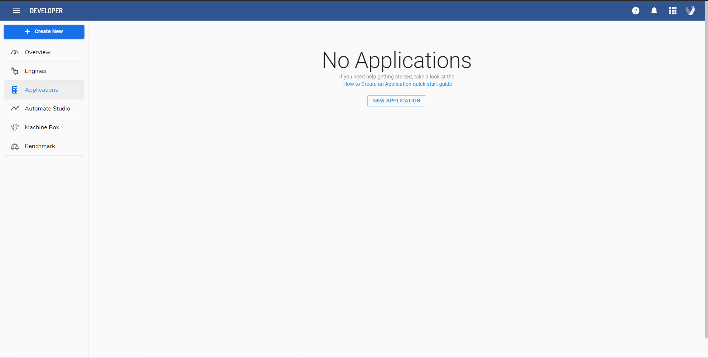

To know how to create your own App, check our step-by-step [build your own AI app](https://docs.veritone.com/#/developer/applications/app-tutorial/) guide to build and integrate an app in the Veritone Platform.

## Developer App: Automate Studio <!-- {docsify-ignore} -->

Clicking on the Automate Studio on the upper left redirects you to the Automate studio App

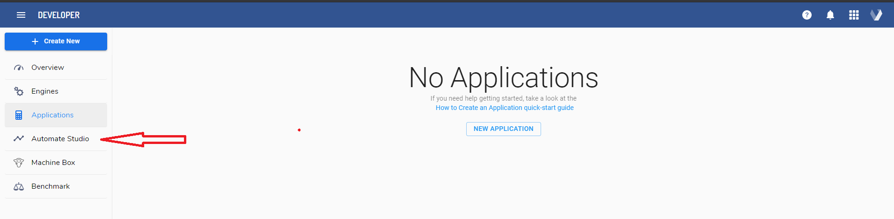

Automate Studio is a low-code workflow designer that leverages an intuitive drag-and-drop UI to easily create advanced business solutions without the need for in-depth coding skills or AI expertise.

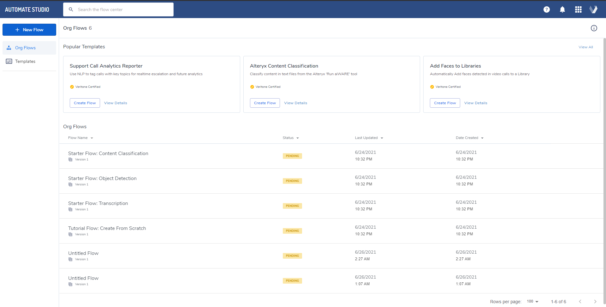

To know the basics of Veritone Automate Studio, visit  [ Automate Studio Overview ](https://docs.veritone.com/#/automate-studio/application/README) for more information

## Developer App: Machine Box <!-- {docsify-ignore} -->

Veritone Machine Box app allows you to integrate, deploy and scale Machine Learning capabilities fast, on-prem, or in the cloud.

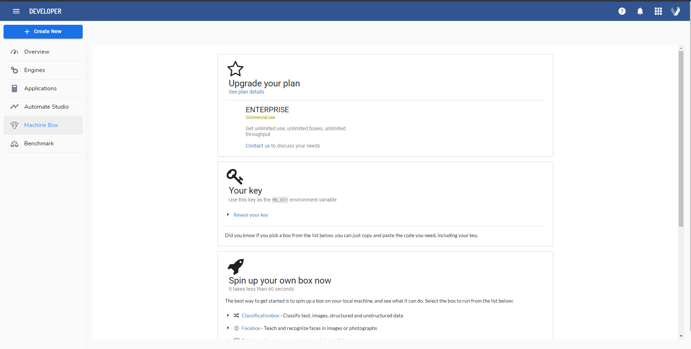

In the developer app, you get an option to upgrade your Machine Box plan to Enterprise. Machine box is free for developers, but there is an enterprise plan for companies that allows the creation of unlimited boxes.

Each box in a Machine Box is a Docker container that contains all the necessary dependencies to deliver world-class Machine Learning capabilities to your development team.

In the developer app, you get the option to get started with the following machine box products:

- [Facebox](https://docs.veritone.com/#/developer/machine-box/boxes/facebox-overview) - Teach and recognize faces in images or photographs
- [Tagbox](https://docs.veritone.com/#/developer/machine-box/boxes/tagbox) - Teach and automatically understand the content of images
- [Textbox](https://docs.veritone.com/#/developer/machine-box/boxes/textbox) - Understand text with natural language processing
- [Classificationbox](https://docs.veritone.com/#/developer/machine-box/boxes/classificationbox) - Build your own classifiers for text, images, structured and unstructured data (Developer preview)
- [Nudebox](https://docs.veritone.com/#/developer/machine-box/boxes/nudebox) - Detect adult and NSFW content
- [Objectbox](https://docs.veritone.com/#/developer/machine-box/boxes/objectbox) - Detect objects in images (Developer preview)
- [Fakebox](https://docs.veritone.com/#/developer/machine-box/boxes/fakebox) - Analyze news content and detect fake news

To know more about Machine Box and its capabilities, check [here](https://docs.veritone.com/#/developer/machine-box/)

## Developer App: Benchmark <!-- {docsify-ignore} -->

Clicking on the Benchmark App in the upper left corner redirects you to the Veritone Benchmark app, which allows you to compare engine results for efficiency and performance.

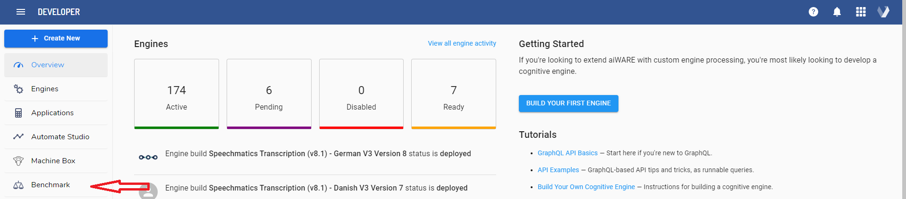

To know how to benchmark an engine using the  Benchmark App, visit [Benchmark Overview](https://docs.veritone.com/#/benchmark/?id=introduction) for more information.  

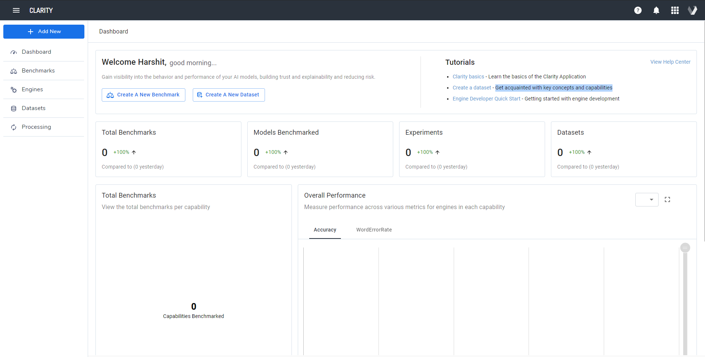

## Next Steps <!-- {docsify-ignore} -->

Other than the developer app, Veritone also provides many other powerful AI applications that enable users to organize, manage, search, analyze, and extend their cognitively enriched content. Learn more about them [here](https://docs.veritone.com/#/aiware/aiWARE-in-depth/apps/)

Also know :

- [How to build an engine using developer app]()
- [How to build a schema using developer app]()
- [How to build an app using developer app ]()
