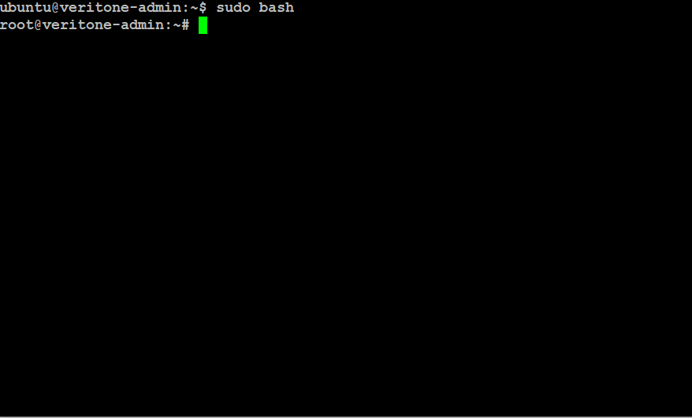
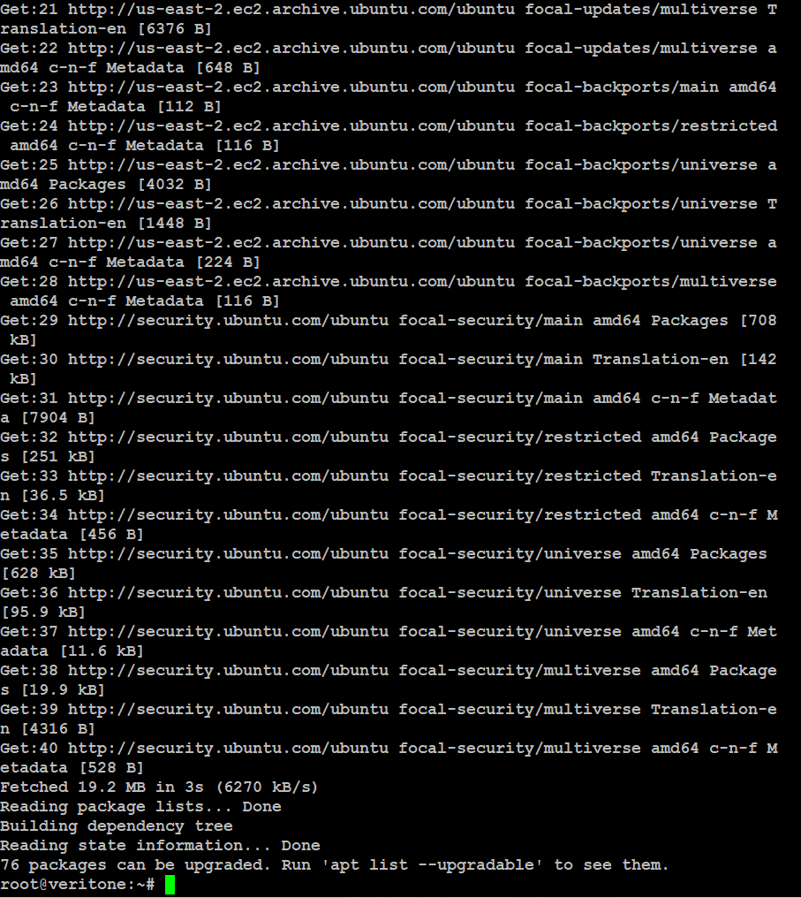
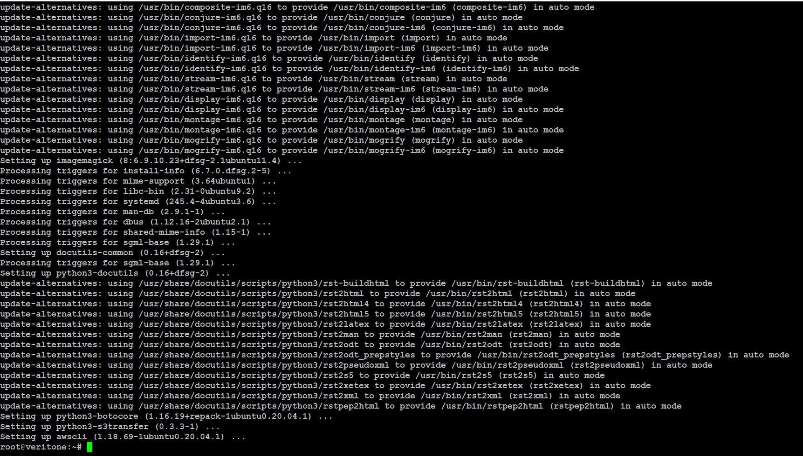
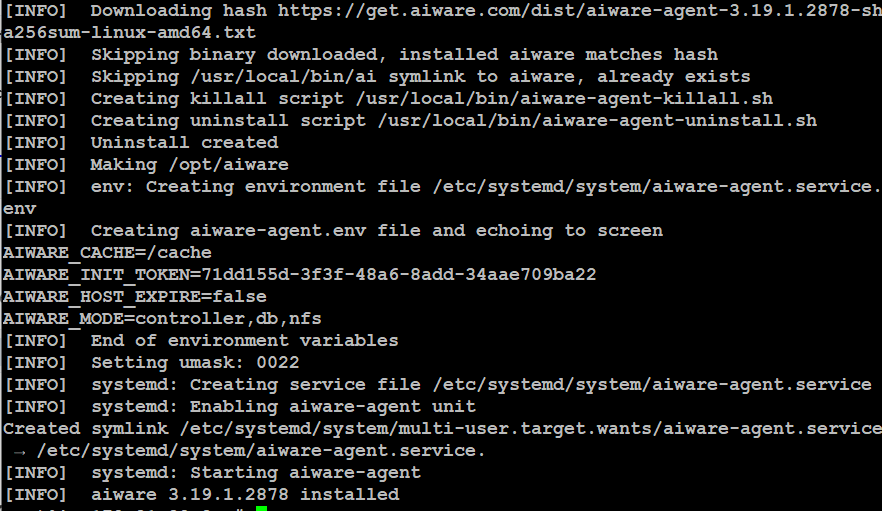
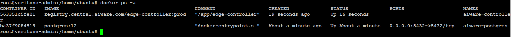
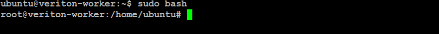
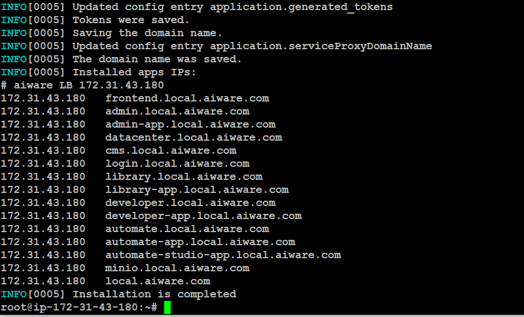
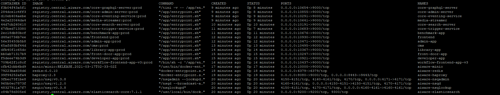
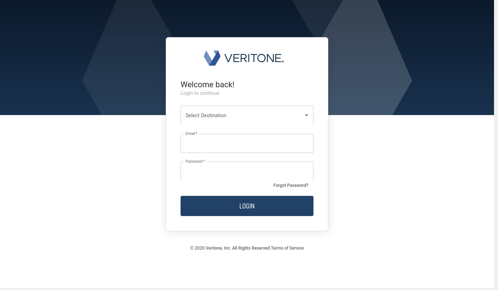

# Install aiWARE on Cluster

**APPROXIMATE READING TIME: 30 Minutes**

## Before we begin <!-- {docsify-ignore} -->

If you're new to Veritone aiWARE, we will recommend you to read about aiWARE and its benefits using the links below.

[aiWARE Overview](https://docs.veritone.com/#/aiware/README)

[aiWARE Applications](https://docs.veritone.com/#/aiware/aiWARE-in-depth/apps/)

[aiWARE-in-depth](https://docs.veritone.com/#/aiware/aiWARE-in-depth/)

## Installing aiWARE on Cluster <!-- {docsify-ignore} -->

In this step-by-step tutorial, we will explain how to install the aiWARE operating system on a cluster. A full aiWARE Anywhere cluster comes with 12 run modes. A run mode is the cluster role of that instance that can be one or many of the following: `api`, `controller`, `db`, `es`, `engine`, `lb`, `minio`, `nfs`, `nsq`, `prometheus`, `redis`, `registry`.

To run a minimal cluster that can run jobs and produce results. An `admin` instance should run the minimum of the aiWARE `controller,` `nfs` and `db` functionalities while a `worker`  and `core` instance handles `engine`  and aiWARE applications functionalities.


## Expected Result <!-- {docsify-ignore} -->

  After following this step-by-step tutorial, you will be able to successfully install aiWARE as a service on a cluster and test its functionalities.

 ## Steps <!-- {docsify-ignore} -->
 ### System Requirements

 At a minimum, three Linux Instances are required. One for Admin node, worker node, and aiWARE core functionalities. You can have more admin nodes and worker nodes deployed for  better availability and performance.

  - Preferred Linux OS for nodes: Ubuntu 18.04 or Ubuntu 20.04, Red Hat 7 (Requires Docker EE)
  - Minimum Requirement for Admin Node: 2 CPUs, 20GB of Initial Storage Space, and 4GB of RAM

  - Minimum Requirements for Worker Node: 2CPUs, 20GB of Initial Storage Space, and 4GB of RAM

  - Minimum Requirements for aiWARE Core Node: 2CPUs, 100GB of Initial Storage Space, and 8GB of RAM

    Note: The above-mentioned node requirements are just the starting points to initialize an aiWARE cluster. You will require additional system resources depending on the number of engines and run modes deployed.

## Setting up the Admin Node <!-- {docsify-ignore} -->

### Step 1: Open Terminal

Open Terminal in Linux and elevate command execution permissions to root using the command.
 ```
  sudo bash
  ```



### Step 2: Install Docker and dependencies
aiWARE resources are packaged and deployed as [Docker](https://www.docker.com/) containers, so to initialize aiWARE, docker and external dependencies are required.

To install docker and dependencies copy the below command to the Terminal and press enter to update the package information from all of the configured sources  

 ```
 sudo apt update -y
 ```

 

Install Docker and other external packages using the command below

  ```
  sudo apt install docker.io nfs-common awscli uuid prometheus-node-exporter -y
  ```
Response: This may take a minute or two. Here is the screenshot after successful installation

  

 To verify whether the docker has installed, enter:

  ```
  docker --version
  ```

 On successful installation, the output should be following.

  ```
  Docker version 20.10.2, build 20.10.2-0ubuntu1~20.04.2
  ```

  ### Step 3: Set up Variables

  An Admin node should run a minimum of the `controller`, `nfs` and `db` run modes.

 The command below will setup different variables for these run modes and output the value of `AIWARE_INIT_TOKEN`. A`AIWARE_INIT_TOKEN`, is a universally unique identifier that  is generated using a random number generator and is required for the installation of other nodes. Make sure to copy your `AIWARE_INIT_TOKEN` value somewhere safe.

`AIWARE_LICENSE` variable is set to `trial` for now as our licensing policies are still being reviewed. Details on it will be available shortly.

  ```bash
  export AIWARE_MODE=controller,db,nfs
  export AIWARE_HOST_EXPIRE=false
  export AIWARE_LICENSE=trial
  export AIWARE_INIT_TOKEN=`uuidgen`
  echo "AIWARE_INIT_TOKEN is $AIWARE_INIT_TOKEN"
  ```
Here is a sample `AIWARE_INIT_TOKEN` :

  ```
  843489f6-ecff-4d19-95b0-2359eff60ec8
  ```

  ### Step 4: Install the aiWARE agent

   Now install the aiware-agent as a service using the following command

  ```
  curl -sfL https://get.aiware.com |  sh -
  ```

  Response after successful installation:

  

  ### Step 5: Validate Admin node

  Run the following docker command to check the container status for running and non-running aiWARE containers

  ```
  docker ps -a
  ```

  The response should show the `aiware-controller`, `aiware-postgres` container running.

  

  Go to http://localhost:9000/edge/v1/version, or `curl localhost:9000/edge/v1/version`, for aiWARE Edge version information.

  Response:

  ```
  root@veritone-admin:/home/ubuntu# curl localhost:9000/edge/v1/version
  { "version": "Build number: , Build time: 2021-06-16_20:09:55, Build commit hash: dd27e7cf925434a9e3e6bcd0fc56f0f41b15308f" }
  ```

  ## Setting up the Worker Node <!-- {docsify-ignore} -->

  ### Step 1: Open Terminal

  Open Terminal in another machine/instance and elevate command execution permissions to root using the command.

  ```
  sudo bash
  ```

  This will ensure that all the steps are executed as root.

  

  ### Step 2: Install Docker and dependencies

  aiWARE resources are packaged and deployed as [Docker](https://www.docker.com/) containers, so to initialize aiWARE, docker and external dependencies are required.

  To install docker and dependencies:

   Copy the command below to the Terminal and press enter to update the package information from all of the configured sources  

  ```
  sudo apt update -y
  ```

   Install Docker and other external packages using the command below. This may take a minute or two.

  ```
  sudo apt install docker.io nfs-common awscli uuid prometheus-node-exporter -y
  ```

   To verify whether the docker has installed, enter:

  ```
  docker --version
  ```

  On successful installation, the output should be following.

  ```
  Docker version 20.10.2, build 20.10.2-0ubuntu1~20.04.2

  ```

  ### Step 3: Set up Variables

  A Worker node consists of `engine` run mode. The below commands will set up different variables for aiWARE `engine` run mode.

  Note: Replace the value of the variable `IP_OF_ADMIN_NODE ` and `AIWARE_INIT_TOKEN` in the below command with the internal IP and `AIWARE_INIT_TOKEN` of your admin node.

  The internal IP can be fetched by running the `ifconfig` command on your admin machine.


  ```bash
  export AIWARE_MODE=engine
  export AIWARE_HOST_EXPIRE=false
  export AIWARE_LICENSE=trial
  export AIWARE_CONTROLLER=http://<IP_OF_ADMIN_NODE>:9000/edge/v1
  export AIWARE_INIT_TOKEN=<ADMIN_INIT_TOKEN>   
  echo "AIWARE_INIT_TOKEN is $AIWARE_INIT_TOKEN"
  ```

  ### Step 4: Install the aiWARE agent

  Now install the aiware-agent as a service using the following command

  ```
  curl -sfL https://get.aiware.com | sudo -E sh -
  ```

  ### Step 5: Validate worker node

  To check whether the worker node is working.

  [Configure aiWARE CLI](https://docs.veritone.com/#/aiware/install/cluster?id=configure-aiware-cli) by creating a `aiware-cli.yaml ` file  in the `~/.config`.directory. Add the below text to the file

```
  profiles:
    default:
      url: "http://localhost:9000/edge/v1"
      token: "$AIWARE_INIT_TOKEN"
```

Replace the `localhost`  under `url` with the Internal IP of the admin node. Also replace `$AIWARE_INIT_TOKEN` value with aiWARE token value of your admin node.

   Save the changes to the yaml file and run the following command

  ```
  ai host ls --type engine --format json
  ```

  If the worker node is properly running, the response should output a JSON response like below :

  Note: The below response is formatted. You might receive unformatted output when running the command above.

  ```
  {
     "Count":1,
     "Error":{
        "Description":"",
        "Detail":"",
        "Id":""
     },
     "Limit":100,
     "Offset":0,
     "Result":[
        {
           "AgentCommitID":"dd27e7cf925434a9e3e6bcd0fc56f0f41b15308f",
           "AgentLabel":"agent:eng",
           "AgentVersionNumber":"3.19.1.2878",
           "CloudProviderInstanceID":"i-06761dc2d218b46a2",
           "ControllerPort":9000,
           "CreatedDateTime":"2021-06-23T18:22:46Z",
           "DbPort":5432,
           "DockerHostID":"5S3C:V2FV:YQGE:EFWY:XMKX:GMZP:B7S6:K3LH:XZCP:TUKN:EUA5:PFFV",
           "DockerInfo":"
           "Drain":false,
           "DrainDetail":"",
           "DrainReason":"",
           "ExpirationDateTime":"2021-06-24T07:37:32Z",
           "GpuAvailable":0,
           "GpuType":"",
           "HostID":"be564a0d-158f-4439-87c3-99a4c3be83ed",
           "Ips":[
              "172.31.34.19"
           ],
           "IsAPI":false,
           "IsActive":true,
           "IsApps":false,
           "IsAssigned":true,
           "IsAutomate":false,
           "IsController":false,
           "IsDB":false,
           "IsES":false,
           "IsEngine":true,
           "IsEventing":false,
           "IsLB":false,
           "IsNFS":false,
           "IsNSQ":false,
           "IsPrometheus":false,
           "IsRedis":false,
           "IsRegistry":false,
           "LastUpdateDateTime":"2021-06-23T18:28:57Z",
           "Memory":0,
           "ModifiedDateTime":"2021-06-23T18:28:57Z",
           "NfsPartition":-1,
           "NfsPort":2049,
           "NumCPU":2,
           "NumEngines":0,
           "NumGPU":0,
           "RegistryPort":443,
           "RunModes":"",
           "ServerTypeID":"",
           "ServerTypeName":"",
           "ShouldExpire":false,
           "SuggestedRuntimeTTL":0,
           "TerminationDateTime":"0001-01-01T00:00:00Z",
           "TerminationDetail":"",
           "TerminationReason":"",
           "VcpuAvailable":2045
        }
     ],
     "Success":true,
     "level":"info",
     "message":"",
     "timestamp":"2021-06-23T18:29:56Z"
  }
  ```

  ## Setting up Node for aiWARE Core <!-- {docsify-ignore} -->

  ### Step 1: Open Terminal

  Open Terminal and elevate command execution permissions to root using the command.

  Ubuntu: Press `Ctrl` + `Alt` + `T` to open a terminal window.

  ```
  sudo bash
  ```

  This will ensure that all the steps are executed as root.

  ### Step 2: Install Docker and dependencies

  aiWARE resources are packaged and deployed as [Docker](https://www.docker.com/) containers, so to initialize aiWARE,docker and external dependencies are required.

  To install docker and dependencies:

  Copy the command below to the Terminal and press enter to update the package information from all of the configured sources  

  ```
  sudo apt update -y
  ```
  Install Docker and other external packages using the below command. This may take a minute or two.

  ```
  sudo apt install docker.io nfs-common awscli uuid prometheus-node-exporter -y
  ```

   To verify whether the docker has installed, enter:

  ```
  docker --version
  ```

  On successful installation, the output should be following.

  ```
  Docker version 20.10.2, build 20.10.2-0ubuntu1~20.04.2

  ```
  ### Step 3: Set up Variables

  The installation of aiWARE Core requires the additional run modes of `api`, `db`, `es`, `lb`, `minio`, `nsq`, `redis`. The below command will  setup different variables for `api`, `db`, `es`, `lb`, `minio`, `nsq`, `redis` run modes .

 Note: Replace the value of the variable `IP_OF_ADMIN_NODE ` and `AIWARE_INIT_TOKEN` in the command below with the internal IP and `AIWARE_INIT_TOKEN` of your admin node

  ```bash
  export AIWARE_MODE=api,es,lb,nsq,minio,redis
  export AIWARE_HOST_EXPIRE=false
  export AIWARE_LICENSE=trial
  export AIWARE_CONTROLLER=http://<IP_OF_ADMIN_NODE>:9000/edge/v1
  export AIWARE_INIT_TOKEN=<ADMIN_INIT_TOKEN>
  echo "AIWARE_INIT_TOKEN is $AIWARE_INIT_TOKEN"

  ```
  ### Step 4: Install the aiWARE agent

  Now install the aiware-agent as a service using the following command

  ```bash
  curl -sfL https://get.aiware.com |  sh -
  ```

  ### Step 5: Validate the Node

  Follow the Step 5 in [Setting up the Worker node](#setting-up-the-worker-node) section.

  ### Step 6: Install aiWARE Core

  Run install command for aiWARE applications

  ```
  ai hub install core
  ```
 This will install the aiware-agent as a service. You can check the status via running `service aiware-agent status` command or monitor it in realtime with `watch service  aiware-agent status`

 Response after successful installation:

  

 The `ai hub install` command can also be executed with additional parameters/flags, which can be viewed by running the  `ai hub install --help` command.

 Here are the parameters:

  ```
Install a new service to the hub

Usage:
  aiware-agent hub install <path-to-config-file> [flags]

Flags:
   --channel string   Install channel for a service
  -h, --help               help for install

Global Flags:
  -c, --config string         CLI Config file to use.  By default it will be /root/.config/aiware-cli.yaml
  --controller-token string   Bearer token to use for authenticating operations.
  --controller-url string     Controller URL to use for the CLI.  If specified, this will be used instead of what is in the configuration.
                              (default "http://localhost:9000/edge/v1")              
  -d, --debug                  Enables debug output
  -f, --format string          The output format.  The values are text, log or json. (default "text")
  -p, --profile string         The profile to use.  If not specified, the profile named 'default' will be used.  The profiles are set in ~/.config/aiware-cli.yaml (default "default")
  -q, --quiet                   Disables output extra output except the main output

  ```

  ## Step 7: Validate aiWARE Core: <!-- {docsify-ignore} -->

To validate whether all the applications are successfully installed and running perfectly. Run `docker ps` command to see all aiWARE applications running with their access links specified.

The response should be similar to the screenshot below. All the applications should be up and running:

  

  ## Step 8: Test aiWARE Core <!-- {docsify-ignore} -->
 Once all the aiWARE core components are up and running. They can be easily tested; for instance, let's access the developer app by visiting http://localhost:10921 in the browser.

  ## Final Result: <!-- {docsify-ignore} -->

 In the response, The browser will respond with the Developer App sign-in page, which means aiWARE components are successfully installed and working perfectly.

  

  ## Next Steps <!-- {docsify-ignore} -->

  Check additional aiWARE cluster deployment considerations [here](https://docs.veritone.com/#/aiware/install/cluster?id=deployment-considerations)

  [Learn more about aiWARE and its Applications](https://docs.veritone.com/#/aiware/aiWARE-in-depth/apps/)

  - [Developer App ](https://docs.veritone.com/#/tutorials/pages/developer-app/)
  - [Automate Studio Tutorials](https://docs.veritone.com/#/automate-studio/tutorials/README)
