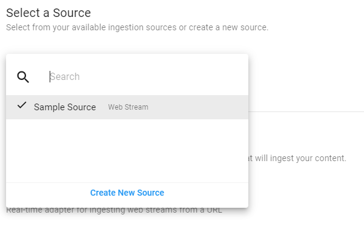

# Testing and Debugging Engines

**APPROXIMATE READING TIME: 10 MINUTES**

>**Tip** Before getting started, you should read about [how to quickly get started with aiWARE](/getting-started/quickstart/) and get familiar with our [cognitive engines](/cognitive-technology/). It would also help if you read about [training an engine](training-an-engine) and [working with jobs](#/developer/engines).

## Overview <!-- {docsify-ignore} -->

In this tutorial, you will learn how to test our engine and debug the most common error. You should validate your engine before you submit a build.

You must perform the following steps to ensure that your engine is completely validated and you can submit the build:

- [Data Validation Testing](#step-1-data-validation-testing)
- [Segment or Stream Engine Testing](#step2-segment-or-stream-engine-testing)


You can review the [Debug](#step-3-debugging) section to understand any issues that you find in the above tests. These tests only validate the structural part of your engine. You must perform functional testing on your engines to ensure it is performing as intended.


## Testing and Debugging Engines<!-- {docsify-ignore} -->

### Data Validation Testing

Before you do functional testing of your engine, you should ensure that your engine's output is valid data according to the [engine output standard (vtn-standard)](/developer/engines/standards/engine-output/).

Veritone provides a simple HTTP post endpoint that you can use to test the validity of your engine's output. For example, to validate a speech-to-text engine, you can make the following call:

```bash
curl --request POST \
  --url https://api.veritone.com/v3/tools/engine/validate/ \
  --header 'content-type: application/json' \
  --data '{
  "schemaId": "https://docs.veritone.com/schemas/vtn-standard/master.json",
  "validationContracts": [
    "transcript"
  ],
  "series": [
    {
      "startTimeMs": 0,
      "stopTimeMs": 300,
      "words": [
        {
          "word": "this",
          "extra": "not part of the standard"
        }
      ]
    },
    {
      "startTimeMs": 300,
      "stopTimeMs": 500,
      "words": [
        {
          "word": "is"
        }
      ]
    },
    {
      "startTimeMs": 500,
      "stopTimeMs": 800,
      "words": [
        {
          "word": "a"
        }
      ]
    },
    {
      "startTimeMs": 800,
      "stopTimeMs": 1200,
      "words": [
        {
          "word": "sentence"
        }
      ]
    }
  ]
}'
```


In this example, if the engine output is valid, then the `data` key of the response is set to `valid: true`. Also, the processed field shows only the fields that have been validated against the vtn.

If the engine output is valid, you will see `valid: true` under the `data` key of the response, as well as a `processed` field, which will show you only the fields that have been validated against the [vtn-standard](/developer/engines/standards/engine-output/).

Here is sample validation of the above `transcript` output:

```json
{
  "data": {
    "valid": true,
    "processed": {
      "schemaId": "https://docs.veritone.com/schemas/vtn-standard/master.json",
      "validationContracts": [
        "transcript"
      ],
      "series": [
        {
          "startTimeMs": 0,
          "stopTimeMs": 300,
          "words": [
            {
              "word": "this"
            }
          ]
        },
        {
          "startTimeMs": 300,
          "stopTimeMs": 500,
          "words": [
            {
              "word": "is"
            }
          ]
        },
        {
          "startTimeMs": 500,
          "stopTimeMs": 800,
          "words": [
            {
              "word": "a"
            }
          ]
        },
        {
          "startTimeMs": 800,
          "stopTimeMs": 1200,
          "words": [
            {
              "word": "sentence"
            }
          ]
        }
      ]
    }
  }
}
```


In this processed output, the  `"extra": "not part of the standard"` has been removed from the `words` array in the first element in the `series` array. This is because `extra` is not part of the vtn-standard for speech-to-text.

Here is a sample invalid input:

```bash
curl --request POST \
  --url https://api.veritone.com/v3/tools/engine/validate/ \
  --header 'content-type: application/json' \
  --data '{
  "schemaId": "https://docs.veritone.com/schemas/vtn-standard/master.json",
  "validationContracts": [
    "transcript"
  ],
  "series": [
    {
      "startTimeMs": 0,
      "stopTimeMs": 300,
      "words": [
        {
          "word": "this"
        }
      ]
    },
    {
      "startTimeMs": 300,
      "stopTimeMs": 500,
      "words": [
        {
        }
      ]
    },
    {
      "startTimeMs": -1,
      "stopTimeMs": 800,
      "words": [
        {
          "word": "a"
        }
      ]
    },
    {
      "startTimeMs": 800,
      "stopTimeMs": 1200,
      "words": [
        {
          "word": "sentence"
        }
      ]
    }
  ]
}'
```

In this example, the second element in the array has an empty object and the third element has a negative `startTimeMs`. This will cause an error due to data inconsistency and is reported by the engine output validator. The validator can identify a large subset of similar issues. 


Below is a validation of the incorrect output:

```json
{
  "errors": [
    {
      "name": "invalid_input",
      "message": "The supplied engine result failed schema validation checks. Details errors are included in the validationErrors field.",
      "validationErrors": [
        {
          "keyword": "required",
          "dataPath": ".series[1].words[0]",
          "schemaPath": "#/else/items/required",
          "params": {
            "missingProperty": "word"
          },
          "message": "should have required property 'word'"
        },
        {
          "keyword": "if",
          "dataPath": ".series[1].words",
          "schemaPath": "#/if",
          "params": {
            "failingKeyword": "else"
          },
          "message": "should match \"else\" schema"
        },
        {
          "keyword": "minimum",
          "dataPath": ".series[2].startTimeMs",
          "schemaPath": "#/properties/series/items/properties/startTimeMs/minimum",
          "params": {
            "comparison": ">=",
            "limit": 0,
            "exclusive": false
          },
          "message": "should be >= 0"
        }
      ]
    }
  ]
}
```


The validation does not include the `valid` as the engine output is invalid. The validation, however, includes an array of `errors` with details information about the errors such as:

- The second element in the `series` array, `series[1]` (an empty object), is missing the `word` property.
- The third element in the `series` array, `series[2]`, has a `startTimeMs` that is below the required value of `0`.

#### Limitations

The engine output validator can determine if test data from your engine is invalid. However, it cannot determine whether _all_ the possible outputs of your engine will be valid. The validator does not yet cover the full spectrum of [vtn-standard output](/developer/engines/standards/engine-output/). Also, note that data validation is a processing-intensive task. Hence, the API allows validation of engine output that is `1MB` or less to be validated at a time without rate limiting.


### Segment or Stream Engine Testing 

You can test segment or stream engines either locally or on aiWARE. To test these engines locally, it is recommended that you locally simulate and verify your engine. You must test that  your engine can consume and process messages documented in the construction guidelines:

* [Segment Engine Construction Guidelines](/developer/engines/processing-modes/segment-processing/)
* [Stream Engine Construction Guidelines](/developer/engines/processing-modes/stream-processing/)


However, it is much easier if you want to test the engine in aiWARE. You can test your uploaded build in CMS by following the steps below.

**To test segment or stream engines in aiWARE:**

1. Navigate to [Veritone CMS](https://cms.veritone.com/).

2. Click on the `New` > `Ingestion Job`.

   

   

3. Select an adapter, such as *Web Stream Adapter*. The configuration page is displayed.

   

4. Select a source and click **Next**. If you don't have any existing sources, then create a new source by clicking `Select a Source` > `Create New Source`. You must then enter the name and stream URL to create the source.

   

   

   

   Once the source is created, you can select the newly created source from the `Select a Source` dropdown and click `Next`. Optionally, you can select the cluster and segment duration length for the job.

5. On the schedule page, select one of the following and click **Next**:

   - Recurring to run the job at regular intervals.
   - Continuous to run the job continuously unless interrupted.
   - On-Demand to run the job when requested for.
   - Immediate to run the job immediately.

   For this example, we will run a recurring job that recurs for the next two hours.

   

   

   On the processing page, you can view the Simple Cognitive Workflow that lets you select a category. Veritone selects the best engine in the category to process the media with. 

6. Click on `Show Advanced Cognitive Workflow`.

   

   

7. On the Advanced Cognitive Workflow page, select the engine category for your engine from the Available Engines dropdown and click on the green plus icon to add the engine to the Selected Engines panel. Once done, click **Next** to view the **Customize** page.

   If your engine requires either engine parameters or a library you will now be asked to input these. After configuring your engine parameters, click `Next`.

   

   

8. Enter the job name, select a folder where you want to store the files, and click **Save**. You can also tag the job to group it. Fill out the `Customize` step with any information you'd like, and finally click `Save` to finish.  That will redirect you to the CMS main page.

   


The job is created and run depending on the schedule. You can click on the `Processing Status` button in the left navigation panel to view the processing list. Then, you can click on a file in the processing list to view its media details page. You can view the output of a successfully processed file, as well as make additional actions against the file such as reprocessing in the media details page.

If your ingestion job results in an error, please review the [debugging](#debugging) to understand how to debug your engine in the Veritone Platform.

### Legacy (Batch) Engine Testing

!> Legacy batch engines are deprecated. If you have developed a legacy batch engine, we highly recommend you upgrade it to a [segment engine](/developer/engines/processing-modes/segment-processing/). For more information,  see [batch engines](/developer/engines/testing-and-debugging/batch-engines/).

## Debugging

Your tasks are listed under the tasks page of your engine in VDA when you send them for processing. The task page is the best place for you to start debugging your engine. 

You can expand the task row, and view additional information about the task in the following tabs:

- [Payload](#payload)
- [Task Log](#task-log)
- [Task Output](#task-output)
- [Assets](#assets)

### Payload

The Payload tab displays the JSON payload that your engine will receive at runtime. You should ensure that you are handling the payload correctly in your engine and also verify that the correct parameters (custom fields) are being passed to your engine inside of the payload.

You can view your task payload in GraphQL by using the snippet below:

```graphql
query {
  task(id: "replaceMe") {
    payload
  }
}
```

### Task Log

The Task Log tab displays your engine's task log in JSON format. This is the primary tab used for debugging as it lets you view the standard output (`stdout`) of your engine. Note that for the Segment engines, you do not attach stdout as part of the task log.

For both Stream and Segment engines, you will also be able to view the Kafka events related to your task.

> Veritone only returns the task log of completed or failed tasks. You must ensure that your engine correctly updates the task status during the process so that you can view accurate logs.

You can view your task log using graphql by using the snippet below:

```graphql
query {
  task(id: "replaceMe") {
    log {
      uri
      text
      jsondata
    }
  }
}
```

### Task Output

The Task Output tab displays your engine results. For more information about Task output, see  [Engine Results](/apis/tutorials/engine-results?id=uploading-engine-results). You can view your task output in graphql by using the snippet below:

```graphql
query {
  task(id: "replaceMe") {
    output # JSON
    outputString # stringified
  }
}
```


### Assets

The Assets tab displays all of the assets that were produced by your engine for a task. You can click on the asset ID to view the source, and ensure that the assets produced have been processed by your engine correctly.

You can also view the assets created by your engine by using the graphql query below.  To run this mutation for your task, replace the ID `replaceMe` with the `recordingId` from your task payload.

```graphql
query{
  temporalDataObject(id:"replaceMe"){
    assets(orderBy:createdDateTime) {
      records  {
        id
        assetType
        contentType
        createdDateTime
        jsondata
        signedUri
      }
    }
  }
}
```

This query orders the assets by the creation date in ascending order. You can use the `signedUri` value to view the asset in your browser. You can also filter by assets types using the `type` filter. This filters the `assetType` of the asset as shown below.

```graphql
query{
  temporalDataObject(id:"replaceMe"){
    assets(type: "vtn-standard" orderBy:createdDateTime) {
      records  {
        id
        assetType
        contentType
        createdDateTime
        jsondata
        signedUri
      }
    }
  }
}
```

